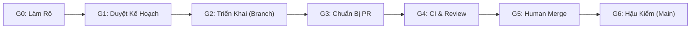

# Quy Chuẩn Quản Trị & Cẩm Nang Kỹ Thuật Cho AI Agent (AGENTS.md)

> **Dự án**: Haven: Sovereign Frontier (Build-Settlement)  
> **Mục đích**: Tài liệu này là bộ khung quản trị kỹ thuật bắt buộc cho toàn bộ các AI Agent (Gemini, Claude, GPT...) tham gia phát triển dự án. Bộ quy chuẩn phân tách rõ: **Luật bắt buộc (Hard Laws)**, **Hướng dẫn chất lượng (Quality Guidelines)**, và **Quy trình kiểm soát (Lifecycle Gates)**.

---

## 1. Tám Nhóm Luật Bắt Buộc (Hard Laws)

Mọi thay đổi mã nguồn vi phạm bất kỳ điều nào dưới đây sẽ bị **từ chối merge ngay lập tức**:

| Mã Luật | Tên Luật | Nội Dung Bắt Buộc | Cách Thức Kiểm Chứng | Thẩm Quyền Ngoại Lệ |
| :---: | :--- | :--- | :--- | :---: |
| **LAW-01** | **Kỷ Luật Phạm Vi (Scope Discipline)** | Chỉ thực hiện đúng mục tiêu và phạm vi gói việc (WP) đã được duyệt. Tuyệt đối không tự ý thêm subsystem mới, đổi tech stack hoặc sửa luật để làm bài toán dễ hơn. | Đối chiếu Git diff với Work Package (WP); Reviewer kiểm tra các thay đổi ngoài phạm vi. | **Human duy nhất** |
| **LAW-02** | **Ranh Giới Kiến Trúc (Architectural Boundaries)** | `packages/core` và `packages/simulation` là **Pure TypeScript (Deterministic)**, cấm import DOM (`document`, `window`), Canvas hay UI libraries. UI không được trực tiếp sửa state nghiệp vụ (phải thông qua Command Dispatcher). | Lệnh kiểm tra import/dependency kết hợp rà soát luồng thực thi trong code review. | **Không có** |
| **LAW-03** | **Tính Nhất Quán & Một Clock (Determinism & Clock)** | Chỉ tồn tại duy nhất một đồng hồ thời gian (`Clock`) trong `GameState`. Random trong gameplay phải có trạng thái kiểm soát được (`seed`). Bật/tắt animation hoặc thay đổi UI không bao giờ làm lệch kết quả mô phỏng. | Unit test chứng minh cùng đầu vào và chuỗi lệnh luôn cho ra cùng một trạng thái kết quả. | **Không có** |
| **LAW-04** | **Toàn Vẹn State & Luật Bất Biến (State Invariants)** | Lệnh không hợp lệ không được tạo ra thay đổi một phần (all-or-nothing). Tài nguyên vật lý **không bao giờ được âm** (áp dụng logic Nhu cầu $\rightarrow$ Cấp phát $\rightarrow$ Thiếu hụt). Chỉ số nhân vật phải hữu hạn, clamp [0, 100]. Không đếm trùng nhân lực giữa Cohort và Named NPC. | Unit test kiểm tra trường hợp biên, bảo toàn tài nguyên sàn $0$, và kịch bản lỗi giữa giao dịch. | **Không có** |
| **LAW-05** | **Vòng Đời & Quyền Quản Trị (Lifecycle & Authority)** | Người chơi được quản trị tối đa một lãnh địa trực trị tại một thời điểm (số lượng có thể là $0$ hoặc $1$). Giao dịch Bàn Giao (Handoff) phải là nguyên tử: không nhân đôi tài sản/NPC và cấm người chơi gửi lệnh can thiệp vào Lãnh địa Di sản (Legacy). | Test chuyển trạng thái, kiểm tra thu hồi quyền điều khiển và kiểm tra sau Save/Load. | **Không có** |
| **LAW-06** | **Bảo Vệ Tiến Trình (Persistence Integrity)** | Thao tác Import, Export hoặc Migration schema thất bại tuyệt đối không được làm hỏng bản lưu cũ (phải thực hiện trên bản sao tạm). Chế độ New Game+ không được ghi đè hoặc làm hỏng World nguồn. | Test round-trip serialization, test migration với payload hỏng, test cô lập world. | **Không có** |
| **LAW-07** | **Bằng Chứng Thực Nghiệm (Evidence-Based)** | Tuyệt đối không báo PASS hoặc hoàn thành khi chưa chạy kiểm tra thực tế. Mọi kết luận phải gắn kèm commit hash cụ thể, log kiểm thử, exit code và đối chiếu trực tiếp với tiêu chí nghiệm thu. | CI Run log trên GitHub và bằng chứng thực thi độc lập. | **Không có** |
| **LAW-08** | **Quản Trị, Công Bố & An Toàn (Governance & Safety)** | Không đẩy bí mật, API key hoặc nội dung chưa được duyệt công bố lên repo. Không tự ý merge vào `main`. Cấm làm suy yếu kiểm tra CI (cấm dùng `continue-on-error`, `|| true`, bỏ test lỗi, hoặc dùng `--if-present` để né script bắt buộc). | Pre-push scan, Review PR độc lập và Branch Protection trên GitHub. | **Human duy nhất** |

---

## 2. Hướng Dẫn Chất Lượng (Quality Guidelines)

Khác với Luật bắt buộc, các hướng dẫn dưới đây là **chuẩn mực kỹ thuật (Heuristics)** để định hướng thiết kế và review, tránh áp dụng máy móc:

1. **Trách Nhiệm & Độ Dài File (File Responsibility & Sizing)**:
   - Ngưỡng **200 dòng** là tín hiệu cảnh báo cần review kiến trúc, không phải lý do để chia tách file mù quáng.
   - Ưu tiên hàng đầu là **Đơn Trách Nhiệm (Single Responsibility Principle)**: Tách riêng Định nghĩa kiểu (`types.ts`), Thuật toán (`rules.ts`/`calculator.ts`), và Ràng buộc an toàn (`invariants.ts`). Không băm nhỏ hàm logic liền mạch chỉ để giảm số dòng.
2. **Thẩm Mỹ Giàu Hình Ảnh & Hoạt Ảnh Vi Mô (Visual-Rich & Ambient VFX)**:
   - Định hướng văn bản cô đọng, sắc bén (No Wall-of-Text); mỗi sự kiện quan trọng nên có tranh minh họa Pixel Art dẫn dắt.
   - Hoạt ảnh vi mô (cờ bay, chim bay, khói lò, nhịp thở nhân vật) là **lớp hỗ trợ thị giác**. Nếu thiếu asset, hệ thống phải có phương án hiển thị dự phòng (fallback); hoạt ảnh không được làm gián đoạn hay phụ thuộc vào luồng logic mô phỏng.
3. **Ngân Sách Hiệu Năng & Dung Lượng (Performance Budget)**:
   - Tính "nhẹ" phải được đo lường bằng con số cụ thể: Bundle JS/CSS của UI duy trì mức tối ưu (< 200KB gzip), asset ảnh chuyển sang WebP, thời gian nạp trang < 1 giây, thời gian xử lý nhịp ngày (tick) < 50ms với 100 nhân vật.
4. **Chính Sách Thư Viện Phụ Thuộc (Dependency Policy)**:
   - Mọi thư viện mới bổ sung vào `package.json` đều phải giải trình: Lý do cần thiết, phạm vi sử dụng, kích thước bundle và chi phí bảo trì lâu dài. Tránh cài cắm tùy tiện nhưng cũng không tự viết lại những giải pháp phức tạp đã có chuẩn mực an toàn.

---

## 3. Quy Trình Phát Triển 7 Cổng Kiểm Soát (Lifecycle Gates: G0 $\rightarrow$ G6)

Quy trình chuẩn hóa từ lúc tiếp nhận ý tưởng đến khi code an toàn trên nhánh `main`:

* **G0 — Làm Rõ Yêu Cầu (Scope Framing)**: Human và Agent xác định rõ kết quả người chơi cần nhận được, giới hạn phạm vi và những điều *dứt khoát không làm* trong đợt này.
* **G1 — Duyệt Kế Hoạch (Work Package Approval)**: Agent lập văn bản kế hoạch (Work Package - WP) gồm: mục tiêu, commit nền, luật bất biến liên quan, các test case nghiệm thu, và rủi ro save/content. **Human duyệt phiên bản WP cụ thể trước khi code**.
* **G2 — Triển Khai (Implementation)**: Agent tạo nhánh làm việc riêng (ví dụ: `feat/r1-execution-core`), viết test hồi quy trước khi sửa code, đảm bảo thay đổi gói gọn trong phạm vi đã duyệt.
* **G3 — Chuẩn Bị PR (Pre-PR Review)**: Rà soát toàn bộ Git diff, kiểm tra lint, typecheck toàn bộ workspace, chạy unit test local và quét bí mật trước khi push.
* **G4 — CI & Review PR (Quality Gate)**: Mở PR trên GitHub. Chạy workflow CI bắt buộc (`quality-gate`). Reviewer độc lập (hoặc Human) đối chiếu diff cuối cùng với tiêu chí nghiệm thu.
* **G5 — Merge Quyết Định (Human Authority)**: **Chỉ duy nhất Human có quyền duyệt merge PR vào `main`**. Agent không được tự approve PR của chính mình.
* **G6 — Hậu Kiểm & Đóng Việc (Post-Merge Verification)**: Kiểm tra trạng thái commit trên `main`, cập nhật [INTERNAL_PROGRESS_TRACKER.md](docs/INTERNAL_PROGRESS_TRACKER.md) tương ứng và liên kết bằng chứng hoàn thành.

---

## 4. Quy Tắc Chống Lặp Vô Hạn (Anti-Loop & Hold Rule)

* Nếu một lỗi hoặc test case không thể giải quyết sau **2 lượt sửa (2 iterations)**, Agent phải lập tức chuyển trạng thái sang **HOLD**, dừng code và báo cáo Human để đánh giá lại nguyên nhân gốc rễ hoặc phạm vi bài toán.
* Tuyệt đối không tự động mở rộng cuộc tái cấu trúc (refactor loop) kéo theo các subsystem khác ngoài phạm vi được giao.
