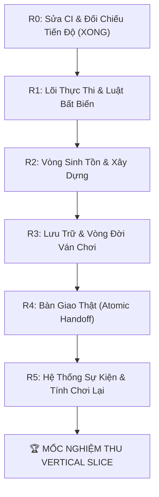

# Bản Đồ Lộ Trình Kỹ Thuật Tổng Thể (MASTER_ROADMAP.md)

> **Mục đích**: Bản đồ lộ trình thống nhất và duy nhất của dự án. Khóa chặt mục tiêu xây dựng **Bản Cắt Dọc Tối Thiểu (Vertical Slice R0 $\rightarrow$ R5)** trước khi mở rộng sang bất kỳ nội dung chuyên sâu nào.

---

## 1. Mục Tiêu Tối Thượng: Bản Cắt Dọc Tối Thiểu (Vertical Slice)

Mục tiêu giai đoạn hiện tại không phải là hoàn thiện toàn bộ các hệ thống 18+ hay đồ họa phức tạp, mà là chứng minh **vòng chơi quản lý sinh tồn cốt lõi hoạt động ổn định và có thể kiểm chứng được**:

> **Kịch bản nghiệm thu Vertical Slice**:  
> *Tạo world mới $\rightarrow$ Xây dựng nông trại & giếng nước $\rightarrow$ Phân công nhân lực $\rightarrow$ Tiến nhịp ngày (Day Tick) $\rightarrow$ Thấy sản xuất & tiêu thụ rõ ràng (tài nguyên không âm, thiếu hụt có giải trình nhân quả) $\rightarrow$ Lưu và tải lại game an toàn $\rightarrow$ Thực hiện Bàn giao (Handoff nguyên tử) $\rightarrow$ Lập thuộc địa mới (thuộc địa cũ trở thành Legacy tự vận hành) $\rightarrow$ Bắt đầu New Game+ mà world nguồn không bị phá hủy.*

---

## 2. Lộ Trình Triển Khai: Chặng 1 - Vertical Slice (R0 $\rightarrow$ R5)

### Gói R0: Đối Chiếu Tiến Độ & Chuẩn Hóa CI (ĐÃ HOÀN THÀNH)
* [x] Xóa bỏ workflow Deno không tương thích, thiết lập `.github/workflows/ci.yml` chuẩn Node.js 20.
* [x] Dọn sạch 2 unused imports gây lỗi lint trong `settlement.ts` và `command.ts`.
* [x] Chuẩn hóa [INTERNAL_PROGRESS_TRACKER.md](INTERNAL_PROGRESS_TRACKER.md) theo 4 cấp độ (L1: Đã định nghĩa $\rightarrow$ L4: Đã tích hợp).
* [x] Đồng bộ hóa Schema Quan hệ 8D giữa code và [GLOSSARY.md](GLOSSARY.md).

---

### Gói R1: Lõi Thực Thi & Luật Bất Biến (ƯU TIÊN SỐ 1)
* **Mục tiêu**: Thiết lập luồng xử lý Command $\rightarrow$ Invariant $\rightarrow$ Effect tập trung, loại bỏ hoàn toàn việc UI trực tiếp sửa state.
* **Các đầu việc cụ thể**:
  * [ ] Đồng bộ một Clock duy nhất trong `GameState` (loại bỏ biến `day` cục bộ trong UI).
  * [ ] Xây dựng Command Dispatcher trung tâm (`executeCommand(state, command) -> { nextState, effects, auditLog }`).
  * [ ] Hoàn thiện Invariant Validator:
    * `createNamedCharacter`: Deep clone object mặc định, chặn tuổi âm, clamp chỉ số [0, 100].
    * `PopulationCohort`: Bổ sung trường `socialClass` còn thiếu theo đúng thiết kế 3 trục thân phận.
  * [ ] Viết Unit Test tự động chứng minh: Lệnh sai bị từ chối; State không bị mutate dở dang; Invariant được bảo toàn.

---

### Gói R2: Vòng Sinh Tồn & Xây Dựng (Survival & Building Loop)
* **Mục tiêu**: Khắc phục dứt điểm lỗi kho âm và hoàn thiện vòng lặp Xây dựng $\rightarrow$ Sản xuất $\rightarrow$ Tiêu thụ.
* **Các đầu việc cụ thể**:
  * [ ] Triển khai logic tài nguyên sàn $0$: **Nhu Cầu (Demand) - Cấp Phát (Allocated) - Thiếu Hụt (Deficit)**. Kho không bao giờ âm; thiếu hụt sinh Effect trừ Sĩ khí/Sức khỏe kèm dòng giải trình WHY.
  * [ ] Sửa lỗi ngày báo cáo kinh tế: `simulateDailyEconomy` nhận vào ngày mô phỏng thực tế (thay vì cố định `dayCreated`).
  * [ ] Hiện thực hóa lệnh `BUILD_FACILITY` với 3 bản vẽ hiện có:
    * Kiểm tra điều kiện & trừ chi phí kho $\rightarrow$ Tạo công trình.
    * Gán công nhân lao động $\rightarrow$ Tính toán sản lượng hàng ngày (`production`) bù đắp tiêu thụ.
  * [ ] Viết Unit Test và Browser smoke test kiểm chứng kho không âm và sản xuất hoạt động.

---

### Gói R3: Lưu Trữ & Vòng Đời Ván Chơi (Persistence & Session Lifecycle)
* **Mục tiêu**: Đảm bảo tiến trình chơi được lưu và khôi phục an toàn, chuẩn bị nền tảng New Game+.
* **Các đầu việc cụ thể**:
  * [ ] Hiện thực hóa logic tuần tự hóa (`serializeWorld` / `deserializeWorld`).
  * [ ] Xử lý Save an toàn trên bản sao tạm (ngăn chặn hỏng save cũ khi ghi/đọc thất bại).
  * [ ] Hỗ trợ Xuất/Nhập file Save (`.json`) chéo giữa Web và máy tính.
  * [ ] Quy tắc vòng đời: New Game cô lập; Continue khôi phục chính xác toàn bộ Clock, NPC, Kho; New Game+ không làm hỏng World nguồn.

---

### Gói R4: Bàn Giao Thật (Atomic Handoff)
* **Mục tiêu**: Hiện thực hóa cơ chế đặc trưng nhất của game với sự bảo vệ tuyệt đối về luật chơi.
* **Các đầu việc cụ thể**:
  * [ ] Giao dịch Handoff nguyên tử: Bổ nhiệm Governor, phân chia tài sản, thu hồi quyền điều khiển trực tiếp của Player.
  * [ ] Cho phép Player có $0$ hoặc $1$ Active Settlement.
  * [ ] Thuộc địa cũ chuyển thành `legacy` và tự động cập nhật nền theo 4 quỹ đạo.
  * [ ] Viết Test chứng minh: Không nhân đôi NPC/tài sản; cấm Player gửi lệnh điều hành vào Legacy Settlement.

---

### Gói R5: Hệ Thống Sự Kiện & Tính Chơi Lại (Event Loop & Replayability)
* **Mục tiêu**: Đưa yếu tố ngẫu nhiên có kiểm soát và sự kiện có hệ quả vào game.
* **Các đầu việc cụ thể**:
  * [ ] Event Scheduler với RNG có seed (`worldSeed`).
  * [ ] Vài nhóm sự kiện sinh tồn mẫu (nguồn nước, bất mãn lao động, thương nhân vãng lai) có điều kiện kích hoạt, lịch sử lựa chọn và cooldown.
  * [ ] Giới hạn độ dài nhật ký lưu trữ (bounded log buffer) chống tràn bộ nhớ trong các ván chơi dài ngày.

---

## 3. Lộ Trình Mở Rộng: Chặng 2 - Nội Dung Chuyên Sâu (Post-Vertical Slice)

*Chỉ được phép kích hoạt sau khi Chặng 1 đã vượt qua toàn bộ tiêu chuẩn nghiệm thu và được Human phê duyệt:*

* **Phase C1**: Hệ thống Thể chất, Giải phẫu & Chỉ số 18+ (Anatomy, Beauty, Virginity).
* **Phase C2**: Động cơ Sinh sản & Di truyền học nhiều thế hệ (Pregmod Core).
* **Phase C3**: Tâm lý Thuần hóa, Kỷ cương & Sở thích tình dục (FC Conditioning).
* **Phase C4**: Cơ sở hạ tầng 18+ & Kinh tế chuyên biệt (Nhà thổ, Dinh thự, Viện nhân giống).
* **Phase C5**: Tích hợp Đồ họa 100% Thuần Pixel Art (Bản đồ Lưới ô bàn cờ, Chân dung Pixel Dolls, Ambient VFX).
* **Phase C6**: Đóng gói Đa nền tảng (Tauri Desktop) & Trình Nạp Mod Ngoại Vi (External Mod Loader).
