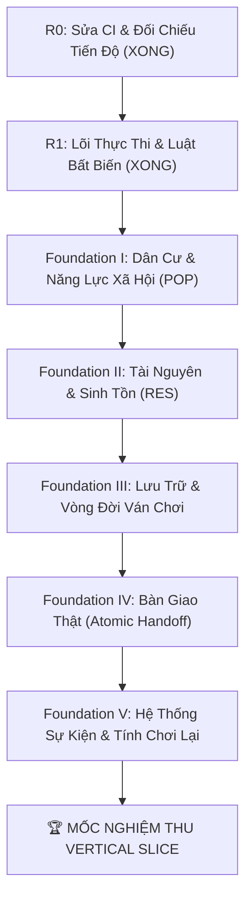

# Bản Đồ Lộ Trình Kỹ Thuật Tổng Thể (MASTER_ROADMAP.md)

> **Mục đích**: Bản đồ lộ trình thống nhất và duy nhất của dự án. Khóa chặt mục tiêu xây dựng **Bản Cắt Dọc Tối Thiểu (Vertical Slice R0 $\rightarrow$ R5)** trước khi mở rộng sang bất kỳ nội dung chuyên sâu nào.

---

## 1. Mục Tiêu Tối Thượng: Bản Cắt Dọc Tối Thiểu (Vertical Slice)

Mục tiêu giai đoạn hiện tại không phải là hoàn thiện toàn bộ các hệ thống 18+ hay đồ họa phức tạp, mà là chứng minh **vòng chơi quản lý sinh tồn cốt lõi hoạt động ổn định và có thể kiểm chứng được**:

> **Kịch bản nghiệm thu Vertical Slice**:  
> *Tạo world mới $\rightarrow$ Xây dựng nông trại & giếng nước $\rightarrow$ Phân công nhân lực $\rightarrow$ Tiến nhịp ngày (Day Tick) $\rightarrow$ Thấy sản xuất & tiêu thụ rõ ràng (tài nguyên không âm, thiếu hụt có giải trình nhân quả) $\rightarrow$ Lưu và tải lại game an toàn $\rightarrow$ Thực hiện Bàn giao (Handoff nguyên tử) $\rightarrow$ Lập thuộc địa mới (thuộc địa cũ trở thành Legacy tự vận hành) $\rightarrow$ Bắt đầu New Game+ mà world nguồn không bị phá hủy.*

---

## 2. Lộ Trình Triển Khai: Chặng 1 - Vertical Slice (R0 $\rightarrow$ R5)

### Gói R0: Đối Chiếu Tiến Độ & Chuẩn Hóa CI (ĐÃ HOÀN THÀNH)
* [x] Xóa bỏ workflow Deno không tương thích, thiết lập `.github/workflows/ci.yml` chuẩn Node.js 20.
* [x] Dọn sạch 2 unused imports gây lỗi lint trong `settlement.ts` và `command.ts`.
* [x] Chuẩn hóa [INTERNAL_PROGRESS_TRACKER.md](INTERNAL_PROGRESS_TRACKER.md) theo 4 cấp độ (L1: Đã định nghĩa $\rightarrow$ L4: Đã tích hợp).
* [x] Đồng bộ hóa Schema Quan hệ 8D giữa code và [GLOSSARY.md](GLOSSARY.md).

---

### Gói R1: Lõi Thực Thi & Luật Bất Biến (ĐÃ HOÀN THÀNH)
* [x] Đồng bộ một Clock duy nhất trong `GameState` (loại bỏ biến `day` cục bộ trong UI).
* [x] Xây dựng Command Dispatcher trung tâm (`executeCommand(state, command) -> { success, nextState, effects, auditEntries, data? }`).
* [x] Hoàn thiện Invariant Validator:
  * `createNamedCharacter`: Deep clone object mặc định, chặn tuổi âm, reject giá trị ngoài [0, 100].
  * `PopulationCohort`: Bổ sung trường `socialClass` bắt buộc theo đúng thiết kế 3 trục thân phận.
  * Validation Invariants hai chiều (0 hoặc 1 Active Settlement, Key-ID matching, tài nguyên không âm).
* [x] Viết 51 Unit Tests tự động và 1 Playwright smoke test chứng minh: Lệnh sai bị từ chối; State không bị mutate dở dang; Invariant được bảo toàn.
* [x] Merge PR #1 (`375b60e`) vào `main`, hậu kiểm CI `36527428842` pass 100%.

---

### Foundation I: Dân Cư & Năng Lực Xã Hội (WP-HAVEN-02) (ƯU TIÊN HIỆN TẠI)
* **Triết lý**: Dân số thật tạo ra các năng lực xã hội. Nhu cầu và mức ủng hộ quyết định bao nhiêu năng lực đó thực sự sử dụng được. Player phân bổ năng lực, không phân bổ từng đầu người.
* **Ranh giới phạm vi**:
  * **Named NPC $\rightarrow$ `NPC-01 Future`**: Decouple hoàn toàn khỏi Population Core.
  * **Resource Core $\rightarrow$ Foundation II**: Chỉ triển khai sau khi Population Core cung cấp đủ input Demand và Capacity ổn định.
* **Các đầu việc cụ thể**:
  * [x] **POP-01A: Class Resource Core** — **ĐÃ TRIỂN KHAI & KIỂM THỬ (L3 - Tested)** *(Merged PR #4 tại commit `b5c72e9`)*:
    * Khóa chuẩn Fixed-Point `SOCIAL_RESOURCE_SCALE = 1000` (integer milli-units, `Math.floor`).
    * Bộ giải mã chuẩn tắc `resolveEconomicProfile` từ canonical `PopulationCohort` với tiền lệ nô lệ (enslaved precedence) và ánh xạ toàn diện `SocialClass` (exhaustive SocialClass mapping).
    * Quy đổi các khối dân số trung gian (Population Blocks).
    * Hàm tính toán snapshot tổng hợp `calculateSocialResources` (pure calculator, không mutate state, tính toán headcount, populationBlocks, laborCapacityMilli, purchaseDemandCapacityMilli, survivalFoodNeedMilli, lifestyleFoodDemandMilli; chưa bao gồm Military/Tax capacity).
    * Nghiệm thu tuyệt đối 2 Benchmark Fixtures A/B và Edge cases 1/99/101 dân. Chưa tích hợp trực tiếp vào vòng chơi/UI/lưu trữ (chưa đạt L4).
  * [ ] **POP-01B: Needs & Effective Capacity**: **DESIGN ONLY**
    * Cơ chế Satisfaction, Tác động thiếu hụt & Mức ủng hộ (Support) sang nhịp $T \rightarrow T+1$.
  * [ ] **POP-01C: Labor Allocation**: **DESIGN ONLY**
    * Phân bổ năng lực lao động (Effective $\rightarrow$ Allocated Labor), không phân bổ từng đầu người.
  * [ ] **POP-02: Population Dynamics**: **DESIGN ONLY**
    * Di cư, xuất cư, dịch chuyển giai cấp, ngưỡng sức chứa bền vững, dòng người nộp đơn nhập cư (Immigration, Emigration, Class Mobility, Sustainable Capacity, Outside Applicants, Headcount flows - chưa bao gồm Sinh/Tử, Tháp tuổi hay mô phỏng thế hệ).
  * [ ] **POP-03: Law & Social Conflict**: **DESIGN ONLY**
    * Chính sách giai cấp, xung đột quyền lợi, trật tự xã hội.

---

### Foundation v2: Các Thành Phần Nền Tảng Đã Triển Khai (L3 - Tested)
*(Đã merge vào `main` qua PR #5 `699f32c` và hiệu chỉnh hợp đồng kiểm định qua PR #7 `a5b6bae`)*

* **Base Workforce v2 (L3)**:
  * Dân số thật (`Headcount`) luôn là nguồn chân lý duy nhất.
  * Quy đổi vĩ mô: **10 cư dân = 1 Base WF**; đơn vị nội bộ fixed-point **1 WF = 1000 milli-WF**.
  * Hệ số lao động giai cấp: Servile (2.0×), Lower (1.5×), Middle (1.0×), Upper/High (0× direct WF).
* **Effective Workforce Arithmetic (L3)**:
  * `calculateEffectiveWorkforceMilli(...)` là ranh giới số học thuần túy (pure arithmetic boundary), áp dụng hệ số điều chỉnh basis-point đã cung cấp (`modifierBps`) đúng một lần; không tự động tích hợp hay đọc trực tiếp City Effects, không thực hiện bộ giải mã Status $\rightarrow$ Effect; chưa thực hiện phân bổ công việc (`Assigned`/`Available` WF chưa triển khai).
* **Generic Resource Primitives (L3)**:
  * Các hàm nguyên thủy phân bổ tài nguyên bảo toàn sàn 0 và quy luật bảo toàn (`packages/core/src/resource/allocation.ts`); tách biệt rõ Nhu cầu $\rightarrow$ Cấp phát $\rightarrow$ Thiếu hụt.
  * *Lưu ý*: Foundation v2 đã thiết lập các hàm nguyên thủy phân bổ/dòng chảy (primitives), nhưng việc tích hợp toàn diện vào Resource Core (RES-01..04) vẫn đang mở.
* **City Effect Lifecycle (L3)**:
  * Quản lý vòng đời hiệu ứng đô thị có thời hạn (`packages/core/src/status/effects.ts`) với chu kỳ đếm lùi dùng chung 3 tuần (`shared 3-week countdown`), bậc cao thay thế bậc thấp mà không reset bộ đếm, chống làm mới chu kỳ (anti-refresh), trạng thái đối lập thay thế nhau không cộng dồn.
  * Phân biệt rõ hai tầng (không gộp lẫn):
    * **4 Thanh Trạng Thái Đô Thị Toàn Cục (Primary Global Status Bars)**: Happiness, Security, Goods, Corruption (kèm đầu vào bổ trợ: Food Fulfillment).
    * **4 Nhóm Hiệu Ứng Đô Thị (City Effect Families)**: `economy`, `security`, `qol`, `corruption`.
    * *Chưa có công thức bộ giải mã Status $\rightarrow$ City Effect nào được phê duyệt hay triển khai.*
* **Các Hạng Mục Rõ Ràng Chưa Triển Khai / Tạm Hoãn (Deferred / Unimplemented)**:
  * POP-01B Needs & Effective Capacity (DESIGN ONLY).
  * POP-01C Labor Allocation (DESIGN ONLY).
  * Assigned Workforce & Available Workforce.
  * Bộ giải mã Status $\rightarrow$ City Effect resolver (chưa khóa công thức Happiness + Food Fulfillment, Security, Corruption, QOL).
  * Tích hợp nhịp tuần `END_WEEK` / weekly resolver.
  * Tích hợp Foundation v2 vào UI Dashboard & Persistence / Save-Load.
  * Di chuyển kho (inventory migration), hệ thống Gold/thuế/tư bản, di cư/nhập cư, dịch chuyển giai cấp (Social Mobility), khủng hoảng/nổi loạn (Crisis/Revolt), Luật pháp (Law), Mở rộng Quyền hạn (Authority), Sự kiện (Events), Công trình & Bản đồ (Buildings/Map).

---

### Foundation II: Tài Nguyên & Vòng Sinh Tồn (Resource Core & Survival Loop)
* **Mục tiêu**: Xây dựng mô hình tài nguyên vật lý độc lập, kết nối Capacity & Demand từ Population Core vào vòng lặp Cấp phát $\rightarrow$ Tiêu thụ $\rightarrow$ Sản xuất.
* **Hiện trạng**: Foundation v2 đã thiết lập các hàm nguyên thủy phân bổ/dòng chảy sàn 0 (`packages/core/src/resource/allocation.ts`), nhưng việc tích hợp toàn diện Resource Core vẫn đang mở.
* **Các đầu việc cụ thể**:
  * [ ] **RES-01: Resource Model, Stock & Invariants**: Mô hình kho và biến thiên vật lý, bảo toàn sàn 0, tách biệt Physical Resources vs Social Capacities.
  * [ ] **RES-02: Demand $\rightarrow$ Allocation $\rightarrow$ Deficit / Surplus**: Động cơ cấp phát lương thực và nhu yếu phẩm từ đầu vào của Population Core.
  * [ ] **RES-03: Production, Conversion & Inflow-Outflow**: Chuyển hóa nguyên liệu thô, sản lượng, hao hụt tự nhiên.
  * [ ] **RES-04: Building & Physical Activity Integration**: Xây dựng công trình (`BUILD_FACILITY`), bố trí địa điểm, tích hợp hạ tầng vật lý sau khi Resource Core đã đứng vững độc lập.

---

### Gói R3: Lưu Trữ & Vòng Đời Ván Chơi (Persistence & Session Lifecycle)
* **Mục tiêu**: Đảm bảo tiến trình chơi được lưu và khôi phục an toàn, chuẩn bị nền tảng New Game+.
* **Các đầu việc cụ thể**:
  * [ ] Hiện thực hóa logic tuần tự hóa (`serializeWorld` / `deserializeWorld`).
  * [ ] Xử lý Save an toàn trên bản sao tạm (ngăn chặn hỏng save cũ khi ghi/đọc thất bại).
  * [ ] Hỗ trợ Xuất/Nhập file Save (`.json`) chéo giữa Web và máy tính.
  * [ ] Quy tắc vòng đời: New Game cô lập; Continue khôi phục chính xác toàn bộ Clock, NPC, Kho; New Game+ không làm hỏng World nguồn.

---

### Gói R4: Bàn Giao Thật (Atomic Handoff)
* **Mục tiêu**: Hiện thực hóa cơ chế đặc trưng nhất của game với sự bảo vệ tuyệt đối về luật chơi.
* **Các đầu việc cụ thể**:
  * [ ] Giao dịch Handoff nguyên tử: Bổ nhiệm Governor, phân chia tài sản, thu hồi quyền điều khiển trực tiếp của Player.
  * [ ] Cho phép Player có $0$ hoặc $1$ Active Settlement.
  * [ ] Thuộc địa cũ chuyển thành `legacy` và tự động cập nhật nền theo 4 quỹ đạo.
  * [ ] Viết Test chứng minh: Không nhân đôi NPC/tài sản; cấm Player gửi lệnh điều hành vào Legacy Settlement.

---

### Gói R5: Hệ Thống Sự Kiện & Tính Chơi Lại (Event Loop & Replayability)
* **Mục tiêu**: Đưa yếu tố ngẫu nhiên có kiểm soát và sự kiện có hệ quả vào game.
* **Các đầu việc cụ thể**:
  * [ ] Event Scheduler với RNG có seed (`worldSeed`).
  * [ ] Vài nhóm sự kiện sinh tồn mẫu (nguồn nước, bất mãn lao động, thương nhân vãng lai) có điều kiện kích hoạt, lịch sử lựa chọn và cooldown.
  * [ ] Giới hạn độ dài nhật ký lưu trữ (bounded log buffer) chống tràn bộ nhớ trong các ván chơi dài ngày.

---

## 3. Lộ Trình Mở Rộng: Chặng 2 - Nội Dung Chuyên Sâu (Post-Vertical Slice)

*Chỉ được phép kích hoạt sau khi Chặng 1 đã vượt qua toàn bộ tiêu chuẩn nghiệm thu và được Human phê duyệt:*

* **Phase C1**: Hệ thống Thể chất, Giải phẫu & Chỉ số 18+ (Anatomy, Beauty, Virginity).
* **Phase C2**: Động cơ Sinh sản & Di truyền học nhiều thế hệ (Pregmod Core).
* **Phase C3**: Tâm lý Thuần hóa, Kỷ cương & Sở thích tình dục (FC Conditioning).
* **Phase C4**: Cơ sở hạ tầng 18+ & Kinh tế chuyên biệt (Nhà thổ, Dinh thự, Viện nhân giống).
* **Phase C5**: Tích hợp Đồ họa 100% Thuần Pixel Art (Bản đồ Lưới ô bàn cờ, Chân dung Pixel Dolls, Ambient VFX).
* **Phase C6**: Đóng gói Đa nền tảng (Tauri Desktop) & Trình Nạp Mod Ngoại Vi (External Mod Loader).
