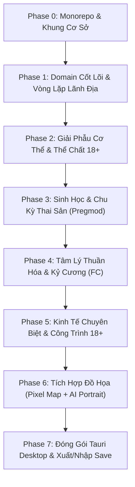

# Bản Đồ Lộ Trình Kỹ Thuật Tổng Thể (MASTER_ROADMAP.md)

> **Mục đích**: Tài liệu này đóng vai trò là "Thước đo chuẩn mực" và "Bản đồ thi công" phân kỳ cho toàn bộ các AI Agent và lập trình viên tham gia phát triển dự án.

---

## 1. Tiêu Chuẩn Kỹ Thuật & Điều Kiện Hoàn Thành (Definition of Done - DoD)

Bất kỳ tính năng hoặc giai đoạn (Phase) nào được coi là hoàn thành khi và chỉ khi thỏa mãn đồng thời 8 tiêu chí sau:

1. **Tuân thủ Kiến trúc Headless**: Mã nguồn mô phỏng nằm trong `packages/core` và `packages/simulation` hoàn toàn độc lập với DOM và UI framework.
2. **Type Safety 100%**: Biên dịch thành công với TypeScript Strict Mode, không có `any`, không có lỗi cú pháp hoặc cảnh báo kiểu.
3. **Độ bao phủ Kiểm thử (Automated Tests)**: Mọi domain model và hàm tính toán mới đều có ít nhất 1 test suite trong Vitest kiểm chứng các trường hợp thông thường (*happy path*) và trường hợp biên (*edge cases*).
4. **Build Thành Công**: Lệnh `npm test` và `npm run build` chạy thành công không có lỗi.
5. **Cập nhật Tiến độ & Bách khoa toàn thư**: Đã ghi nhận thay đổi vào [INTERNAL_PROGRESS_TRACKER.md](file:///d:/NghienCuuTiemNang/Build-Settlement/docs/INTERNAL_PROGRESS_TRACKER.md) và cập nhật cơ chế vào [ENCYCLOPEDIA_MECHANICS.md](file:///d:/NghienCuuTiemNang/Build-Settlement/docs/ENCYCLOPEDIA_MECHANICS.md).
6. **Tiêu chuẩn Siêu Nhẹ (Lightweight Footprint)**: Giữ dung lượng tải về và mức tiêu thụ RAM ở mức tối thiểu. Gói UI build ra duy trì dưới 200KB gzip. Không dùng thư viện bên ngoài nếu có thể tự viết bằng logic thuần.
7. **Kiến trúc Hướng Modding (Modding-First)**: Mọi định nghĩa về công trình, sự kiện, lời thoại, trait tính cách PHẢI được lưu ở dạng file JSON/Data Schema trong `packages/content/`, sẵn sàng cho cơ chế nạp đè (override) từ thư mục `mods/`.
8. **Chống Phình Code & Thân Thiện Với Context AI (The 200-Line Limit)**: Không cho phép bất kỳ file mã nguồn nào vượt quá 200 dòng. Khi một file có nguy cơ phình to, Agent bắt buộc phải chia tách thành module con độc lập để đảm bảo bất kỳ Agent nào kế thừa cũng đọc hiểu trọn vẹn trong 1 lần gọi công cụ.

---

## 2. Phân Kỳ Các Giai Đoạn Phát Triển (Development Phases)

---

### Phase 0: Hạ Tầng Monorepo & Công Cụ Phát Triển (ĐÃ HOÀN THÀNH)
* [x] Cấu hình npm workspaces với 5 packages: `core`, `simulation`, `content`, `persistence`, `ui`.
* [x] Cấu hình `tsconfig.base.json` theo chế độ TypeScript Strict.
* [x] Cấu hình bộ khung kiểm thử Vitest và đóng gói giao diện Vite + Svelte 5.
* [x] Thiết lập kho lưu trữ Git và kiểm thử tự động.

---

### Phase 1: Lõi Domain Nền Tảng & Vòng Đời Lãnh Địa (ĐÃ HOÀN THÀNH)
* [x] Mô hình 3 trục thân phận độc lập (`Occupation`, `SocialClass`, `LegalStatus`).
* [x] Hệ thống Quan hệ 8 chiều (`trust, respect, affection, fear, debt, lust, obedience, resentment`).
* [x] Hệ thống Ký ức nhân vật (`MemoryEntry`, `MemoryEffect`).
* [x] Hai tầng dân số (`Named NPC` và `PopulationCohort`).
* [x] Vòng đời lãnh địa (`SettlementLifecycle: unexplored -> active -> handoff -> legacy`).
* [x] Đồng hồ thời gian và Lõi kinh tế cơ bản hàng ngày (Tiêu thụ lương thực, nước sạch).
* [x] Giao diện mẫu Svelte 5 hiển thị Dashboard tài nguyên và Audit Log ("WHY").

---

### Phase 2: Hệ Thống Giải Phẫu Cơ Thể & Chỉ Số 18+ (TIẾP THEO)
* **Mục tiêu**: Hiện thực hóa mô hình thể chất chi tiết kế thừa từ *Free Cities*.
* **Các đầu việc cụ thể**:
  * [ ] Tạo `packages/core/src/domain/anatomy.ts`:
    * Chỉ số đo lường cơ thể: Chiều cao, cân nặng, tỷ lệ eo/hông/ngực, kích thước vòng 1, vòng 3, cơ quan sinh dục.
    * Ngoại hình & Độ quyến rũ: Điểm nhan sắc tự nhiên (*beauty*), màu da, màu mắt, kiểu tóc.
    * Tình trạng trinh tiết (*virginity*) và kinh nghiệm quan hệ ở từng khía cạnh.
  * [ ] Cơ chế Biến đổi Thể chất (*Modifications & Augmentations*):
    * Vết xăm nô lệ định danh (*Slave tattoo*), xỏ khuyên, vòng cổ (*Collar*).
    * Sẹo vết thương chiến tranh và phẫu thuật tạo hình.
  * [ ] Viết Unit Test xác thực tính toán điểm quyến rũ (*Attractiveness score*) và biến động chỉ số.

---

### Phase 3: Động Cơ Sinh Sản & Di Truyền Học (Pregmod Core)
* **Mục tiêu**: Đưa toàn bộ cơ chế mang thai, sinh nở và di truyền nhiều thế hệ vào chu kỳ thời gian hàng ngày.
* **Các đầu việc cụ thể**:
  * [ ] Tạo `packages/core/src/domain/gestation.ts`:
    * Độ màu mỡ sinh sản (*Fertility*), chu kỳ rụng trứng, tỷ lệ thụ tinh thành công.
    * Trạng thái thai kỳ: Người cha danh nghĩa, ngày thụ thai, tuần thai hiện tại, biến chứng tiềm ẩn.
  * [ ] Tạo `packages/simulation/src/gestation.ts`:
    * Hàm tick hàng ngày `tickGestation()`: Cập nhật kích thước bụng bầu, tác động lên năng suất lao động và sức khỏe.
    * Tự động kích hoạt sự kiện chuyển dạ sinh nở (*Childbirth event*) khi đạt đủ thời gian thai kỳ.
  * [ ] Cơ chế Di truyền thế hệ con cháu (*Genetics Inheritance*):
    * Đứa trẻ sinh ra thừa hưởng các đặc điểm dung mạo, màu tóc, chỉ số tiềm năng từ cha và mẹ.
    * Thêm NPC mới vào danh sách dân cư của lãnh địa.
  * [ ] Cơ chế Tiết sữa mẹ (*Lactation*) và điều trị y tế sản khoa.

---

### Phase 4: Hệ Thống Tâm Lý Thuần Hóa & Kỷ Cương (FC Conditioning)
* **Mục tiêu**: Xây dựng cơ chế tương tác quyền lực, kỷ luật và thuần hóa giữa Lãnh chúa và cư dân/nô lệ.
* **Các đầu việc cụ thể**:
  * [ ] Tạo `packages/core/src/domain/conditioning.ts`:
    * 4 chỉ số tâm lý rèn luyện: Phục tùng (*Obedience*), Tôn sùng (*Devotion*), Sợ hãi (*Fear*), Lòng tin (*Trust*).
    * Ý chí kháng cự (*Willpower*) và ngưỡng sụp đổ tinh thần (*Mental break*).
    * Danh mục sở thích tình dục (*Kinks/Fetishes*): Thích thuần phục (*submissive*), thích mang thai (*breeding fetish*), khổ dâm (*masochist*)...
  * [ ] Luật Tương Tác Tâm Lý:
    * Thưởng/Phạt, thẩm vấn, cưỡng chế, nuông chiều, ban tặng ân huệ.
    * Chấn thương tâm lý (*Trauma*) vs. Hội chứng lệ thuộc sùng kính (*Stockholm Syndrome*).
  * [ ] Tích hợp chặt chẽ với `MemorySystem`: Tạo ra các ký ức sâu đậm thay đổi vĩnh viễn thái độ của NPC.

---

### Phase 5: Kinh Tế Chuyên Biệt & Cơ Sở Hạ Tầng 18+
* **Mục tiêu**: Kết nối các cơ sở đặc thù vào mạng lưới tài nguyên và ngân khố của lãnh địa.
* **Các đầu việc cụ thể**:
  * [ ] Bổ sung các bản vẽ công trình vào `packages/content/src/buildings.json`:
    * **Nhà Thổ Lãnh Địa (Arcade / Brothel)**: Phân công nhân sự phục vụ, tạo thu nhập Ngân khố, giảm bất mãn của khối Công nhân & Lính bảo an.
    * **Dinh Thự Lãnh Chúa (Master Quarters)**: Không gian riêng cho Lãnh chúa và các ái thiếp/nô lệ yêu thích.
    * **Trại Huấn Luyện Nô Lệ (Conditioning Center)**: Tăng tốc độ tăng Obedience, giảm Willpower.
    * **Viện Dưỡng Thai & Nhân Giống (Breeding Nursery)**: Tối ưu hóa tỷ lệ sinh nở an toàn và nuôi dưỡng thế hệ sau.
  * [ ] Thiết lập Hiến chương Tình dục & Hôn nhân (*Sexual Policies & Charters*).

---

### Phase 6: Tích Hợp Đồ Họa 100% Thuần Pixel Art & Bản Đồ Ô Bàn Cờ (Chessboard Grid)
* **Mục tiêu**: Nâng cấp giao diện với phong cách 100% Thuần Pixel Art, bản đồ lưới ô bàn cờ chiến thuật và bảng màu dịu mắt, thuận thị giác.
* **Các đầu việc cụ thể**:
  * [ ] Xây dựng Bản Đồ Lưới Ô Bàn Cờ (Chessboard Grid Canvas):
    * Lưới ô vuông/isometric kiểu bàn cờ phân chia các ô đất, ô tài nguyên (nước, đá, rừng).
    * Cơ chế tương tác kề cận (Adjacency Bonus: Xây xưởng gần kho giúp tăng sản lượng, xây nhà thổ gần doanh trại giúp giảm nhanh bất mãn).
    * Sprite công trình và cư dân tí hon chuyển động dạng Pixel Art.
  * [ ] Xây dựng Trình Hiển Thị Chân Dung Pixel Art (Pixel Doll Portrait):
    * Khung hiển thị chân dung nhân vật 100% Pixel Art độ nét cao (16/32-bit).
    * Ghép lớp linh hoạt (*Pixel Doll Layers*): Khuôn mặt, kiểu tóc, trang phục, các giai đoạn bụng bầu, vết xăm/vòng cổ nô lệ.
  * [ ] Bộ Sưu Tập Tranh Toàn Cảnh Pixel Art (Pixel CG Milestones):
    * Các bức tranh sự kiện 18+ toàn màn hình vẽ theo phong cách Pixel Art nghệ thuật.
  * [ ] Thiết Kế Giao Diện Tối Ưu, Màu Sắc Thuận Mắt (Ergonomic Eye-friendly Theme):
    * Bảng màu êm dịu, tương phản vừa phải (Warm Dark / Earthy Retro), bảo vệ mắt người chơi khi trải nghiệm lâu.
    * Hỗ trợ nút gạt chuyển đổi **Song Ngữ Song Song (EN / VI)** trực tiếp trên thanh điều hướng.

---

### Phase 7: Đóng Gói Đa Nền Tảng, Đồng Bộ Save & Modding Engine
* **Mục tiêu**: Xuất xưởng đồng thời bản Web Online và bản PC Desktop Offline, mở toang khả năng Modding cho cộng đồng.
* **Các đầu việc cụ thể**:
  * [ ] Hệ thống Lưu trữ IndexedDB trên Web: Tự động lưu mỗi ngày (Day Tick), không giới hạn dung lượng.
  * [ ] Nút Xuất Save (`.sav` / JSON nén) và Nhập Save chéo giữa Web và Máy tính.
  * [ ] Cấu hình **Tauri** để biên dịch thành file cài đặt Desktop `.exe` siêu nhẹ cho Windows/macOS.
  * [ ] **Hệ thống Nạp Mod Ngoại Vi (External Mod Loader)**:
    * Tự động quét thư mục `mods/portraits/` để nạp ảnh chân dung AI của người chơi tự chế đè lên ảnh gốc.
    * Tự động quét thư mục `mods/buildings/` và `mods/events/` để nạp thêm công trình và sự kiện 18+ viết bằng JSON.
    * Hệ thống Event Hooks (`onDayTick`, `onIntimacy`, `onChildbirth`) cho phép modder can thiệp vào logic game.
