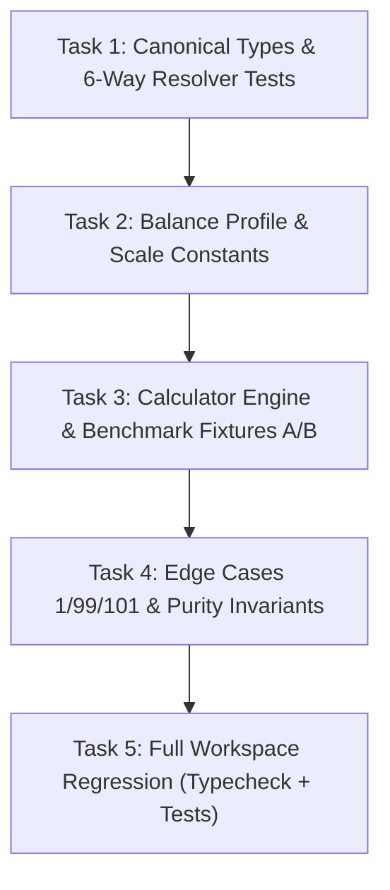

# Kế Hoạch Triển Khai Kỹ Thuật (Implementation Plan): POP-01A
# Gói: Class Resource Core (Foundation I — Population)

> **Mã gói**: `POP-01A`  
> **Tài liệu đặc tả nguồn**: [WP-HAVEN-02_Unified_v1.0.md](file:///d:/NghienCuuTiemNang/Build-Settlement/docs/work_packages/WP-HAVEN-02_Unified_v1.0.md) (v1.5)  
> **Commit nền**: `913d981897b8e64886f12e335f8dd6d4af1918de` (nhánh `main`)  
> **Trạng thái**: Chờ duyệt Plan $\rightarrow$ Mở nhánh `feat/pop-01a-social-resource-core` để thi công  
> **Mục tiêu**: Xây dựng module tính toán năng lực kinh tế - xã hội thuần túy (Pure Snapshot Calculator) cấp Population Cohort với chuẩn Fixed-Point `milli-units`, triệt tiêu hoàn toàn hiện tượng vách đá số học (cliff) và tách bạch sinh học vs lối sống.

---

## 1. Ranh Giới Phạm Vi Tuyệt Đối (Strict Allowlist)

Chỉ được phép tạo mới và chỉnh sửa đúng **4 files** thuộc `packages/core/src/social/`:

| STT | Đường Dẫn File | Trách Nhiệm Duy Nhất |
| :---: | :--- | :--- |
| 1 | `packages/core/src/social/types.ts` | Khai báo kiểu macro (`EconomicProfileKey`, `ClassResourceProfile`, `SocialResourceSnapshot`). Tái sử dụng kiểu canonical từ R1. |
| 2 | `packages/core/src/social/profile.ts` | Hằng số quy chuẩn `SOCIAL_RESOURCE_SCALE = 1000` và cấu hình cân bằng khởi đầu `INITIAL_BALANCE_PROFILE`. |
| 3 | `packages/core/src/social/calculator.ts` | Các hàm thuần túy: `calculatePopulationBlocks`, `resolveEconomicProfile`, `calculateSocialResources`. |
| 4 | `packages/core/src/social/__tests__/pop01a_resource_core.test.ts` | Bộ Unit Test độc lập kiểm chứng toàn bộ tiêu chuẩn nghiệm thu AC-POP01A-01 $\rightarrow$ 07. |

### Danh Sách Cấm (Strict Denylist)
* ❌ **Không export** module `social` từ `packages/core/src/index.ts` (tránh mở rộng public API surface khi chưa có command/state nối vào).
* ❌ **Không sửa UI** (`packages/ui`).
* ❌ **Không sửa Command Dispatcher** (`packages/simulation/src/dispatcher.ts`).
* ❌ **Không can thiệp Simulation Tick** hay `ADVANCE_DAY`.
* ❌ **Không can thiệp Resource Inventory / Kho** (`packages/core/src/domain/resource.ts`, `economy.ts`).
* ❌ **Không can thiệp hay mô phỏng Named NPC** (đã cắt sang `NPC-01 Future`).
* ❌ **Không can thiệp Building / Xây dựng**.

---

## 2. Đặc Tả Hợp Đồng Kỹ Thuật (Technical Contracts)

### A. Tái sử dụng Canonical Types từ R1 (`types.ts`)
```ts
import type { PopulationCohort } from "../domain/population.js";
import type { SocialClass, LegalStatus } from "../domain/character.js";

export type EconomicProfileKey = "servile" | "lower" | "middle" | "upper";

export interface ClassResourceProfile {
  laborMultiplierMilli: number;
  purchaseDemandMultiplierMilli: number;
  lifestyleFoodMultiplierMilli: number;
}

export interface SocialResourceSnapshot {
  headcount: number;
  populationBlocks: number; // pure derived: headcount / 100 (for display)
  laborCapacityMilli: number; // integer milli-units
  purchaseDemandCapacityMilli: number; // integer milli-units
  survivalFoodNeedMilli: number; // integer milli-units (headcount * 1.0)
  lifestyleFoodDemandMilli: number; // integer milli-units (theo giai cấp)
}
```

### B. Hằng số & Bảng Tham Số Khởi Đầu (`profile.ts`)
```ts
export const SOCIAL_RESOURCE_SCALE = 1000;

export const INITIAL_BALANCE_PROFILE: Record<EconomicProfileKey, ClassResourceProfile> = {
  servile: {
    laborMultiplierMilli: 2000,
    purchaseDemandMultiplierMilli: 1000,
    lifestyleFoodMultiplierMilli: 500,
  },
  lower: {
    laborMultiplierMilli: 1500,
    purchaseDemandMultiplierMilli: 1000,
    lifestyleFoodMultiplierMilli: 1000,
  },
  middle: {
    laborMultiplierMilli: 1000,
    purchaseDemandMultiplierMilli: 1500,
    lifestyleFoodMultiplierMilli: 1000,
  },
  upper: {
    laborMultiplierMilli: 500,
    purchaseDemandMultiplierMilli: 2000,
    lifestyleFoodMultiplierMilli: 2000,
  },
};
```

### C. Logic Thuật Toán Thuần Túy (`calculator.ts`)
1. **`calculatePopulationBlocks(headcount: number): number`**:
   $$\text{blocks} = \frac{\text{headcount}}{100}$$
2. **`resolveEconomicProfile(cohort: PopulationCohort): EconomicProfileKey`**:
   Ánh xạ chính xác 6 nhánh (không fallback ngầm, không tạo hệ class thứ hai):
   - `cohort.legalStatus === "enslaved"` $\rightarrow$ `"servile"`
   - `cohort.socialClass === "lower"` (`legalStatus !== "enslaved"`) $\rightarrow$ `"lower"`
   - `cohort.socialClass === "common"` (`legalStatus !== "enslaved"`) $\rightarrow$ `"middle"`
   - `cohort.socialClass === "skilled"` (`legalStatus !== "enslaved"`) $\rightarrow$ `"middle"`
   - `cohort.socialClass === "administrative"` (`legalStatus !== "enslaved"`) $\rightarrow$ `"upper"`
   - `cohort.socialClass === "elite"` (`legalStatus !== "enslaved"`) $\rightarrow$ `"upper"`
3. **`calculateSocialResources(cohorts: PopulationCohort[], profileMap = INITIAL_BALANCE_PROFILE): SocialResourceSnapshot`**:
   Với từng cohort:
   $$\text{laborMilli} = \left\lfloor \frac{\text{count} \times \text{laborMultiplierMilli}}{100} \right\rfloor$$
   $$\text{purchaseMilli} = \left\lfloor \frac{\text{count} \times \text{purchaseDemandMultiplierMilli}}{100} \right\rfloor$$
   $$\text{survivalFoodMilli} = \left\lfloor \frac{\text{count} \times \text{SOCIAL\_RESOURCE\_SCALE}}{100} \right\rfloor$$
   $$\text{lifestyleFoodMilli} = \left\lfloor \frac{\text{count} \times \text{lifestyleFoodMultiplierMilli}}{100} \right\rfloor$$
   Cộng dồn trên toàn bộ danh sách `cohorts`. Trả về `SocialResourceSnapshot` mới (zero mutation).

---

## 3. Kế Hoạch Thi Công Từng Bước (Task Breakdown)

Kế hoạch chia thành **5 bước tuần tự ngắn gọn**, tuân thủ TDD (Test-Driven Development):



### Task 1: Resolver Tests & Canonical Imports
* Tạo `packages/core/src/social/types.ts` với đầy đủ types và import canonical từ R1.
* Viết test trong `packages/core/src/social/__tests__/pop01a_resource_core.test.ts` kiểm thử toàn diện 6 nhánh của `resolveEconomicProfile`:
  - `enslaved` với bất kỳ `socialClass` nào luôn ra `servile`.
  - `lower` + non-enslaved $\rightarrow$ `lower`.
  - `common` + non-enslaved $\rightarrow$ `middle`.
  - `skilled` + non-enslaved $\rightarrow$ `middle`.
  - `administrative` + non-enslaved $\rightarrow$ `upper`.
  - `elite` + non-enslaved $\rightarrow$ `upper`.
* Triển khai hàm `resolveEconomicProfile` trong `packages/core/src/social/calculator.ts` để pass test.

### Task 2: Balance Profile & Fixed-Point Constants
* Tạo `packages/core/src/social/profile.ts` chứa `SOCIAL_RESOURCE_SCALE = 1000` và `INITIAL_BALANCE_PROFILE`.
* Viết test kiểm tra tính toàn vẹn của config:
  - 4 key: `servile`, `lower`, `middle`, `upper`.
  - Giá trị multiplier đúng với bảng đặc tả v0.1.

### Task 3: Calculator Engine & Benchmark Fixtures A/B
* Viết test kiểm thử 2 Fixtures nghiệm thu chuẩn:
  - **Fixture A (Canonical Scale)**: 10.000 lower, 1.000 enslaved, 3.000 middle, 500 upper.
    - Headcount: $14.500$, Blocks: $145.0$.
    - Labor: $202.500$ milli ($202,5$).
    - Purchase Demand: $165.000$ milli ($165,0$).
    - Survival Food: $145.000$ milli ($145,0$).
    - Lifestyle Food: $145.000$ milli ($145,0$).
  - **Fixture B (Formula Discrimination)**: 9.700 lower, 1.000 enslaved, 3.000 skilled, 800 administrative.
    - Headcount: $14.500$, Blocks: $145.0$.
    - Labor: $199.500$ milli ($199,5$).
    - Purchase Demand: $168.000$ milli ($168,0$).
    - Survival Food: $145.000$ milli ($145,0$).
    - Lifestyle Food: $148.000$ milli ($148,0$).
    - Bắt buộc kiểm tra khẳng định: $\mathbf{SurvivalFoodMilli (145.000) \ne LifestyleFoodDemandMilli (148.000)}$.
* Triển khai `calculatePopulationBlocks` và `calculateSocialResources` trong `calculator.ts` để pass test.

### Task 4: Edge Cases 1/99/101 & Purity Invariants
* Viết test kiểm thử tính liên tục và chống block cliff (Lower Class - $1.500$ milli):
  - $1$ cư dân $\rightarrow$ đúng $15$ milli ($0,015$).
  - $99$ cư dân $\rightarrow$ đúng $1.485$ milli ($1,485$). Không bị cliff về 0.
  - $101$ cư dân $\rightarrow$ đúng $1.515$ milli ($1,515$).
  - Mảng rỗng `[]` $\rightarrow$ toàn bộ 0.
* Viết test chứng minh tính thuần túy (Purity / Immutability):
  - Object và mảng cohort đầu vào không bị biến đổi (Deep equality trước và sau khi gọi hàm).

### Task 5: Full Workspace Regression Verification
* Chạy `npm run typecheck` trên toàn bộ workspace:
  - `typecheck:core`
  - `typecheck:simulation`
  - `typecheck:persistence`
  - `typecheck:content`
  - `typecheck:ui`
* Chạy toàn bộ test suite `npm test`:
  - 51 tests R1 cũ + các tests mới của POP-01A.
  - Kiểm tra luật kiến trúc: `packages/core/src/__tests__/architecture.test.ts` (không import simulation, không chứa DOM/UI).

---

## 4. Ma Trận Tiêu Chí Nghiệm Thu (Acceptance Checklist)

| Tiêu Chí | Nội Dung Kiểm Chứng | Phương Thức Đánh Giá |
| :--- | :--- | :---: |
| **AC-POP01A-01** | Hằng số `SOCIAL_RESOURCE_SCALE = 1000`. Integer milli-units với `Math.floor`. | Unit Test |
| **AC-POP01A-02** | Fixture A khớp chính xác 100% với bảng đặc tả. | Unit Test |
| **AC-POP01A-03** | Fixture B chứng minh $\text{Survival Food} (145.000) \ne \text{Lifestyle Food} (148.000)$. | Unit Test |
| **AC-POP01A-04** | Edge cases 1, 99, 101 cư dân xác nhận lũy tiến liên tục, 99 dân = 1.485 milli, không cliff. | Unit Test |
| **AC-POP01A-05** | `calculateSocialResources` là pure function, zero mutation, zero side effect. | Unit Test |
| **AC-POP01A-06** | `resolveEconomicProfile` đúng và đủ 100% cho 6 nhánh canonical, không fallback ngầm. | Unit Test |
| **AC-POP01A-07** | `types.ts` import canonical từ `domain/population.js` & `domain/character.js`; không tái định nghĩa. | Architecture / Typecheck |
| **AC-POP01A-08** | Không export module `social` ra ngoài `packages/core/src/index.ts`. | Review Allowlist |
