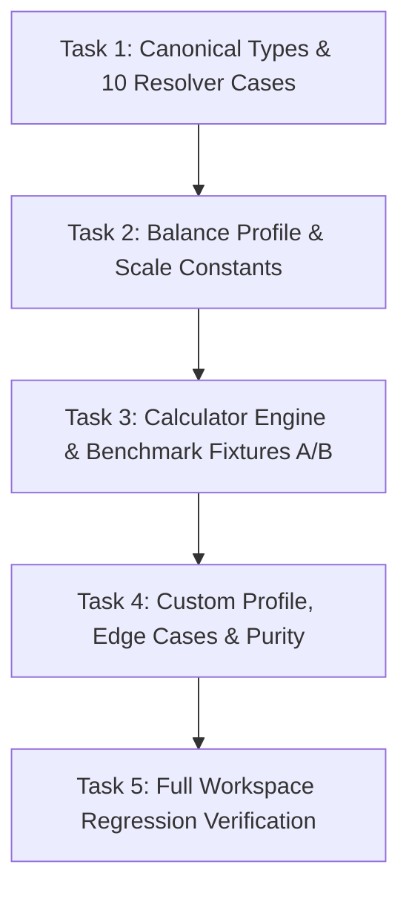

# Kế Hoạch Triển Khai Kỹ Thuật (Implementation Plan): POP-01A
# Gói: Class Resource Core (Foundation I — Population)

> **Mã gói**: `POP-01A`  
> **Tài liệu đặc tả nguồn**: [WP-HAVEN-02_Unified_v1.0.md](./WP-HAVEN-02_Unified_v1.0.md) (v1.5)  
> **Commit nền**: Nhánh `main` sau khi merge PR #3 (exact commit SHA sẽ được khóa tại biên bản bàn giao G2)  
> **Trạng thái**: G1 Approved / Closed $\rightarrow$ Chờ duyệt Plan để mở nhánh `feat/pop-01a-social-resource-core` thi công  
> **Mục tiêu**: Xây dựng module tính toán năng lực kinh tế - xã hội thuần túy (Pure Snapshot Calculator) cấp Population Cohort với chuẩn Fixed-Point `milli-units`, triệt tiêu hoàn toàn hiện tượng vách đá số học (cliff) và tách bạch sinh học vs lối sống.

---

## 1. Ranh Giới Phạm Vi & Điều Kiện Tiền Đề (Scope & Preconditions)

### A. Phạm Vi Files Cho Phép (Strict Allowlist — Đúng 4 Files)
Chỉ được phép tạo mới và chỉnh sửa đúng 4 files trong `packages/core/src/social/`:
1. `packages/core/src/social/types.ts`
2. `packages/core/src/social/profile.ts`
3. `packages/core/src/social/calculator.ts`
4. `packages/core/src/social/__tests__/pop01a_resource_core.test.ts`

### B. Danh Sách Cấm Tuyệt Đối (Strict Denylist)
* ❌ **Không export** module `social` từ `packages/core/src/index.ts` (slice chỉ tập trung chứng minh pure calculation qua unit test trực tiếp, tránh mở rộng public API surface khi chưa tích hợp Command/State).
* ❌ **Không sửa UI** (`packages/ui`).
* ❌ **Không sửa Command Dispatcher** (`packages/simulation/src/dispatcher.ts`).
* ❌ **Không can thiệp Simulation Tick** hay `ADVANCE_DAY`.
* ❌ **Không can thiệp Resource Inventory / Kho** (`packages/core/src/domain/resource.ts`, `economy.ts`).
* ❌ **Không can thiệp hay mô phỏng Named NPC** (đã tách sang `NPC-01 Future`).
* ❌ **Không can thiệp Building / Xây dựng**.

### C. Khóa Điều Kiện Tiền Đề (Preconditions & Anti-YAGNI)
* `calculateSocialResources` và `resolveEconomicProfile` giả định mảng `cohorts` đầu vào đã tuân thủ đầy đủ các domain invariants của R1 (được khởi tạo/kiểm định thông qua `createPopulationCohort` tại `packages/core/src/domain/population.ts`).
* **POP-01A TUYỆT ĐỐI KHÔNG thêm duplicate validation** cho count âm, NaN, chuỗi rỗng hay malformed state. Không tự tạo custom exception/error subsystem.

---

## 2. Đặc Tả Hợp Đồng Kỹ Thuật (Exact Technical Contracts)

### A. Canonical Imports & Macro Types (`types.ts`)
```ts
import type { PopulationCohort } from "../domain/population.js";
import type { SocialClass, LegalStatus } from "../domain/character.js";

export type EconomicProfileKey = "servile" | "lower" | "middle" | "upper";

export interface ClassResourceProfile {
  laborMultiplierMilli: number;
  purchaseDemandMultiplierMilli: number;
  lifestyleFoodMultiplierMilli: number;
}

export interface SocialResourceSnapshot {
  headcount: number;
  populationBlocks: number; // derived display: headcount / 100
  laborCapacityMilli: number; // integer milli-units
  purchaseDemandCapacityMilli: number; // integer milli-units
  survivalFoodNeedMilli: number; // integer milli-units (headcount * 1.0)
  lifestyleFoodDemandMilli: number; // integer milli-units (theo giai cấp)
}
```

### B. Hằng Số & Bảng Tham Số Khởi Đầu (`profile.ts`)
```ts
import type { EconomicProfileKey, ClassResourceProfile } from "./types.js";

export const SOCIAL_RESOURCE_SCALE = 1000;

export const INITIAL_BALANCE_PROFILE: Record<EconomicProfileKey, ClassResourceProfile> = {
  servile: {
    laborMultiplierMilli: 2000,
    purchaseDemandMultiplierMilli: 1000,
    lifestyleFoodMultiplierMilli: 500,
  },
  lower: {
    laborMultiplierMilli: 1500,
    purchaseDemandMultiplierMilli: 1000,
    lifestyleFoodMultiplierMilli: 1000,
  },
  middle: {
    laborMultiplierMilli: 1000,
    purchaseDemandMultiplierMilli: 1500,
    lifestyleFoodMultiplierMilli: 1000,
  },
  upper: {
    laborMultiplierMilli: 500,
    purchaseDemandMultiplierMilli: 2000,
    lifestyleFoodMultiplierMilli: 2000,
  },
};
```

### C. Logic Thuật Toán Thuần Túy (`calculator.ts`)
```ts
import type { PopulationCohort } from "../domain/population.js";
import type { EconomicProfileKey, ClassResourceProfile, SocialResourceSnapshot } from "./types.js";
import { SOCIAL_RESOURCE_SCALE } from "./profile.js";

export function calculatePopulationBlocks(headcount: number): number;
export function resolveEconomicProfile(cohort: PopulationCohort): EconomicProfileKey;
export function calculateSocialResources(
  cohorts: PopulationCohort[],
  profileMap: Record<EconomicProfileKey, ClassResourceProfile>
): SocialResourceSnapshot;
```

* **Khóa Contract**: Tuyệt đối **không có default argument** trong `calculateSocialResources`. Test và caller bắt buộc phải truyền đủ 2 đối số `(cohorts, profileMap)`.

---

## 3. Quy Trình Thi Công Chi Tiết (TDD-Executable Task Breakdown)



---

### Task 1: Canonical Types & 10 Resolver Test Cases
*Mục tiêu*: Thiết lập định nghĩa kiểu macro và kiểm chứng bộ giải mã kinh tế với 10 ca kiểm thử bảo đảm quyền ưu tiên tuyệt đối của `enslaved`.

- [ ] **Step 1.1**: Tạo file `packages/core/src/social/types.ts` với đầy đủ các types macro (`EconomicProfileKey`, `ClassResourceProfile`, `SocialResourceSnapshot`) và import canonical `PopulationCohort`, `SocialClass`, `LegalStatus`.
- [ ] **Step 1.2**: Tạo file test `packages/core/src/social/__tests__/pop01a_resource_core.test.ts`. Viết test suite `describe("resolveEconomicProfile")` gồm đúng **10 test cases**:
  1. `legalStatus: "enslaved"` + `socialClass: "lower"` $\rightarrow$ `"servile"`
  2. `legalStatus: "enslaved"` + `socialClass: "common"` $\rightarrow$ `"servile"`
  3. `legalStatus: "enslaved"` + `socialClass: "skilled"` $\rightarrow$ `"servile"`
  4. `legalStatus: "enslaved"` + `socialClass: "administrative"` $\rightarrow$ `"servile"`
  5. `legalStatus: "enslaved"` + `socialClass: "elite"` $\rightarrow$ `"servile"`
  6. `legalStatus: "citizen"` + `socialClass: "lower"` $\rightarrow$ `"lower"`
  7. `legalStatus: "citizen"` + `socialClass: "common"` $\rightarrow$ `"middle"`
  8. `legalStatus: "citizen"` + `socialClass: "skilled"` $\rightarrow$ `"middle"`
  9. `legalStatus: "citizen"` + `socialClass: "administrative"` $\rightarrow$ `"upper"`
  10. `legalStatus: "citizen"` + `socialClass: "elite"` $\rightarrow$ `"upper"`
- [ ] **Step 1.3 (RED)**: Chạy lệnh test:
  ```bash
  npx vitest run packages/core/src/social/__tests__/pop01a_resource_core.test.ts
  ```
  *Kỳ vọng RED*: Lỗi thực thi do hàm `resolveEconomicProfile` chưa tồn tại trong `calculator.ts`.
- [ ] **Step 1.4**: Tạo file `packages/core/src/social/calculator.ts`. Triển khai hàm tối thiểu:
  ```ts
  export function resolveEconomicProfile(cohort: PopulationCohort): EconomicProfileKey {
    if (cohort.legalStatus === "enslaved") return "servile";
    if (cohort.socialClass === "lower") return "lower";
    if (cohort.socialClass === "common" || cohort.socialClass === "skilled") return "middle";
    return "upper"; // administrative | elite
  }
  ```
- [ ] **Step 1.5 (GREEN)**: Chạy lại lệnh test:
  ```bash
  npx vitest run packages/core/src/social/__tests__/pop01a_resource_core.test.ts
  ```
  *Kỳ vọng GREEN*: Toàn bộ 10 resolver test cases đều PASS.
- [ ] **Step 1.6**: Chạy typecheck kiểm chứng:
  ```bash
  npm run typecheck:core
  ```
  *Kỳ vọng*: 0 errors.
- [ ] **Step 1.7 (Commit Checkpoint)**: Commit checkpoint Task 1:
  ```bash
  git commit -m "feat(social): define macro types and implement 10-case resolveEconomicProfile"
  ```
- [ ] **Step 1.8 (Reviewer Gate)**: Reviewer xác nhận: Đúng 10 cases, không tái định nghĩa canonical types, không export ra `core/src/index.ts`.

---

### Task 2: Balance Profile & Fixed-Point Constants
*Mục tiêu*: Khởi tạo hằng số tỷ lệ `SOCIAL_RESOURCE_SCALE = 1000` và cấu hình hệ số v0.1 cho 4 hồ sơ kinh tế.

- [ ] **Step 2.1**: Viết test suite `describe("INITIAL_BALANCE_PROFILE & Scale")` trong `pop01a_resource_core.test.ts`:
  - Khẳng định `SOCIAL_RESOURCE_SCALE === 1000`.
  - Khẳng định `INITIAL_BALANCE_PROFILE` có đủ 4 key: `servile`, `lower`, `middle`, `upper`.
  - Khẳng định chính xác từng hệ số:
    - `servile`: labor = 2000, purchaseDemand = 1000, lifestyleFood = 500
    - `lower`: labor = 1500, purchaseDemand = 1000, lifestyleFood = 1000
    - `middle`: labor = 1000, purchaseDemand = 1500, lifestyleFood = 1000
    - `upper`: labor = 500, purchaseDemand = 2000, lifestyleFood = 2000
- [ ] **Step 2.2 (RED)**: Chạy test:
  ```bash
  npx vitest run packages/core/src/social/__tests__/pop01a_resource_core.test.ts
  ```
  *Kỳ vọng RED*: Lỗi do `packages/core/src/social/profile.ts` chưa tồn tại.
- [ ] **Step 2.3**: Tạo file `packages/core/src/social/profile.ts`, khai báo `SOCIAL_RESOURCE_SCALE` và `INITIAL_BALANCE_PROFILE`.
- [ ] **Step 2.4 (GREEN)**: Chạy lại test:
  ```bash
  npx vitest run packages/core/src/social/__tests__/pop01a_resource_core.test.ts
  ```
  *Kỳ vọng GREEN*: Tests profile và scale đều PASS.
- [ ] **Step 2.5 (Commit Checkpoint)**: Commit checkpoint Task 2:
  ```bash
  git commit -m "feat(social): add SOCIAL_RESOURCE_SCALE and INITIAL_BALANCE_PROFILE config"
  ```
- [ ] **Step 2.6 (Reviewer Gate)**: Reviewer xác nhận: Config độc lập, pure constants, đúng giá trị v0.1.

---

### Task 3: Calculator Engine & Benchmark Fixtures A/B
*Mục tiêu*: Hiện thực hóa công thức tính toán tài nguyên xã hội với Integer Math (`Math.floor`) và vượt qua 2 bộ Benchmark bắt buộc.

- [ ] **Step 3.1**: Viết test suite `describe("calculateSocialResources - Benchmark Fixtures")`:
  - **Fixture A (Canonical Scale)**:
    - Đầu vào: 10.000 lower (`citizen`), 1.000 enslaved (`lower`), 3.000 middle (`citizen`, `common`), 500 upper (`citizen`, `elite`).
    - Gọi: `calculateSocialResources(cohortsA, INITIAL_BALANCE_PROFILE)`.
    - Kỳ vọng:
      - `headcount`: 14.500
      - `populationBlocks`: 145.0
      - `laborCapacityMilli`: 202.500
      - `purchaseDemandCapacityMilli`: 165.000
      - `survivalFoodNeedMilli`: 145.000
      - `lifestyleFoodDemandMilli`: 145.000
  - **Fixture B (Formula Discrimination)**:
    - Đầu vào: 9.700 lower (`citizen`), 1.000 enslaved (`lower`), 3.000 middle (`citizen`, `skilled`), 800 upper (`citizen`, `administrative`).
    - Gọi: `calculateSocialResources(cohortsB, INITIAL_BALANCE_PROFILE)`.
    - Kỳ vọng:
      - `headcount`: 14.500
      - `populationBlocks`: 145.0
      - `laborCapacityMilli`: 199.500
      - `purchaseDemandCapacityMilli`: 168.000
      - `survivalFoodNeedMilli`: 145.000
      - `lifestyleFoodDemandMilli`: 148.000
    - **Khẳng định bắt buộc**:
      ```ts
      expect(resultB.survivalFoodNeedMilli).not.toBe(resultB.lifestyleFoodDemandMilli);
      ```
- [ ] **Step 3.2 (RED)**: Chạy test:
  ```bash
  npx vitest run packages/core/src/social/__tests__/pop01a_resource_core.test.ts
  ```
  *Kỳ vọng RED*: Lỗi do `calculateSocialResources` và `calculatePopulationBlocks` chưa được export/implement.
- [ ] **Step 3.3**: Triển khai trong `packages/core/src/social/calculator.ts`:
  ```ts
  export function calculatePopulationBlocks(headcount: number): number {
    return headcount / 100;
  }

  export function calculateSocialResources(
    cohorts: PopulationCohort[],
    profileMap: Record<EconomicProfileKey, ClassResourceProfile>
  ): SocialResourceSnapshot {
    let totalHeadcount = 0;
    let totalLaborMilli = 0;
    let totalPurchaseMilli = 0;
    let totalSurvivalFoodMilli = 0;
    let totalLifestyleFoodMilli = 0;

    for (const cohort of cohorts) {
      const count = cohort.count;
      totalHeadcount += count;
      const profile = profileMap[resolveEconomicProfile(cohort)];

      totalLaborMilli += Math.floor((count * profile.laborMultiplierMilli) / 100);
      totalPurchaseMilli += Math.floor((count * profile.purchaseDemandMultiplierMilli) / 100);
      totalSurvivalFoodMilli += Math.floor((count * SOCIAL_RESOURCE_SCALE) / 100);
      totalLifestyleFoodMilli += Math.floor((count * profile.lifestyleFoodMultiplierMilli) / 100);
    }

    return {
      headcount: totalHeadcount,
      populationBlocks: calculatePopulationBlocks(totalHeadcount),
      laborCapacityMilli: totalLaborMilli,
      purchaseDemandCapacityMilli: totalPurchaseMilli,
      survivalFoodNeedMilli: totalSurvivalFoodMilli,
      lifestyleFoodDemandMilli: totalLifestyleFoodMilli,
    };
  }
  ```
- [ ] **Step 3.4 (GREEN)**: Chạy lại test:
  ```bash
  npx vitest run packages/core/src/social/__tests__/pop01a_resource_core.test.ts
  ```
  *Kỳ vọng GREEN*: Fixture A và Fixture B đều PASS tuyệt đối.
- [ ] **Step 3.5 (Commit Checkpoint)**: Commit checkpoint Task 3:
  ```bash
  git commit -m "feat(social): implement calculateSocialResources and verify Benchmarks A/B"
  ```
- [ ] **Step 3.6 (Reviewer Gate)**: Reviewer xác nhận: Không dùng default argument, kiểm tra phân biệt công thức sinh học vs lối sống thành công.

---

### Task 4: Custom Profile, Edge Cases 1/99/101 & Purity Verification
*Mục tiêu*: Chứng minh `profileMap` thực sự được sử dụng, chứng minh loại bỏ block cliff, và chứng minh zero mutation.

- [ ] **Step 4.1**: Bổ sung test suite `describe("calculateSocialResources - Edge Cases & Robustness")`:
  - **Custom Profile Test**: Truyền một `customProfileMap` với hệ số gấp đôi (ví dụ: `laborMultiplierMilli = 3000` cho lower). Kết quả `laborCapacityMilli` phải tăng tương ứng theo hệ số mới (chứng minh hàm không ngầm dùng `INITIAL_BALANCE_PROFILE`).
  - **Edge Cases Blocks & Labor**:
    - 1 dân Lower: `populationBlocks === 0.01`, `laborCapacityMilli === 15`
    - 99 dân Lower: `populationBlocks === 0.99`, `laborCapacityMilli === 1485` (không bị vách đá cliff về 0)
    - 101 dân Lower: `populationBlocks === 1.01`, `laborCapacityMilli === 1515`
    - 0 dân (hoặc danh sách cohort rỗng `[]`): mọi đại lượng đều là `0`
  - **Purity & Immutability Test**:
    - Chuẩn bị một mảng `cohorts` và một `profileMap`. Tạo deep clone snapshot của cả hai trước khi gọi.
    - Thực thi: `calculateSocialResources(cohorts, profileMap)`.
    - Khẳng định: `cohorts` đầu vào bằng 100% snapshot ban đầu (không bị thêm/bớt/sửa property).
    - Khẳng định: `profileMap` đầu vào bằng 100% snapshot ban đầu (không bị mutate).
- [ ] **Step 4.2**: Chạy test suite:
  ```bash
  npx vitest run packages/core/src/social/__tests__/pop01a_resource_core.test.ts
  ```
  *Kỳ vọng GREEN*: Toàn bộ tests edge cases và purity đều PASS.
- [ ] **Step 4.3 (Commit Checkpoint)**: Commit checkpoint Task 4:
  ```bash
  git commit -m "test(social): add custom profile usage, cliff edge cases, and immutability tests"
  ```
- [ ] **Step 4.4 (Reviewer Gate)**: Reviewer xác nhận: Cả `cohorts` và `profileMap` được chứng minh bất biến; tham số `profileMap` có hiệu lực thực thi.

---

### Task 5: Full Workspace Regression Verification
*Mục tiêu*: Đảm bảo không có bất kỳ hồi quy nào trên toàn bộ workspace.

- [ ] **Step 5.1**: Chạy kiểm tra kiểu toàn diện:
  ```bash
  npm run typecheck
  ```
  *Kỳ vọng*: 0 errors, 0 warnings trên cả 5 packages (`core`, `simulation`, `persistence`, `content`, `ui`).
- [ ] **Step 5.2**: Chạy toàn bộ test suites của repo:
  ```bash
  npm test
  ```
  *Kỳ vọng*: Toàn bộ 51 tests cũ + toàn bộ tests mới của `pop01a_resource_core.test.ts` đều PASS.
- [ ] **Step 5.3**: Kiểm tra ranh giới kiến trúc:
  ```bash
  npx vitest run packages/core/src/__tests__/architecture.test.ts
  ```
  *Kỳ vọng*: `core` không import `simulation` hay DOM/UI.
- [ ] **Step 5.4**: Kiểm tra allowlist exports:
  Mở `packages/core/src/index.ts`, xác nhận **KHÔNG** chứa `export * from "./social/..."`.
- [ ] **Step 5.5 (Final Checkpoint)**: Commit hoàn thành lát cắt POP-01A sẵn sàng mở PR review.

---

## 4. Ma Trận Nghiệm Thu Cuối Cùng (Acceptance Checklist)

| Tiêu Chí | Nội Dung Kiểm Chứng | Phương Thức Đánh Giá | Trạng Thái |
| :--- | :--- | :---: | :---: |
| **AC-POP01A-01** | Hằng số `SOCIAL_RESOURCE_SCALE = 1000`. Integer milli-units với `Math.floor`. | Unit Test | [ ] |
| **AC-POP01A-02** | Fixture A khớp chính xác 100% với bảng đặc tả. | Unit Test | [ ] |
| **AC-POP01A-03** | Fixture B chứng minh $\text{Survival Food} (145.000) \ne \text{Lifestyle Food} (148.000)$. | Unit Test | [ ] |
| **AC-POP01A-04** | Edge cases 1, 99, 101 cư dân xác nhận lũy tiến liên tục, blocks = 0.01/0.99/1.01, không cliff. | Unit Test | [ ] |
| **AC-POP01A-05** | `calculateSocialResources` là pure function, zero mutation trên cả `cohorts` và `profileMap`. | Unit Test | [ ] |
| **AC-POP01A-06** | `resolveEconomicProfile` kiểm chứng đủ 10 cases (5 enslaved across classes + 5 non-enslaved). | Unit Test | [ ] |
| **AC-POP01A-07** | `types.ts` import canonical từ `domain/population.js` & `domain/character.js`; không tái định nghĩa. | Architecture / Typecheck | [ ] |
| **AC-POP01A-08** | Không có default parameter trong signature của `calculateSocialResources(cohorts, profileMap)`. | Code Inspection | [ ] |
| **AC-POP01A-09** | Tham số tùy biến `profileMap` được chứng minh có hiệu lực thông qua Unit Test. | Unit Test | [ ] |
| **AC-POP01A-10** | Không export module `social` ra ngoài `packages/core/src/index.ts`. | Code Inspection | [ ] |
