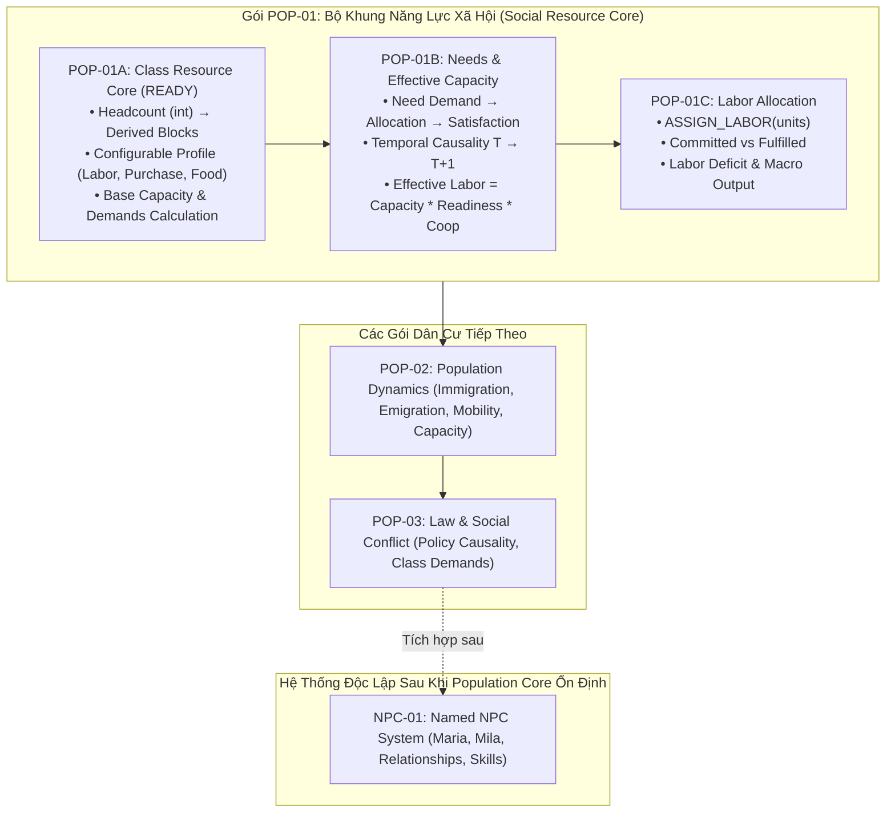

# Kế Hoạch Công Việc Thống Nhất: Dân Cư, Năng Lực Xã Hội & Quản Trị Lãnh Địa
# Mã Gói: WP-HAVEN-02 | Phiên Bản: 1.5 (POPULATION COHORT CORE & POP-01A CONTRACT)

> **Trạng thái**: `POPULATION COHORT CORE ARCHITECTURE FREEZE` — Thu hẹp phạm vi chính thức: Cắt toàn bộ Named NPC sang gói riêng `NPC-01 Future`. Đóng khung 100% vào cấp độ Population Cohort. Khóa contract thi công cho POP-01A.  
> **Commit nền**: `8111bf1e0fa5d3a49e30404ea65a9fd6ff4ccc17` (nhánh `main`).  
> **Nhánh thực hiện PR**: `docs/wp-haven-02` (Pull Request #2).  
> **Triết lý trung tâm**:
> > **Dân số thật tạo ra các năng lực xã hội. Nhu cầu và mức ủng hộ quyết định bao nhiêu năng lực đó thực sự sử dụng được. Player phân bổ năng lực, không phân bổ từng đầu người.**  
>
> **Scope Law (Luật Phạm Vi Bất Biến)**:
> > **WP-HAVEN-02 mô phỏng dân cư ở cấp Population Cohort. Nó không mô phỏng năng lực, xuất thân, tâm lý hay quan hệ của Named NPC. Economic class/profile trong WP này chỉ dùng để tính các đại lượng vĩ mô của dân số. Named NPC sẽ được thiết kế trong một hệ thống riêng sau khi Population Core ổn định.**

---

## I. Mục Tiêu Cốt Lõi Của Hệ Thống

Hệ thống mô phỏng xã hội và dân cư của *Haven* phải trả lời minh bạch 5 câu hỏi cốt lõi tại mọi thời điểm:

1. **Lãnh địa có bao nhiêu người?** (Headcount quy mô thực tế).
2. **Cơ cấu tầng lớp của số dân đó là gì?** (Tỷ trọng các giai cấp trong xã hội).
3. **Mỗi tầng lớp tạo ra bao nhiêu lao động, sức mua và nhu cầu?** (Năng lực tiềm năng - Capacity).
4. **Bao nhiêu năng lực trong số đó thực sự sử dụng được ở thời điểm hiện tại?** (Năng lực khả dụng - Effective).
5. **Tại sao con số đó tăng hoặc giảm?** (Giải trình nhân quả - Dòng WHY).

```text
VÍ DỤ VẬN HÀNH:
Lower Class (Lao động nghèo)
Dân số thực tế:         10.000 người

Labor Capacity:            150 units
Effective Labor:           120 units
Allocated Labor:           110 units

GIẢI TRÌNH DÒNG WHY:
- Thiếu hụt lương thực      -10 units
- Mức ủng hộ chính quyền    +15 units
- Thiếu chỗ ở che mưa nắng   -5 units
```

* **Trải nghiệm người chơi**: Player cảm nhận trọn vẹn sức nặng của **10.000 cư dân**, nhưng giao diện điều hành chỉ yêu cầu phân bổ **100–200 đơn vị lao động (Labor Units)** có ý nghĩa.

---

## II. Giữ `Headcount` Làm Nguồn Chân Lý Duy Nhất

* Tuyệt đối không xóa bỏ số dân thật. Mỗi Cohort trong `Population` bắt buộc lưu trữ:
  $$\text{count} = \text{Số lượng cư dân thực tế}$$
* *Ví dụ*:
  * `Enslaved`: 1.000 người
  * `Lower`: 10.000 người
  * `Middle`: 3.000 người
  * `Upper`: 500 người
* **Phạm vi sử dụng Headcount**: Dùng trực tiếp cho quy mô lãnh địa, tính toán nhu yếu phẩm sinh tồn tuyệt đối, nhà ở, dịch bệnh, tỷ lệ tử vong, di cư, và các báo cáo nhân khẩu học.
* **Nguyên tắc phân công**: **Tuyệt đối không dùng trực tiếp Headcount để Player micro-manage phân công việc**.

---

## III. Lớp Quy Đổi Trung Gian: Population Blocks & Chuẩn Fixed-Point (Contract)

Để kết nối giữa hàng chục nghìn con người với các đơn vị điều hành vĩ mô, hệ thống sử dụng lớp quy đổi khái niệm **Population Blocks**:

$$\mathbf{100\ cư\ dân = 1\ Population\ Block}$$

* **Headcount là Nguồn Chân Lý Duy Nhất (Single Source of Truth)**: Engine **CHỈ lưu trữ số nguyên `Headcount: number` trong State**.
* **Population Blocks là Giá Trị Dẫn Xuất (Pure Derived Value)**:
  $$\mathbf{PopulationBlocks} = \frac{\text{Headcount}}{100}$$
  * Population Blocks **tuyệt đối không lưu thành field độc lập trong state và không được phép mutate**. Khi cần tính toán, engine suy ra trực tiếp từ Headcount qua selector/calculator thuần túy. Điều này triệt tiêu hoàn toàn nguy cơ lệch dữ liệu (State Drift) giữa `count` và `blocks` (LAW-03, LAW-04).
* **Khóa Chuẩn Fixed-Point & Chính Sách Làm Tròn (Contract)**:
  * Khóa hằng số quy chuẩn:
    $$\mathbf{SOCIAL\_RESOURCE\_SCALE = 1000}$$
    $$\text{Tương ứng: } 1.000\text{ milli-units} = 1,000\text{ Resource Unit} \quad \mid \quad 500\text{ milli-units} = 0,500\text{ Resource Unit}$$
  * Công thức tính năng lực nội bộ (Integer Math):
    $$\mathbf{CapacityMilli} = \left\lfloor \frac{\text{Headcount} \times \text{MultiplierMilli}}{100} \right\rfloor$$
  * **Chính sách làm tròn (Rounding Policy)**: Sử dụng hàm lấy sàn số nguyên (`Math.floor`) cho các giá trị không âm. Mọi tài nguyên xã hội dẫn xuất trong mô phỏng đều lưu chuyển dưới dạng số nguyên `milli-units`. UI người chơi chịu trách nhiệm format hiển thị thành số thập phân (ví dụ: `150.000 milli` $\rightarrow$ hiển thị `150,0 Labor Units`).
* **Bảo toàn số học và loại bỏ Block Cliff**:
  * Giải quyết dứt điểm nghịch lý $99\text{ dân} \ne 0$. Một nhóm 99 người vẫn tạo ra năng lực lao động chính xác, không bị rơi vào vách đá số học (cliff) do ép kiểu số nguyên Block.

---

## IV. Hồ Sơ Năng Lực Giai Cấp & Phân Định Rõ Ràng Invariant vs Balance

### 1. Phân Định Rõ Ràng Kiến Trúc (Architecture Distinction)
Để tránh nhầm lẫn giữa nguyên lý cấu trúc và cân bằng gameplay, hệ thống phân tách nghiêm ngặt:
* **Luật Bất Biến Cốt Lõi (Hard State Invariants - Không Thể Đổi)**:
  * Headcount bảo toàn, không tự sinh tự diệt ngoài luồng di cư/sinh tử.
  * $\text{EffectiveLabor} \le \text{LaborCapacity}$.
  * $\text{FulfilledLabor} \le \text{EffectiveLabor}$.
  * $\text{FulfilledLabor} = 0 \implies \text{Labor-Derived Output} = 0$.
  * Tài nguyên vật lý không bao giờ âm ($\text{Stock} \ge 0$).
* **Hồ Sơ Cân Bằng Khởi Đầu (`INITIAL_BALANCE_PROFILE` - Configurable Balance)**:
  * Các hệ số quy đổi năng lực giai cấp là **tham số cấu hình cân bằng (Balance Config)**, có thể hiệu chỉnh qua playtest mà không làm biến dạng cấu trúc engine hay vi phạm luật bất biến.

### 2. Bảng Tham Số Khởi Đầu (`INITIAL_BALANCE_PROFILE` v0.1)

| Nhóm Xã Hội | Labor Multiplier (Milli) | Purchase Demand Multiplier (Milli) | Lifestyle Food Multiplier (Milli) |
| :--- | :---: | :---: | :---: |
| **Enslaved / Servile** | $2.000$ ($\times 2.0$) | $1.000$ ($\times 1.0$) | $500$ ($\times 0.5$) |
| **Lower Class** | $1.500$ ($\times 1.5$) | $1.000$ ($\times 1.0$) | $1.000$ ($\times 1.0$) |
| **Middle Class** | $1.000$ ($\times 1.0$) | $1.500$ ($\times 1.5$) | $1.000$ ($\times 1.0$) |
| **Upper Class** | $500$ ($\times 0.5$) | $2.000$ ($\times 2.0$) | $2.000$ ($\times 2.0$) |

* **Quy chuẩn Survival Food Multiplier**: Mọi nhóm xã hội trưởng thành ở slice hiện tại đều có:
  $$\mathbf{SurvivalFoodMultiplier} = 1.000\text{ milli} \quad (\times 1.0)$$
*Ví dụ chuyển đổi với 1.000 người (= 10 Population Blocks)*:
* **1.000 Enslaved**: $\text{Labor Cap} = 20.000\text{ milli}$ | $\text{Purchase} = 10.000\text{ milli}$ | $\text{Survival Food} = 10.000\text{ milli}$ | $\text{Lifestyle Food} = 5.000\text{ milli}$
* **1.000 Upper**: $\text{Labor Cap} = 5.000\text{ milli}$ | $\text{Purchase} = 20.000\text{ milli}$ | $\text{Survival Food} = 10.000\text{ milli}$ | $\text{Lifestyle Food} = 20.000\text{ milli}$

---

## V. Giữ Thiết Kế Ba Trục Thân Phận & Khóa Resolver Macro Economic Profile

* Kiến trúc kiên định duy trì 3 trục độc lập ở cấp độ **Population Cohort**:
  $$\mathbf{Occupation} \quad \times \quad \mathbf{SocialClass} \quad \times \quad \mathbf{LegalStatus}$$
* **Hệ thống kiểu Canonical của R1 (Single Source of Truth)**:
  * `SocialClass` gồm 5 bậc chuẩn: `"lower" | "common" | "skilled" | "administrative" | "elite"`.
  * `LegalStatus` gồm 6 trạng thái chuẩn: `"citizen" | "free_resident" | "contract_bound" | "enslaved" | "prisoner" | "outsider"`. (Tuyệt đối không dùng `"free"` vì không tồn tại trong canonical model).
* **Khóa Thuật Toán Resolver (Economic Profile Resolver Contract)**:
  Để loại bỏ hoàn toàn việc Builder phải phỏng đoán (`common = middle? skilled = middle? administrative = upper?`), POP-01A khóa chặt chẽ thuật toán ánh xạ:
  ```text
  NẾU cohort.legalStatus === "enslaved":
      → "servile"
  NGƯỢC LẠI:
      NẾU cohort.socialClass === "lower":
          → "lower"
      NẾU cohort.socialClass === "common" HOẶC cohort.socialClass === "skilled":
          → "middle"
      NẾU cohort.socialClass === "administrative" HOẶC cohort.socialClass === "elite":
          → "upper"
  ```
* **Nguyên tắc cốt lõi: Không Tạo Hệ Class Thứ Hai**:
  * `"middle"` và `"upper"` ở đây **CHỈ là `EconomicProfileKey`** phục vụ việc tra cứu bộ multiplier vĩ mô (`INITIAL_BALANCE_PROFILE`), **tuyệt đối không phải SocialClass mới**.
  * Input của hệ thống luôn là canonical `PopulationCohort` với `SocialClass` và `LegalStatus` gốc.
  * Việc áp dụng Servile Profile theo `LegalStatus = "enslaved"` không làm thay đổi hay xóa bỏ `occupation`, `socialClass` hay skills của thực thể nhân vật.

---

## VI. Danh Mục Năng Lực Xã Hội Mở Rộng

Hệ thống định hướng quản lý đa dạng các nguồn lực xã hội:
1. **Labor Capacity** (Sức lao động chân tay phổ thông)
2. **Skilled Labor** (Lao động kỹ thuật / tay nghề cao)
3. **`purchaseDemandCapacity`** (Dung lượng thị trường & sức mua kỳ vọng)
4. **Capital** (Vốn đầu tư tư bản)
5. **Influence** (Tầm ảnh hưởng chính trị)
6. **Administration** (Năng lực bộ máy quan liêu)
7. **Security / Military** (Tiềm lực quân sự & dân quân)
8. **Servile Labor** (Lao động cưỡng bức tuyệt đối)

* **Quy tắc phân kỳ**: Giai đoạn **POP-01 chỉ code 3 đại lượng tối thiểu**: **Labor Capacity**, **`purchaseDemandCapacity`**, và **Food Needs (Survival & Lifestyle)**. Ba đại lượng này là đủ để chứng minh toàn bộ cỗ máy kinh tế tầng lớp.

---

## VII. Phân Biệt `Capacity` (Tiềm Năng) Và `Effective` (Khả Dụng)

Một Cohort sở hữu năng lực tiềm năng (`Capacity`), nhưng mức độ huy động thực tế (`Effective`) phụ thuộc vào điều kiện sống và mức độ hợp tác:

$$\mathbf{EffectiveCapacity} = \mathbf{BaseCapacity} \times \mathbf{NeedReadiness} \times \mathbf{Cooperation}$$

* *Ví dụ*: 200 dân nghèo $\rightarrow$ Base Capacity = 3 units.
  * Đủ ăn, trật tự bình thường $\rightarrow$ Effective = 3 units.
  * Thiếu lương thực, đói kém $\rightarrow$ Effective tụt xuống 2 units.
  * Được đáp ứng mọi nhu cầu và ủng hộ chính quyền tột đỉnh $\rightarrow$ Effective duy trì tối đa.

---

## VIII. Cấu Trúc Nhu Cầu Hai Tầng & Tách Đôi Nhu Cầu Lương Thực

Hệ thống loại bỏ thanh "Happiness" đơn điệu, chia nhu cầu thành 2 nhóm với các trọng số khác nhau theo từng tầng lớp:

1. **Nhu cầu thiết yếu (Vital Needs)**: Ảnh hưởng trực tiếp đến sự sống còn, sức khỏe thể chất và thể lực làm việc:
   * *Survival Food, Water, Housing, Health, Security*.
2. **Nhu cầu xã hội & kỳ vọng (Social & Aspirational Needs)**: Ảnh hưởng đến mức độ ủng hộ (`Support`), chính trị và xu hướng di cư:
   * *Lifestyle Food, Employment, Education, Luxury, Prestige, Property Protection, Political Privilege, Autonomy, Public Services*.

### Tách Đôi Nhu Cầu Lương Thực: Sinh Tồn vs Lối Sống
* **`Survival Food Need` (Nhu Cầu Sinh Tồn Sinh Học)**:
  * Nhu cầu duy trì sự sống cơ bản, áp dụng **bình đẳng trên cơ sở sinh học** ($\times 1.0$ cho mọi cư dân bất kể giai cấp).
  * Quyết định: Nạn đói (`starvation`), suy kiệt thể lực, bệnh tật, sức khỏe thể chất (`physical readiness`) và nguy cơ tử vong.
  * Triệt tiêu nghịch lý sinh học vô lý: Quý tộc Upper không cần ăn gấp 4 lần nô lệ Enslaved để sống sót.
* **`Lifestyle Food Demand` (Tiêu Chuẩn Lương Thực Theo Kỳ Vọng Giai Cấp)**:
  * Mức tiêu thụ kỳ vọng theo lối sống: Enslaved $\times 0.5$, Lower $\times 1.0$, Middle $\times 1.0$, Upper $\times 2.0$.
  * Quyết định: Mức độ thỏa mãn giai cấp (`Lifestyle Satisfaction`), Mức độ ủng hộ chính quyền (`Support`), Uy tín xã hội (`Prestige`), và Sức hấp dẫn di cư (`Class Attraction`).
  * *Ví dụ*: Một quý tộc Upper được cấp khẩu phần ăn bình dân đủ sống:
    $$\text{Survival Satisfaction} = 100\% \implies \text{Sức khỏe không giảm, không đổ bệnh}$$
    $$\text{Lifestyle Satisfaction} = 50\% \implies \text{Bất mãn vì mất đặc quyền, Support giảm, Prestige sụt giảm}$$

| Trọng Số Kỳ Vọng | Enslaved | Lower Class | Middle Class | Upper Class |
| :--- | :---: | :---: | :---: | :---: |
| **Survival Food (Sinh học)** | Đồng nhất | Đồng nhất | Đồng nhất | Đồng nhất |
| **Lifestyle Food (Kỳ vọng)** | Cực thấp ($\times 0.5$) | Chuẩn ($\times 1.0$) | Chuẩn ($\times 1.0$) | Rất cao ($\times 2.0$) |
| **Nhà ở (Housing)** | Trung bình | Cao | Cao | Cao |
| **Việc làm (Employment)** | — | Rất cao | Cao | Trung bình |
| **Giáo dục (Education)** | Thấp | Thấp | Cao | Cao |
| **Xa xỉ phẩm (Luxury)** | Không | Thấp | Trung bình | Cực cao |
| **An ninh (Security)** | Cao | Trung bình | Cao | Cực cao |
| **Quyền tự quyết (Autonomy)**| Cực cao | Cao | Cao | Cao |
| **Bảo vệ tư hữu (Property)** | Thấp | Thấp | Trung bình | Cực cao |

---

## IX. Chu Trình Nhân Quả & Khóa Trật Tự Thời Gian (Temporal Causality $T \rightarrow T+1$)

Để triệt tiêu hoàn toàn vòng lặp toán học phụ thuộc lẫn nhau trong cùng 1 ngày (Circular Dependency: Sản xuất phụ thuộc Năng lực, Năng lực phụ thuộc Thỏa mãn, Thỏa mãn lại phụ thuộc Sản xuất trong cùng nhịp tick), hệ thống áp dụng **nguyên tắc trễ 1 ngày ($T \rightarrow T+1$)**:

$$\mathbf{Satisfaction} = \min\left(1.0, \frac{\text{Allocated}}{\text{Demand}}\right)$$

```text
TRẬT TỰ THỰC THI TRONG MỘT NHỊP NGÀY (DAY TICK ORDER):
[Đầu ngày T]
  1. Đọc Satisfaction, Support & Health từ cuối ngày T-1.
  2. Tính toán Readiness & Effective Capacity ngày T.
  3. Fulfill Labor: Fulfilled = min(Committed, Effective). Phát sinh Labor Deficit (nếu có).
  4. Thực thi Sản xuất (Production) ngày T dựa trên Fulfilled Labor.
[Cuối ngày T]
  5. Phân bổ & Tiêu thụ Nhu cầu (Consumption & Allocation) từ kho dự trữ ngày T.
  6. Tính toán Satisfaction mới cho Survival & Lifestyle.
  7. Cập nhật Support, Health, Readiness.
  8. CÁC CHỈ SỐ NÀY CÓ HIỆU LỰC CHO NGÀY T+1.
```

* **Quy tắc nhân quả bất biến**: Hôm nay thiếu ăn không thể quay ngược thời gian khiến người dân "làm ít hơn vào buổi sáng hôm nay". Việc thiếu ăn hôm nay sẽ làm suy giảm thể lực và tinh thần, dẫn đến **sụt giảm Effective Labor của ngày mai ($T+1$)**. Dòng WHY giải trình minh bạch theo chuỗi nhân quả rời rạc.

---

## X. Tách Bạch Ba Trạng Thái: `Support`, `Compliance`, `Dependency`

Trong xã hội hậu tận thế, thái độ của cư dân đối với Lãnh chúa được chia làm 3 khía cạnh độc lập:

* **Support (Mức độ ủng hộ)**: Họ có thực tâm tán thành và yêu mến chính quyền không?
* **Compliance (Mức độ tuân thủ)**: Họ có phục tùng luật lệ và mệnh lệnh không? (Có thể tuân thủ vì sợ hãi quân đội).
* **Dependency (Mức độ lệ thuộc)**: Sinh kế của họ gắn chặt vào hệ thống của Lãnh chúa đến mức nào?

*Ví dụ minh họa tính thực tế*:
* **Tầng lớp Enslaved**: `Support: 10` | `Compliance: 90` | `Dependency: 95`. *(Tuân thủ cao vì áp chế và phụ thuộc nguồn sống, nhưng ngầm nuôi dưỡng oán hận, không phải trung thành)*.
* **Tầng lớp Upper Class**: `Support: 80` | `Compliance: 55` | `Dependency: 30`. *(Ủng hộ Lãnh chúa vì cùng giai cấp, nhưng sẵn sàng lách luật, trốn thuế khi đụng chạm tới đặc quyền tài sản)*.

---

## XI. Công Thức Tính `Effective Labor`

$$\mathbf{LaborCapacity} = \text{PopulationBlocks} \times \text{LaborMultiplier}$$

$$\mathbf{EffectiveLabor} = \lfloor \text{LaborCapacity} \times \text{NeedReadiness} \times \text{Cooperation} \rfloor$$

* Hệ số hợp tác (`Cooperation`) chịu tác động trực tiếp từ:
  $$\text{Cooperation} = f(\text{Support}, \text{Compliance}, \text{Điều kiện làm việc}, \text{Chính sách})$$

---

## XII. Người Chơi Phân Bổ `Labor Units`, Không Phân Bổ Từng Đầu Người

* **Thay đổi Command**:
  $$\text{Từ: } \text{ASSIGN\_WORKERS}(100\text{ người}) \longrightarrow \text{Thành: } \mathbf{ASSIGN\_LABOR}(20\text{ units})$$
* **Giao diện quản trị vĩ mô**:
  ```text
  LOWER CLASS COHORT (Dân số: 10.000 người | Blocks: 100)
  ├── Labor Capacity:     150 units
  ├── Effective Labor:    125 units (Đang dùng được)
  └── PHÂN BỔ THỰC TẾ:
        ├── Nông nghiệp (Field A):    50 units
        ├── Khai khoáng (Mine B):     30 units
        ├── Xây dựng (Project C):     25 units
        ├── Vận tải / Kho vận:        10 units
        └── Lực lượng dự bị:          10 units
  ```

---

## XIII. Cơ Chế `Committed` Khác `Fulfilled` & Phát Sinh Thiếu Hụt (Deficit)

* **Committed Labor**: Số lượng lao động Player đã chỉ định phân bổ cho một cơ sở.
* **Fulfilled Labor**: Số lượng lao động thực tế có mặt làm việc sau khi đã tính toán sụt giảm Effective do thiếu đói, bệnh tật hay bất mãn.
* **Nguyên tắc bảo toàn**: Không bao giờ tự tạo thêm lao động từ hư không:
  $$\mathbf{FulfilledLabor} = \min(\text{CommittedLabor}, \text{EffectiveLabor})$$
  $$\mathbf{LaborDeficit} = \text{CommittedLabor} - \text{FulfilledLabor}$$
* **Sản xuất (Production)** bắt buộc tính dựa trên **Fulfilled Labor**, không dựa trên Committed Labor. Khi xảy ra `Labor Deficit`, Player buộc phải đưa ra quyết định: tăng khẩu phần lương thực, giảm bớt mục tiêu hoạt động, hay điều chỉnh mức độ ưu tiên giữa các cơ sở.

---

## XIV. Tách Bạch Tuyệt Đối Named NPC (Chuyển Toàn Bộ Sang Gói Độc Lập NPC-01)

* **Khóa Scope Law**: Named NPC (Maria, Mila...), Origin, Personality, 8D Relationships, NPC Skills, NPC Modifiers, NPC Memories, NPC Reactions **tuyệt đối không tham gia bất kỳ tính toán nào của POP-01A, POP-01B, POP-01C, POP-02, POP-03**.
* **Loại bỏ hoàn toàn NPC khỏi chuỗi giá trị lao động hiện tại**:
  * Sản xuất ở POP-01C dừng lại ở mức **Macro Output của Fulfilled Labor**, không bị khuếch đại hay can thiệp bởi bất kỳ nhân vật Named NPC nào.
  * Mọi khái niệm `NPCModifier`, quản lý xưởng/đồng ruộng của Maria/Mila được chuyển hoàn toàn sang gói thiết kế riêng **`NPC-01 Future`**.
* *Ý nghĩa*: Đảm bảo lõi dân cư và năng lực xã hội hoàn toàn độc lập, sạch sẽ và có thể kiểm thử trọn vẹn mà không phụ thuộc vào hệ thống nhân vật phức tạp.

---

## XV. `purchaseDemandCapacity` Và Giỏ Hàng Nhu Cầu Thị Trường

* **Chuẩn hóa thuật ngữ kỹ thuật**: Trong domain code, đại lượng này bắt buộc được định danh là **`purchaseDemandCapacity`** (đo lường bằng integer milli-units: `purchaseDemandCapacityMilli`), tuyệt đối không dùng từ chung chung "Purchasing Power" để tránh nhầm lẫn với lượng tiền tệ thực tế (`currency / credits`) trong túi người dân.
* UI hiển thị tới người chơi: **"Sức mua / Dung lượng thị trường"**.
* Sức mua được phân bổ theo giỏ hàng (Basket) đặc trưng của từng tầng lớp:
  * *Lower Class*: Hàng hóa cơ bản, nhu yếu phẩm, công cụ thô sơ.
  * *Middle Class*: Dịch vụ ăn uống, may mặc chất lượng, y tế, giáo dục.
  * *Upper Class*: Hàng hóa xa xỉ phẩm, dịch vụ đặc quyền, bất động sản cao cấp, an ninh tư nhân.

---

## XVI. Tách Bạch Hai Cơ Chế Lương Thực (Survival vs Lifestyle)

* **Giải quyết dứt điểm nghịch lý sinh học**: Cần ghi rất rõ trong code và tài liệu rằng:
  1. `Survival Food Need`: Tiêu chuẩn dinh dưỡng sinh học thuần túy. 1 con người = 1 khẩu phần sinh tồn. Không phân biệt nô lệ hay lãnh chúa.
  2. `Lifestyle Food Demand`: Tiêu chuẩn văn hóa - xã hội về ẩm thực. Enslaved $\times 0.5$, Lower $\times 1.0$, Middle $\times 1.0$, Upper $\times 2.0$.
* Nếu lãnh địa chỉ cung cấp đủ mức sinh tồn cho tầng lớp Upper: Họ không chết đói, không đau ốm, nhưng lòng trung thành sụt giảm nghiêm trọng và bắt đầu mưu phản vì bị đối xử như thường dân.
* Ngược lại, nếu Lower bị cắt giảm dưới mức sinh tồn: Thể lực suy sụp ngay lập tức, Effective Labor tụt dốc vào ngày hôm sau, và nguy cơ tử vong xuất hiện.

---

## XVII. Mâu Thuẫn Xã Hội Phát Sinh Từ Cạnh Tranh Phân Bổ

Mọi quyết định quản trị nguồn lực đều mang tính hai mặt:
* Gia tăng nguồn cung lao động cưỡng bức (*Servile Labor*) $\rightarrow$ Tầng lớp Upper hài lòng vì giảm chi phí sản xuất, nhưng tầng lớp Lower phẫn nộ vì bị cạnh tranh việc làm trực tiếp.
* Dồn ngân sách sản xuất xa xỉ phẩm (*Luxury Supply*) $\rightarrow$ Tăng mức độ ủng hộ của Upper, nhưng nếu cắt giảm đầu tư lương thực cơ bản $\rightarrow$ Tầng lớp Lower bị suy giảm chỉ số đáp ứng thực phẩm (`Food Satisfaction` tụt dốc).

---

## XVIII. Tăng Trưởng Dân Số Hai Cổng (Sustainable Capacity)

1. **Cổng Sinh Tồn Tối Thiểu (Hard Minimum Gate)**:
   Dân cư thường trú (Resident Population) chỉ được tăng trưởng khi lãnh địa bảo đảm đầy đủ mức sống tối thiểu:
   $$\text{Resident Growth} > 0 \iff \text{FoodStock} \ge \text{MinFood} \land \text{WaterStock} \ge \text{MinWater} \land \text{HousingCapacity} > \text{CurrentPopulation}$$
2. **Lực Hút Và Cơ Cấu Giai Cấp (Attraction & Composition)**:
   Khi qua được Hard Gate, các yếu tố `Employment` + `QoL` + `Security` + `Law` sẽ quyết định quy mô và tỷ trọng các tầng lớp muốn chuyển đến.
3. **Người Lưu Vong Ngoại Vi (Outside Arrivals)**:
   Người tìm đến khi lãnh địa quá tải sẽ ở trạng thái chờ ngoài cổng thành (`Applicants / Outside Settlement`), tuyệt đối không được tính vào Resident Population nếu chưa được tiếp nhận.

---

## XIX. Cơ Chế Luật Pháp (Law) Tác Động Qua Điều Kiện

* Luật pháp (`Policy / Law`) chỉ thay đổi: *Tiêu chí tiếp nhận (`Eligibility`), Quy tắc phân bổ (`Allocation Rules`), Quyền tài sản, Điều kiện lao động, Thuế khóa, Trạng thái pháp lý*.
* **Luật bất biến**: Tuyệt đối không có lệnh nào được phép trực tiếp sửa đổi biến đếm dân số (cấm code kiểu `lowerClass -= 100`). Luật thay đổi môi trường $\rightarrow$ Thay đổi mức thỏa mãn nhu cầu $\rightarrow$ Population Engine tự động tạo ra dòng lưu chuyển.

---

## XX. Hai Báo Cáo Song Song Cho Nhà Quản Trị

Player quản lý lãnh địa thông qua 2 báo cáo độc lập:

1. **Population Report (Báo cáo Nhân khẩu học)**: Phản ánh biến động con người thực tế (Headcount, Immigration, Emigration, Mobility).
2. **Social Resource Report (Báo cáo Năng lực Xã hội)**: Phản ánh sự biến động của Labor Capacity, Effective Labor, Sức mua kèm theo **dòng giải trình nguyên nhân (WHY)**.

---

## XXI. Lộ Trình Triển Khai Thực Tế (Không Dependency Vào NPC)

Hệ thống được chia nhỏ thành 5 lát cắt kỹ thuật độc lập; **chỉ `POP-01A` được chuyển sang trạng thái sẵn sàng triển khai (Implementation-Ready)**, các lát cắt sau tiếp tục giữ trạng thái thiết kế nối tiếp; Named NPC được tách hẳn thành gói riêng:

| Gói Việc | Trọng Tâm Kỹ Thuật | Phạm Vi Triển Khai | Những Điều Chưa Làm |
| :--- | :--- | :--- | :--- |
| **POP-01A** | **Class Resource Core** | Integer Headcount $\rightarrow$ Derived Blocks $\rightarrow$ Economic Profile $\rightarrow$ Capacities & Demands $\rightarrow$ Social Resource Snapshot. | Chưa có assignment, activity, support effects, migration, law. |
| **POP-01B** | **Needs & Effective Capacity** | Need Demand $\rightarrow$ Allocation $\rightarrow$ Satisfaction (Survival vs Lifestyle) $\rightarrow$ Support/Readiness $\rightarrow$ Effective Capacity ngày $T+1$. | Chưa có activity production, chưa có lệnh phân bổ. |
| **POP-01C** | **Labor Allocation** | Effective Capacity $\rightarrow$ `ASSIGN_LABOR` $\rightarrow$ Committed vs Fulfilled $\rightarrow$ Labor Deficit $\rightarrow$ Macro Output. | Hoàn toàn không có Named NPC modifiers. |
| **POP-02** | **Population Dynamics** | Immigration, Emigration, Class Mobility, Sustainable Capacity 2 cổng, Headcount derivation. | Chưa có hệ thống Law sâu. |
| **POP-03** | **Law & Social Conflict** | Policy $\rightarrow$ Allocation Rules / Needs / Eligibility $\rightarrow$ Class Reaction $\rightarrow$ Xung đột xã hội. | Chưa có Map / Grid. |
| **NPC-01** *(Future)* | **Named NPC System** | Maria/Mila, Origin, Personality, 8D Relationships, NPC Skills, Memories, Reactions. | **Gói riêng, không phải dependency của Population Core.** |



---

## XXII. Những Điều Tuyệt Đối CHƯA Làm (Out Of Scope)

Để triệt tiêu nguy cơ trôi dạt phạm vi (Scope Creep), các hạng mục sau nghiêm cấm đưa vào giai đoạn này:
* **Tuyệt đối không có Named NPC**: Không Maria, không Mila, không Origin, không Personality, không 8D Relationships.
* **Chưa có NPC Mechanics**: Không NPC Skills, không NPC Modifiers, không NPC Memories, không NPC Reactions.
* Chưa làm bản đồ, lưới ô cờ (grid), vị trí địa lý, footprint hay tìm đường (pathfinding).
* Chưa làm quy trình xây dựng vật lý (chưa code lệnh `BUILD_FACILITY`, trừ kho vật liệu hay đếm nhịp thi công).
* Chưa làm hệ thống tiền tệ/thuế khóa phức tạp.
* Chưa làm hệ thống ý thức hệ xã hội (Future Societies).
* Chưa làm hệ thống nội dung trưởng thành chi tiết.
* Chưa làm cơ chế sinh/tử (Birth/Death).
* Chưa làm balance cuối cùng (các hệ số chỉ là baseline v0.1).

---

## XXIII. Bảng Phân Loại Các Quyết Định Kỹ Thuật (D17–D25)

Để quản trị rõ ràng ranh giới giữa kiến trúc không đổi và tham số có thể tinh chỉnh, các quyết định được gán nhãn phân loại minh bạch:

| Quyết Định | Nội Dung Cốt Lõi | Phân Loại |
| :--- | :--- | :---: |
| **D17** | **Derived Population Blocks**: $100\text{ cư dân} = 1\text{ conceptual Block}$. Block là pure derived value từ integer Headcount, tuyệt đối không lưu field độc lập trong state và cấm mutate. | **ARCHITECTURE** |
| **D18** | **Initial Balance Profile v0.1**: Bảng multiplier năng lực giai cấp (Labor, Purchase Demand, Lifestyle Food) trong config constant. | **BALANCE_CONFIG v0.1** |
| **D19** | **Tách Đôi Nhu Cầu Lương Thực**: Survival Food Need (sinh học $\times 1.0$) tách riêng Lifestyle Food Demand (tiêu chuẩn lối sống phân tầng). | **ARCHITECTURE** |
| **D20** | **Support Tác Động Labor Qua Nhịp $T \rightarrow T+1$**: Support tham gia tính Readiness cho ngày tiếp theo. | **ARCHITECTURE DIRECTION**<br>*(Chưa code ở A, dành cho B)* |
| **D21** | **Temporal Causality $T \rightarrow T+1$**: Khóa trật tự pha tick rời rạc, feedback loop trễ 1 ngày chống circular dependency trong cùng ngày. | **ARCHITECTURE** |
| **D22** | **Composable Identity & Resolver Contract**: Khóa resolver 6 nhánh từ canonical `SocialClass` và `LegalStatus` sang `EconomicProfileKey` (`servile`, `lower`, `middle`, `upper`). Không tạo class system thứ hai. | **ARCHITECTURE** |
| **D23** | **Fixed-Point Scale & Rounding Policy**: Khóa quy chuẩn `SOCIAL_RESOURCE_SCALE = 1000` và chính sách làm tròn `Math.floor` cho toàn bộ tài nguyên xã hội dẫn xuất. | **ARCHITECTURE** |
| **D24** | **Pure Derived Snapshot Calculator**: Calculator là hàm thuần túy, chỉ trả snapshot, không mutate GameState, không phát sinh Command hay thay đổi kho. | **ARCHITECTURE** |
| **D25** | **Scope Law & NPC Decoupling**: Dân cư chỉ mô phỏng ở cấp độ Cohort. Cắt toàn bộ Named NPC sang gói riêng `NPC-01 Future`. Không tạo hệ class thứ hai. | **ARCHITECTURE** |

---

## XXIV. Hợp Đồng Kỹ Thuật & Acceptance Test Matrix Cho POP-01A

Đây là bản đặc tả duy nhất được phép chuyển sang thi công trong PR tiếp theo:

### 1. Phạm Vi Files Cho Phép Sửa Đổi / Bổ Sung (Strict Allowlist với Exact Paths)
Nhất quán sử dụng module con chuyên biệt `packages/core/src/social/`:
* `packages/core/src/social/types.ts`:  
  * **Import đúng từ canonical model R1**:
    ```ts
    import type { PopulationCohort } from "../domain/population.js";
    import type { SocialClass, LegalStatus } from "../domain/character.js";
    ```
    **Tuyệt đối không tái định nghĩa** các kiểu này để tránh tạo ra hệ thống class thứ hai.  
  * **Chỉ định nghĩa các kiểu macro mới**:
    ```ts
    export type EconomicProfileKey = "servile" | "lower" | "middle" | "upper";
    export interface ClassResourceProfile { ... }
    export interface SocialResourceSnapshot { ... }
    ```
* `packages/core/src/social/profile.ts`: Cấu hình hằng số `SOCIAL_RESOURCE_SCALE = 1000` và `INITIAL_BALANCE_PROFILE` (pure config constants).
* `packages/core/src/social/calculator.ts`: Hàm tính toán thuần túy (pure deterministic functions): `calculatePopulationBlocks(count)`, `resolveEconomicProfile(cohort)`, `calculateSocialResources(cohorts, profile)`.
* `packages/core/src/social/__tests__/pop01a_resource_core.test.ts`: Test suite kiểm chứng độc lập.
* **Quy ước Export**: Tạm thời **chưa export từ `packages/core/src/index.ts`** để slice chỉ tập trung chứng minh pure calculation qua unit test trực tiếp, tránh mở rộng public API surface khi chưa tích hợp Command/State.
* *Tuyệt đối không sửa UI, không sửa Command Dispatcher, không sửa Simulation Tick, không sửa State Persistence*.

### 2. Contract Calculator Thuần Túy (No State Mutation)
```ts
export type EconomicProfileKey = "servile" | "lower" | "middle" | "upper";

export interface SocialResourceSnapshot {
  headcount: number;
  populationBlocks: number; // derived display (e.g. 124.5)
  laborCapacityMilli: number; // integer milli-units
  purchaseDemandCapacityMilli: number; // integer milli-units
  survivalFoodNeedMilli: number; // integer milli-units
  lifestyleFoodDemandMilli: number; // integer milli-units
}

export function resolveEconomicProfile(cohort: PopulationCohort): EconomicProfileKey;

export function calculateSocialResources(
  cohorts: PopulationCohort[],
  profileMap: Record<EconomicProfileKey, ClassResourceProfile>
): SocialResourceSnapshot;
```

### 3. Hai Fixture Kiểm Thử Nghiệm Thu Chuẩn (Deterministic Benchmark Fixtures)

#### Fixture A — Canonical Scale
Đầu vào kiểm thử (Canonical R1 types, không dùng `"free"`):
* `Lower Class`: $10.000$ cư dân (`socialClass: "lower"`, `legalStatus: "citizen"`) $\rightarrow$ profile `lower`
* `Enslaved`: $1.000$ cư dân (`socialClass: "lower"`, `legalStatus: "enslaved"`) $\rightarrow$ profile `servile`
* `Middle Class`: $3.000$ cư dân (`socialClass: "common"`, `legalStatus: "citizen"`) $\rightarrow$ profile `middle`
* `Upper Class`: $500$ cư dân (`socialClass: "elite"`, `legalStatus: "citizen"`) $\rightarrow$ profile `upper`

Bảng kết quả đầu ra bắt buộc khớp chính xác tuyệt đối:

| Cohort | Headcount (Stored) | Derived Blocks | Labor Capacity (Milli) | Purchase Demand (Milli) | Survival Food (Milli) | Lifestyle Food (Milli) |
| :--- | :---: | :---: | :---: | :---: | :---: | :---: |
| **Lower Class** | $10.000$ | $100,0$ | $150.000$ ($150,0$) | $100.000$ ($100,0$) | $100.000$ ($100,0$) | $100.000$ ($100,0$) |
| **Enslaved** | $1.000$ | $10,0$ | $20.000$ ($20,0$) | $10.000$ ($10,0$) | $10.000$ ($10,0$) | $5.000$ ($5,0$) |
| **Middle Class** | $3.000$ | $30,0$ | $30.000$ ($30,0$) | $45.000$ ($45,0$) | $30.000$ ($30,0$) | $30.000$ ($30,0$) |
| **Upper Class** | $500$ | $5,0$ | $2.500$ ($2,5$) | $10.000$ ($10,0$) | $5.000$ ($5,0$) | $10.000$ ($10,0$) |
| **TỔNG CỘNG** | $\mathbf{14.500}$ | $\mathbf{145,0}$ | $\mathbf{202.500}$ ($\mathbf{202,5}$) | $\mathbf{165.000}$ ($\mathbf{165,0}$) | $\mathbf{145.000}$ ($\mathbf{145,0}$) | $\mathbf{145.000}$ ($\mathbf{145,0}$) |

#### Fixture B — Formula Discrimination (Bẫy Test & Bắt Lỗi Thuật Toán)
*Mục đích*: Hóa giải sự trùng hợp ngẫu nhiên của Fixture A ($145 = 145$). Fixture B buộc $\text{Survival Food} \ne \text{Lifestyle Food}$ để bắt lỗi nếu Builder code nhầm `lifestyleFood = survivalFood`. Đồng thời kiểm thử các bậc SocialClass còn lại (`skilled`, `administrative`).

Đầu vào kiểm thử (Canonical R1 types, không dùng `"free"`):
* `Lower Class`: $9.700$ cư dân (`socialClass: "lower"`, `legalStatus: "citizen"`) $\rightarrow$ profile `lower`
* `Enslaved`: $1.000$ cư dân (`socialClass: "lower"`, `legalStatus: "enslaved"`) $\rightarrow$ profile `servile`
* `Middle Class`: $3.000$ cư dân (`socialClass: "skilled"`, `legalStatus: "citizen"`) $\rightarrow$ profile `middle`
* `Upper Class`: $800$ cư dân (`socialClass: "administrative"`, `legalStatus: "citizen"`) $\rightarrow$ profile `upper`

Bảng kết quả đầu ra bắt buộc khớp chính xác tuyệt đối:

| Cohort | Headcount (Stored) | Derived Blocks | Labor Capacity (Milli) | Purchase Demand (Milli) | Survival Food (Milli) | Lifestyle Food (Milli) |
| :--- | :---: | :---: | :---: | :---: | :---: | :---: |
| **Lower Class** | $9.700$ | $97,0$ | $145.500$ ($145,5$) | $97.000$ ($97,0$) | $97.000$ ($97,0$) | $97.000$ ($97,0$) |
| **Enslaved** | $1.000$ | $10,0$ | $20.000$ ($20,0$) | $10.000$ ($10,0$) | $10.000$ ($10,0$) | $5.000$ ($5,0$) |
| **Middle Class** | $3.000$ | $30,0$ | $30.000$ ($30,0$) | $45.000$ ($45,0$) | $30.000$ ($30,0$) | $30.000$ ($30,0$) |
| **Upper Class** | $800$ | $8,0$ | $4.000$ ($4,0$) | $16.000$ ($16,0$) | $8.000$ ($8,0$) | $16.000$ ($16,0$) |
| **TỔNG CỘNG** | $\mathbf{14.500}$ | $\mathbf{145,0}$ | $\mathbf{199.500}$ ($\mathbf{199,5}$) | $\mathbf{168.000}$ ($\mathbf{168,0}$) | $\mathbf{145.000}$ ($\mathbf{145,0}$) | $\mathbf{148.000}$ ($\mathbf{148,0}$) |

$$\mathbf{SurvivalFoodMilli (145.000) \ne LifestyleFoodDemandMilli (148.000)}$$

#### Edge Cases — Kiểm Chứng Chống Block Cliff Tại 100 Dân
Áp dụng cho Lower Class (Labor Multiplier: $1.500$ milli):
* **$1\text{ cư dân}$**: $\lfloor 1 \times 1.500 / 100 \rfloor = \mathbf{15\text{ milli}}$ ($0,015\text{ Labor Unit}$).
* **$99\text{ cư dân}$**: $\lfloor 99 \times 1.500 / 100 \rfloor = \mathbf{1.485\text{ milli}}$ ($1,485\text{ Labor Units}$). *Bảo toàn năng lực, tuyệt đối không bị cliff ép về 0*.
* **$101\text{ cư dân}$**: $\lfloor 101 \times 1.500 / 100 \rfloor = \mathbf{1.515\text{ milli}}$ ($1,515\text{ Labor Units}$).

### 4. Tiêu Chí Nghiệm Thu (Acceptance Criteria)
* **AC-POP01A-01**: Khóa hằng số quy chuẩn `SOCIAL_RESOURCE_SCALE = 1000`. Mọi phép tính nội bộ thực hiện trên integer milli-units với phép chia `Math.floor`.
* **AC-POP01A-02**: Fixture A (Canonical scale) cho ra kết quả khớp chính xác 100% với bảng đặc tả.
* **AC-POP01A-03**: Fixture B (Formula discrimination) chứng minh rõ ràng $\text{Survival Food} (145.000) \ne \text{Lifestyle Food} (148.000)$; chặn đứng lỗi code đồng nhất 2 công thức.
* **AC-POP01A-04**: Edge cases $1$, $99$, $101$ cư dân xác nhận tính lũy tiến liên tục, $99$ cư dân tạo ra đúng $1.485\text{ milli}$, không có cliff.
* **AC-POP01A-05**: `calculateSocialResources` là pure function, chỉ tính toán snapshot, không mutate GameState, không phụ thuộc DOM hay UI libraries.
* **AC-POP01A-06**: `resolveEconomicProfile(cohort)` ánh xạ đúng và đủ 100% cho 6 nhánh canonical, không có fallback ngầm:
  * `legalStatus === "enslaved"` (bất kể `socialClass`) $\rightarrow$ `"servile"`
  * `socialClass === "lower"` (`legalStatus !== "enslaved"`) $\rightarrow$ `"lower"`
  * `socialClass === "common"` (`legalStatus !== "enslaved"`) $\rightarrow$ `"middle"`
  * `socialClass === "skilled"` (`legalStatus !== "enslaved"`) $\rightarrow$ `"middle"`
  * `socialClass === "administrative"` (`legalStatus !== "enslaved"`) $\rightarrow$ `"upper"`
  * `socialClass === "elite"` (`legalStatus !== "enslaved"`) $\rightarrow$ `"upper"`
* **AC-POP01A-07**: `packages/core/src/social/types.ts` import canonical `PopulationCohort` từ `domain/population.js`, `SocialClass` và `LegalStatus` từ `domain/character.js`; tuyệt đối không tái định nghĩa các kiểu này.
