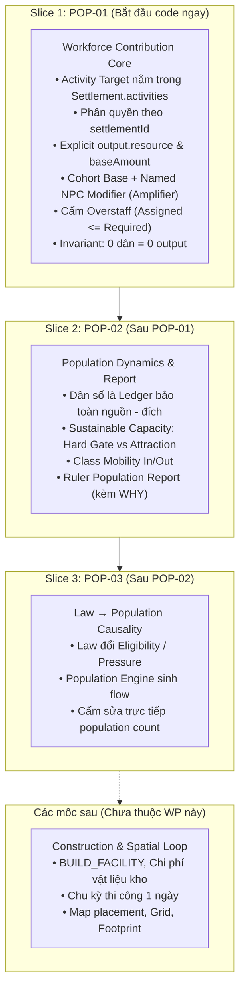

# Kế Hoạch Công Việc Thống Nhất: Dân Cư, Tầng Lớp & Quản Trị Lãnh Địa
# Mã Gói: WP-HAVEN-02 | Phiên Bản: 1.2 (LOCKED_FOR_G1)

> **Trạng thái**: `LOCKED_FOR_G1` — Đã hoàn thiện toàn bộ hợp đồng kỹ thuật và khóa chặt các ranh giới kiến trúc, sẵn sàng để Human phê duyệt chuyển sang G2.  
> **Commit nền**: `8111bf1e0fa5d3a49e30404ea65a9fd6ff4ccc17` (nhánh `main`).  
> **Nhánh thực hiện PR**: `docs/wp-haven-02` (Pull Request #2).  
> **Head Commit trước chỉnh sửa**: `eecacb7a89945433a78811daead3b24591bdefaf`.  
> **Trọng tâm tái cấu trúc**: Umbrella WP về **Population, Society & Governance**, chia 3 lát cắt phụ thuộc. Lát cắt đầu tiên triển khai code ngay là **`POP-01: Workforce Contribution Core`**. Toàn bộ việc xây dựng vật lý (BUILD, chi phí vật liệu, thời gian thi công, map/grid/footprint) được hoãn lại phía sau.

---

## 1. Mục Tiêu Sản Phẩm & Triết Lý "Con Người Đi Trước Kiến Trúc"

### 1.1. Tầm nhìn cốt lõi
> **Player xây dựng một cộng đồng hậu tận thế; tổ chức con người và phân bổ lao động; thiết lập trật tự xã hội; đối diện phản ứng của các tầng lớp dân chúng; rồi có thể bàn giao lãnh địa và chứng kiến di sản của mình tiếp tục vận hành.**

### 1.2. Nguyên tắc ưu tiên (Dependency Order)
$$\mathbf{Con\ người\ (Population)} \longrightarrow \mathbf{Phân\ công\ (Workforce)} \longrightarrow \mathbf{Động\ thái\ dân\ cư\ (Dynamics)} \longrightarrow \mathbf{Chính\ sách\ (Policy)} \longrightarrow \mathbf{Kiến\ trúc\ \&\ Bản\ đồ\ (Spatial)}$$

* Trò chơi bắt đầu từ con người và cách con người vận hành một cơ sở, chứ không bắt đầu từ việc vẽ công trình hay đo đạc bản đồ.
* Một `Field`, `Well` hay `Workshop` ở giai đoạn đầu chỉ đóng vai trò là **Activity Target (Mục tiêu hoạt động)** có sẵn trong simulation để kiểm chứng năng lực phân bổ lao động và sản xuất, chưa đòi hỏi Player phải trả chi phí xây dựng hay chờ đợi thi công.

---

## 2. Hệ Thống Tầng Lớp Xã Hội & Trục Thân Phận

### 2.1. Phân tầng xã hội (4 tầng trong + 1 nhóm ngoại vi)
* **Giới nhà giàu (Thượng lưu & Quyền thế)**: Đến từ tài sản tích lũy, dòng dõi, chức vụ quản lý hoặc chỉ huy quân sự.
* **Giới bình dân (Thường dân có sinh kế ổn định)**: Tiểu thương, thợ thủ công lành nghề, thầy thuốc, chủ nông trại nhỏ, quân nhân biên chế ổn định.
* **Giới nhà nghèo (Lao động nghèo)**: Người làm thuê, tá điền, thợ phụ, lao động thời vụ bấp bênh.
* **Tầng đáy (Nhóm bên lề & Lệ thuộc)**: Người mất hoàn toàn sinh kế, người lưu vong chưa được tiếp nhận, người bị tước đoạt quyền tự quyết (nợ nần, tù nhân, lao động cưỡng bức).
* **Người ngoài lãnh địa (Lực lượng ngoại vi)**: Đoàn buôn vãng lai, cộng đồng wasteland láng giềng, nhóm thảo khấu ngoài vòng pháp luật, người tị nạn xin cư trú. *(Đứng ngoài quyền quản trị trực tiếp, không phải là tầng thứ 5 trên cùng một thang)*.

### 2.2. Tách bạch 6 thuộc tính nhân vật (Không đồng nhất nhãn)
1. **Occupation (Nghề nghiệp)**: Người đó làm công việc gì? (Nông dân, thợ máy, bác sĩ...).
2. **SocialClass (Tầng lớp xã hội)**: Vị thế và uy tín xã hội ở đâu?
3. **LegalStatus (Thân phận pháp lý)**: Có những quyền gì? (Công dân tự do, lao động giao kèo, nô lệ, ngoại kiều...).
4. **Bổ nhiệm (Chức vụ)**: Đang quản lý hoặc chỉ huy cơ sở/vùng nào?
5. **Tư cách thành viên (Affiliation)**: Thuộc lãnh địa trực trị, khách vãng lai hay thuộc phe thế lực khác?
6. **Điều kiện sống (Living Conditions)**: Thực tế được ăn, ở, bảo vệ và y tế ra sao?

### 2.3. Nguyên Tắc Tác Nhân Tập Thể (Population Cohorts as Collective Agents)
> **Population Cohorts là tác nhân mô phỏng cấp tập thể, không phải background statistic. Mọi cohort phải có khả năng tham gia lao động, tiêu thụ, phản ứng xã hội và tạo hậu quả theo nhóm. Named NPC cung cấp chiều sâu cá nhân và vai trò đặc biệt, nhưng không thay thế chức năng của population.**

* **Quy tắc chống "Passive Aura" (Tầng lớp không tự tạo bonus chỉ vì tồn tại)**:
  100 dân nghèo trong thành phố không tự động làm mọi cánh đồng $+10\%$. Bất kỳ sự gia tăng sản lượng nào đều phải bắt nguồn từ **nhóm dân thực sự được phân công vào hoạt động đó**.
* **Phân hóa mối quan tâm giai cấp**:
  * *Lower / poor laborers*: Quan tâm việc làm, khẩu phần ăn uống, nhà ở che mưa nắng.
  * *Stable commoners*: Quan tâm dịch vụ, ổn định giá cả, cơ hội học nghề/đổi nghề.
  * *Upper / elites*: Quan tâm bảo vệ tài sản, quyền lực chính trị, an ninh tuyệt đối và đặc quyền.

---

## 3. Ba Lát Cắt Triển Khai (Implementation Slices) Của WP-HAVEN-02

Để bảo đảm kỷ luật phạm vi và kiểm thử độc lập, WP-HAVEN-02 được chia thành 3 lát cắt nối tiếp:



---

## 4. Chi Tiết Kỹ Thuật Lát Cắt POP-01: Workforce Contribution Core (CODE NGAY)

### 4.1. Vị trí Lưu Trữ Trong State & Ranh Giới Quản Trị (State Location & Authority Gate)
* **Vị trí lưu trữ**: `ActivityTarget` được lưu trữ trực tiếp bên trong cấu trúc `Settlement`:
  ```ts
  interface Settlement {
    id: SettlementId;
    name: string;
    inventory: Inventory;
    population: Population;
    facilities: Record<FacilityId, Facility>; // Công trình vật lý cũ (giữ nguyên không phá vỡ)
    activities: Record<ActivityId, ActivityTarget>; // KHÓA MỚI CHO POP-01
  }
  ```
* **Ranh giới thẩm quyền (Authority Gate - LAW-05)**:
  * Player chỉ được phép gửi Command tác động vào các Activity Target nằm trong **Active Settlement** (`settlementId === state.activeSettlementId`).
  * Mọi Command gửi đến Lãnh địa Di sản (Legacy Settlement) hoặc Settlement không tồn tại đều bị từ chối ngay lập tức với mã lỗi `SETTLEMENT_IMMUTABLE_LEGACY` hoặc `SETTLEMENT_NOT_FOUND`.

### 4.2. Hợp Đồng Dữ Liệu ActivityTarget & Explicit Output Resource
`ActivityTarget` không suy diễn ngầm loại tài nguyên từ tên hay loại hình, mà bắt buộc phải **khai báo tường minh (explicit)**:
```ts
interface ActivityOutput {
  resource: ResourceType; // Ví dụ: "food", "clean_water", "materials"
  baseAmount: number;     // Sản lượng cơ sở ở 100% nhân lực yêu cầu
}

interface ActivityTarget {
  id: ActivityId;
  settlementId: SettlementId;
  targetType: string;         // "agriculture", "water_extraction", "handicraft"
  workersRequired: number;    // Số công nhân tối đa để đạt 100% BaseOutput
  output: ActivityOutput;     // KHAI BÁO RÕ RÀNG LOẠI VÀ SẢN LƯỢNG
  assignedCohorts: Record<CohortId, number>; // Bảng phân bổ nhân lực theo Cohort
  assignedNamedNpcs: CharacterId[];          // Danh sách Named NPC quản lý/khuếch đại
}
```

### 4.3. Mô Hình Đóng Góp Hai Tầng & Khóa Chặt Overstaff (Two-Tier Model & Anti-Overstaff)
Sản lượng thực tế được tính toán nghiêm ngặt theo 2 bước:

1. **Kiểm tra giới hạn nhân lực (Chống Overstaff)**:
   $$0 \le \sum_{c} \text{assignedCohorts}[c] \le \text{workersRequired}$$
   *Quy tắc*: Cánh đồng cần 100 người thì tối đa chỉ được phân bổ 100 người. Mọi lệnh cố tình nhồi nhét vượt quá `workersRequired` đều bị từ chối với mã lỗi `ACTIVITY_CAPACITY_EXCEEDED`.
2. **Tính sản lượng cơ sở (BaseOutput)**:
   $$\text{BaseOutput} = \left\lfloor \text{output.baseAmount} \times \frac{\sum_{c} \text{assignedCohorts}[c]}{\text{workersRequired}} \right\rfloor$$
3. **Tính sản lượng vận hành khuếch đại (OperationalOutput)**:
   $$\text{OperationalOutput} = \left\lfloor \text{BaseOutput} \times \left(1 + \sum_{\text{npc} \in \text{assignedNamedNpcs}} \text{NPCModifier}_{\text{npc}}\right) \right\rfloor$$
4. **Luật bất biến cốt lõi (Hard Invariant)**:
   $$\text{BaseOutput} = 0 \implies \text{OperationalOutput} = 0$$
   *Ý nghĩa*: Nếu không có dân công vận hành ($\sum \text{assignedCohorts} = 0$), thì **dù có gán Maria hay Mila vào, sản lượng bắt buộc bằng 0**. Named NPC là người lãnh đạo, tối ưu hóa quy trình; không tự tay thay thế 50 lao động phổ thông.

### 4.4. Quy Định Modifier Của Named NPC Trong POP-01
* Giá trị `+0.05` của Maria và Mila là **Configured Fixture Modifier** được cấu hình phục vụ riêng cho vertical slice POP-01.
* **Nghiêm cấm Builder tự thiết kế công thức suy diễn từ `skills` hay `traits` sang modifier** trong slice này. Logic chuyển đổi từ thuộc tính kỹ năng sang modifier sẽ được đặc tả trong một WP chuyên biệt về Character RPG.

### 4.5. Hợp Đồng Các Lệnh Phân Công (Command Contracts)
Tất cả các command đều bắt buộc mang `settlementId` để phục vụ Pipeline phân quyền:

```ts
// 1. Phân bổ công nhân từ Cohort
interface AssignWorkersCommand {
  type: "ASSIGN_WORKERS";
  settlementId: SettlementId;
  targetId: ActivityId;
  cohortId: CohortId;
  targetWorkerCount: number;
}

// 2. Chỉ định Named NPC hỗ trợ
interface AssignNamedNpcCommand {
  type: "ASSIGN_NAMED_NPC";
  settlementId: SettlementId;
  targetId: ActivityId;
  characterId: CharacterId;
}

// 3. Rút Named NPC khỏi cơ sở
interface UnassignNamedNpcCommand {
  type: "UNASSIGN_NAMED_NPC";
  settlementId: SettlementId;
  targetId: ActivityId;
  characterId: CharacterId;
}
```

* **Luật Idempotency & Chuyển công tác của Named NPC**:
  * *Idempotency*: Gán Maria vào `field_alpha` khi cô ấy đã ở đó $\rightarrow$ Không lỗi, không tăng modifier, giữ nguyên 1 Maria duy nhất ($+5\%$).
  * *Chống di chuyển ngầm (No Auto-Move)*: Nếu Maria đang được phân công tại `field_alpha` mà Player gửi lệnh `ASSIGN_NAMED_NPC` vào `field_beta` $\rightarrow$ **Lệnh bị từ chối ngay lập tức** với mã lỗi `CHARACTER_ALREADY_ASSIGNED`. Player bắt buộc phải gửi lệnh `UNASSIGN_NAMED_NPC` khỏi `field_alpha` trước, rồi mới được gán sang `field_beta`.
  * *Bảo toàn tiêu thụ*: Người và NPC đi làm vẫn tiêu thụ nhu yếu phẩm (ăn/uống) đầy đủ hàng ngày trong cộng đồng.

---

## 5. Chi Tiết Kế Hoạch Cho Các Lát Cắt Tiếp Theo (POP-02 & POP-03)

### 5.1. Slice POP-02: Động Thái Dân Cư & Báo Cáo Quản Trị (Population Dynamics & Report)
* **Nguyên tắc Bảo toàn Dân số (Population Conservation Ledger)**:
  Mọi biến động dân số đều phải thể hiện qua dòng lưu chuyển nguồn - đích rõ ràng:
  $$P_{T+1} = P_T + \text{Immigration} - \text{Emigration} + \text{MobilityIn} - \text{MobilityOut} + \text{ForcedIn} - \text{ForcedOut}$$
  *(Lưu ý kiến trúc: POP-02 ban đầu chưa mô phỏng Birth/Death tự nhiên. Khi hệ thống nhân khẩu học chuyên sâu được triển khai, Birth và Death sẽ là các dòng Population Flow độc lập có nguyên nhân và bằng chứng rõ ràng, tuân thủ nghiêm ngặt Conservation Ledger)*.
* **Sức Chứa Bền Vững Hai Tầng (Sustainable Capacity: Hard Gate vs Attraction)**:
  * **Tầng 1 - Cổng sinh tồn tối thiểu (Hard Minimum Gate)**:
    Dân cư thường trú (Resident Population) chỉ được phép tăng trưởng khi lãnh địa bảo đảm mức sống tối thiểu:
    $$\text{Resident Growth} > 0 \iff \text{FoodStock} \ge \text{MinFood} \land \text{WaterStock} \ge \text{MinWater} \land \text{HousingCapacity} > \text{CurrentPopulation}$$
    Nếu vi phạm bất kỳ điều kiện nào $\rightarrow \mathbf{Resident\ Growth = 0}$.
  * **Tầng 2 - Lực hút & Cơ cấu giai cấp (Attraction & Composition)**:
    Sau khi vượt qua Hard Gate, các yếu tố `Employment` + `QoL` + `Security` + `Law` sẽ quyết định quy mô và tỷ trọng các tầng lớp (Lower, Middle, Upper) nhập cư hoặc rời bỏ lãnh địa.
  * **Người lưu vong ngoại vi (Arrivals / Outside Settlement)**:
    Người tìm đến khi lãnh địa đang Over-capacity sẽ ở trạng thái chờ tiếp nhận ngoài cổng thành (`Outside Settlement / Applicants`), **tuyệt đối không được tính vào Resident Population** cho đến khi có đủ chỗ ở và được Player chấp thuận.
* **Báo cáo Dân cư của Lãnh chúa (`PopulationReport`)**:
  Là một domain output có cấu trúc đầy đủ, không ghi chung chung `Poor -50`, mà ghi rõ dòng **WHY**:
  ```text
  BÁO CÁO DÂN CƯ (Week T -> T+1)
  ├── Tổng dân số: 10.000 -> 10.142 (+142)
  ├── Lao động nghèo: 5.500 -> 5.480 (-20)
  │     ├── +28 lao động nhập cư mới
  │     ├── -48 người thăng tầng lên thường dân ổn định
  │     └── 0 người lưu vong được nhận (Do chính sách No Refugees)
  └── Thường dân ổn định: 3.000 -> 3.119 (+119)
        ├── +81 lao động tay nghề nhập cư
        ├── +48 thăng tầng từ lao động nghèo
        └── -10 rời lãnh địa do bất mãn chính sách
  ```

### 5.2. Slice POP-03: Luật Lệ và Tính Nhân Quả Dân Số (Law $\rightarrow$ Population Causality)
* **Luật bất biến**: Luật pháp (`Law/Policy`) chỉ thay đổi điều kiện môi trường, tiêu chí tiếp nhận (`eligibility`), hoặc áp lực pháp lý; **tuyệt đối không bao giờ được sửa trực tiếp biến đếm dân số** (cấm code kiểu `if (law.noRefugees) lowerClass -= 100`).
* *Ví dụ kịch bản Luật Cấm Dân Lưu Vong (`No Refugees`)*:
  1. Ban hành luật $\rightarrow$ Tiêu chí tiếp nhận dân lưu vong đặt về 0 (`RefugeeAdmissionEligibility = 0`).
  2. Dân lưu vong tìm đến bị từ chối tiếp nhận (`RejectedArrivals += 300`). Cư dân nghèo hiện có **không hề biến mất**.
  3. Áp lực lương thực và nhà ở giảm bớt $\rightarrow$ Chỉ số an ninh và QoL tăng lên.
  4. Qua các chu kỳ sau, Population Engine ghi nhận sức hút với tầng lớp trung lưu tăng, trong khi dòng nhập cư dân nghèo giảm tự nhiên.

---

## 6. Kịch Bản Nghiệm Thu Số Học POP-01 (Acceptance Scenario)

### 6.1. Thiết lập thử nghiệm ban đầu (Fixture Setup)
* **Settlement**: `settlement_alpha` (Active Settlement).
* **Dân số**: 200 lao động phổ thông (`cohort_lower_labor`).
* **Named NPCs**: 
  * `Maria`: Configured Modifier $+5\%$ ($+0.05$).
  * `Mila`: Configured Modifier $+5\%$ ($+0.05$).
* **Activity Targets dựng sẵn**:
  * `field_alpha`: `workersRequired = 100`, `output = { resource: "food", baseAmount: 100 }`.
  * `field_beta`: `workersRequired = 50`, `output = { resource: "food", baseAmount: 50 }`.

### 6.2. Chuỗi thao tác kiểm chứng và kết quả kỳ vọng

| Bước | Thao tác lệnh | Nhân sự gán tại Field Alpha | BaseOutput | Named NPC Modifiers | Output Cuối Cùng | Ghi chú kiểm chứng |
| :---: | :--- | :--- | :---: | :---: | :---: | :--- |
| **0** | Khởi tạo | 0 công nhân | 0 | Không có | **0 food** | Trạng thái nghỉ ban đầu |
| **1** | `ASSIGN_WORKERS(alpha, lower, 50)` | 50 / 200 công nhân | 50 | Không có | **50 food** | Đạt 50% công suất cơ sở |
| **2** | `ASSIGN_NAMED_NPC(alpha, Maria)` | 50 công nhân + Maria | 50 | $+5\%$ ($+0.05$) | $\lfloor 50 \times 1.05 \rfloor = \mathbf{52\text{ food}}$ | Maria khuếch đại Base |
| **3** | `ASSIGN_NAMED_NPC(alpha, Mila)` | 50 công nhân + Maria + Mila | 50 | $+10\%$ ($+0.10$) | $\lfloor 50 \times 1.10 \rfloor = \mathbf{55\text{ food}}$ | 2 NPC cộng dồn modifier |
| **4** | `ASSIGN_WORKERS(alpha, lower, 100)`| 100 / 200 công nhân + 2 NPC | 100 | $+10\%$ ($+0.10$) | $\lfloor 100 \times 1.10 \rfloor = \mathbf{110\text{ food}}$ | Nâng công suất Base lên 100 |
| **5** | Thử overstaff: `ASSIGN(alpha, lower, 120)`| Không thay đổi | 100 | $+10\%$ ($+0.10$) | **110 food** | **Bị từ chối lỗi OVERSTAFF** |
| **6** | Lặp lại: `ASSIGN_NAMED_NPC(alpha, Maria)`| Không thay đổi | 100 | $+10\%$ ($+0.10$) | **110 food** | **Idempotent, không đúp modifier** |
| **7** | Gán Maria sang Beta: `ASSIGN(beta, Maria)` | Không thay đổi | 100 | $+10\%$ ($+0.10$) | **110 food** | **Từ chối: ALREADY_ASSIGNED** |
| **8** | `UNASSIGN_NAMED_NPC(alpha, Maria)` | 100 công nhân + Mila | 100 | $+5\%$ ($+0.05$) | $\lfloor 100 \times 1.05 \rfloor = \mathbf{105\text{ food}}$ | Rút Maria thành công |
| **9** | Rút hết công nhân: `ASSIGN(alpha, lower, 0)` | 0 công nhân + Mila | 0 | $+5\%$ ($+0.05$) | **0 food** | **0 dân = 0 sản lượng** |
| **10**| Rút toàn bộ | 0 công nhân, 0 NPC | 0 | Không có | **0 food** | Hoàn trả 200 dân khả dụng |

---

## 7. Sổ Quyết Định Kỹ Thuật (Decision Records D09–D16)

* **D09 (Kiến trúc Activity Target & Settlement State)**:
  Activity Targets được lưu trữ trực tiếp trong `Settlement.activities`. Mọi tương tác tuân thủ chặt chẽ ranh giới thẩm quyền của Active Settlement (`settlementId`). Hoãn toàn bộ bài toán bản đồ/grid/footprint.
* **D10 (Mô hình đóng góp 2 tầng & Anti-Overstaff)**:
  $$\text{OperationalOutput} = \text{BaseOutput}(\text{AssignedCohorts}) \times (1 + \sum \text{NPCModifiers})$$
  Số lượng công nhân gán bị chặn cứng: $0 \le \text{Assigned} \le \text{WorkersRequired}$. Named NPC chỉ là hệ số khuếch đại; $BaseOutput = 0 \implies OperationalOutput = 0$.
* **D11 (Nguyên tắc Bảo toàn Dân số - Population Conservation)**: Không có người tự sinh ra hay biến mất; mọi biến động dân số phải ghi nhận qua ledger nguồn - đích (Immigration, Emigration, Mobility, Forced). Birth/Death tạm thời chưa đưa vào POP-02.
* **D12 (Sức chứa Bền vững 2 Tầng - Sustainable Capacity)**:
  Tách riêng: (1) Hard Minimum Gate dựa trên Food, Water, Housing; (2) Lực hút và cơ cấu tầng lớp dựa trên Employment, QoL, Security, Law. Dân tị nạn chưa được tiếp nhận nằm ngoài resident population.
* **D13 (Tính Nhân Quả Của Chính Sách - Policy Causality)**: Luật pháp chỉ thay đổi điều kiện môi trường và tính đủ điều kiện tiếp nhận; tuyệt đối cấm code sửa trực tiếp số lượng dân số.
* **D14 (Dịch Chuyển Giai Cấp - Class Mobility)**: Công dân có thể thăng tầng hoặc giáng tầng dựa trên điều kiện sống và kinh tế; tổng dân số trong sự chuyển dịch phải được bảo toàn.
* **D15 (Sức Hút Theo Giai Cấp - Class-specific Attraction)**: Mỗi tầng lớp có hàm đo lường sức hút riêng biệt (Lower quan tâm lương thực/việc làm; Commoners quan tâm dịch vụ; Elites quan tâm an ninh/đặc quyền).
* **D16 (Báo Cáo Dân Cư Cho Lãnh Chúa - Ruler Population Report)**: Tạo domain output có cấu trúc cho biết biến động dân số trước/sau và giải trình lý do (WHY) của từng dòng chảy.

---

## 8. Danh Mục Tệp Được Phép Chỉnh Sửa Trong POP-01 (Allowlist Chính Xác)

### Được phép chỉnh sửa/tạo mới (Exact Paths):
* `packages/core/src/domain/activity.ts` (Định nghĩa kiểu dữ liệu `ActivityTarget`, `ActivityOutput`, `ActivityId`).
* `packages/core/src/domain/settlement.ts` (Thêm trường `activities: Record<ActivityId, ActivityTarget>` vào interface `Settlement`).
* `packages/core/src/domain/population.ts` (Helper kiểm tra quỹ lao động khả dụng của Cohort).
* `packages/core/src/command/command.ts` (Định nghĩa các command `ASSIGN_WORKERS`, `ASSIGN_NAMED_NPC`, `UNASSIGN_NAMED_NPC` mang `settlementId`).
* `packages/core/src/rules/workforce.ts` (Logic tính toán BaseOutput, OperationalOutput hai tầng, kiểm tra overstaff).
* `packages/simulation/src/dispatcher/` (Dispatcher thực thi 3 command phân công và validation).
* Các file test tương ứng trong `packages/core/src/**/__tests__/` và `packages/simulation/src/**/__tests__/`.

### Nghiêm cấm đụng vào trong POP-01:
* Lệnh `BUILD_FACILITY`, trừ kho vật liệu, thời gian chờ thi công 1 ngày.
* Thuật toán bản đồ, tọa độ `(x, y)`, grid layout, footprint.
* Hệ thống Save/Load phức tạp (R3) hay Handoff (R4).

---

## 9. Tiêu Chí Nghiệm Thu Slice POP-01 (Acceptance Criteria AC-POP01–AC-POP12)

1. **AC-POP01 (Phân công hợp lệ trong Active Settlement)**: Gán số lượng công nhân $\le$ dân số khả dụng thành công; cập nhật chính xác bảng phân công trong `settlement.activities`.
2. **AC-POP02 (Từ chối Settlement không hợp lệ)**: Gửi lệnh vào Legacy Settlement hoặc Settlement không tồn tại bị từ chối ngay lập tức với mã lỗi `SETTLEMENT_IMMUTABLE_LEGACY` hoặc `SETTLEMENT_NOT_FOUND`.
3. **AC-POP03 (Vượt quá dân số Cohort)**: Gán số lượng công nhân vượt quá dân số khả dụng của Cohort bị từ chối với mã lỗi `INSUFFICIENT_COHORT_POPULATION`.
4. **AC-POP04 (Khóa Overstaff)**: Gán số lượng công nhân khiến tổng nhân lực tại target vượt quá `workersRequired` bị từ chối với mã lỗi `ACTIVITY_CAPACITY_EXCEEDED`.
5. **AC-POP05 (Idempotent Cohort)**: Gán cùng một số lượng công nhân liên tiếp nhiều lần không làm thay đổi trạng thái và không nhân đôi số người.
6. **AC-POP06 (Rút nhân lực)**: Gán số lượng bằng 0 giải phóng toàn bộ công nhân về lại quỹ lao động tự do của Cohort.
7. **AC-POP07 (Explicit Output Resource)**: Sinh ra chính xác loại tài nguyên khai báo trong `output.resource` với số lượng tính theo BaseOutput.
8. **AC-POP08 (Named NPC Amplifier)**: Gán Named NPC áp dụng đúng configured modifier nhân trên BaseOutput hiện có.
9. **AC-POP09 (Idempotent Named NPC)**: Gán trùng cùng một Named NPC vào cùng một target không tạo ra duplicate modifier.
10. **AC-POP10 (Chống Auto-Move Named NPC)**: Gán Named NPC đang làm việc ở target này sang target khác bị từ chối với mã lỗi `CHARACTER_ALREADY_ASSIGNED`. Bắt buộc phải unassign trước.
11. **AC-POP11 (Luật 0 dân = 0 output)**: Khi công nhân bằng 0, sản lượng bắt buộc bằng 0 dù có Named NPC được gán.
12. **AC-POP12 (Bảo toàn tiêu thụ & Hồi quy R1)**: Công nhân đang làm việc vẫn tiêu thụ lương thực/nước; toàn bộ 51 tests hiện có của R1 vẫn PASS 100%.

---

## 10. Bằng Chứng Kỹ Thuật & Quy Trình Review PR #2

* **Head Commit trước cập nhật**: `eecacb7a89945433a78811daead3b24591bdefaf`.
* **CI Quality Gate ban đầu**: Run ID `36539546787` (Status: SUCCESS).
* **Quy trình tiếp theo**:
  1. Commit bản cập nhật v1.2 này vào branch `docs/wp-haven-02`.
  2. Push lên remote origin để GitHub tự động cập nhật PR #2.
  3. Lấy SHA đầy đủ mới nhất từ `git rev-parse HEAD` làm bằng chứng.
  4. Cập nhật body PR #2 bằng GitHub CLI.
  5. Chờ CI quality-gate chạy lại trên commit mới.
  6. **Dừng lại ở G4/G5 để Human review và quyết định merge. Tuyệt đối không tự ý merge vào `main`**.
