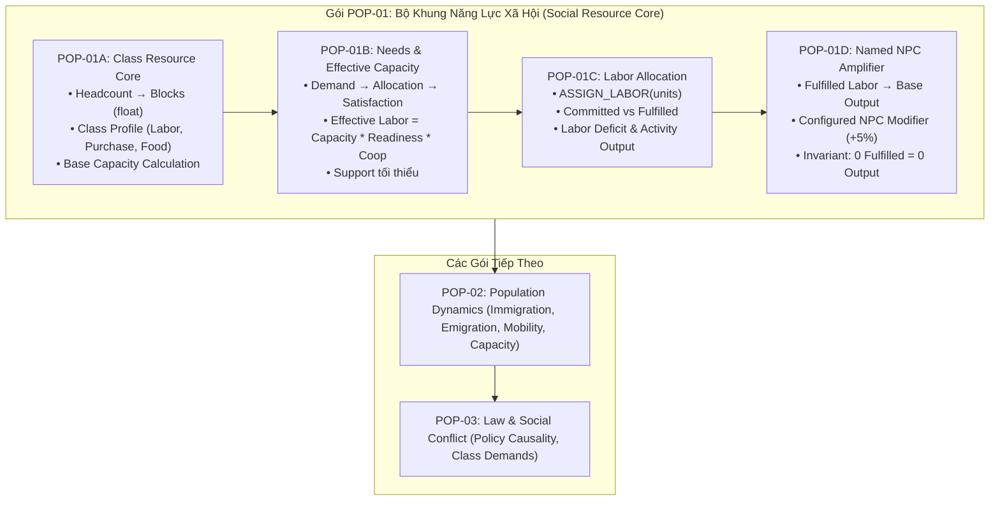

# Kế Hoạch Công Việc Thống Nhất: Dân Cư, Năng Lực Xã Hội & Quản Trị Lãnh Địa
# Mã Gói: WP-HAVEN-02 | Phiên Bản: 1.3 (DÀN Ý KIẾN TRÚC POPULATION & SOCIAL RESOURCE CORE)

> **Trạng thái**: `DÀN Ý KIẾN TRÚC THỐNG NHẤT` — Khóa toàn bộ khung lý thuyết và cơ học lõi cho Population & Social Resource Core trước khi bước vào chi tiết thi công.  
> **Commit nền**: `8111bf1e0fa5d3a49e30404ea65a9fd6ff4ccc17` (nhánh `main`).  
> **Nhánh thực hiện PR**: `docs/wp-haven-02` (Pull Request #2).  
> **Triết lý trung tâm**:
> > **Dân số thật tạo ra các năng lực xã hội. Nhu cầu và mức ủng hộ quyết định bao nhiêu năng lực đó thực sự sử dụng được. Player phân bổ năng lực, không phân bổ từng đầu người.**

---

## I. Mục Tiêu Cốt Lõi Của Hệ Thống

Hệ thống mô phỏng xã hội và dân cư của *Haven* phải trả lời minh bạch 5 câu hỏi cốt lõi tại mọi thời điểm:

1. **Lãnh địa có bao nhiêu người?** (Headcount quy mô thực tế).
2. **Cơ cấu tầng lớp của số dân đó là gì?** (Tỷ trọng các giai cấp trong xã hội).
3. **Mỗi tầng lớp tạo ra bao nhiêu lao động, sức mua và nhu cầu?** (Năng lực tiềm năng - Capacity).
4. **Bao nhiêu năng lực trong số đó thực sự sử dụng được ở thời điểm hiện tại?** (Năng lực khả dụng - Effective).
5. **Tại sao con số đó tăng hoặc giảm?** (Giải trình nhân quả - Dòng WHY).

```text
VÍ DỤ VẬN HÀNH:
Lower Class (Lao động nghèo)
Dân số thực tế:         10.000 người

Labor Capacity:            150 units
Effective Labor:           120 units
Allocated Labor:           110 units

GIẢI TRÌNH DÒNG WHY:
- Thiếu hụt lương thực      -10 units
- Mức ủng hộ chính quyền    +15 units
- Thiếu chỗ ở che mưa nắng   -5 units
```

* **Trải nghiệm người chơi**: Player cảm nhận trọn vẹn sức nặng của **10.000 cư dân**, nhưng giao diện điều hành chỉ yêu cầu phân bổ **100–200 đơn vị lao động (Labor Units)** có ý nghĩa.

---

## II. Giữ `Headcount` Làm Nguồn Chân Lý Duy Nhất

* Tuyệt đối không xóa bỏ số dân thật. Mỗi Cohort trong `Population` bắt buộc lưu trữ:
  $$\text{count} = \text{Số lượng cư dân thực tế}$$
* *Ví dụ*:
  * `Enslaved`: 1.000 người
  * `Lower`: 10.000 người
  * `Middle`: 3.000 người
  * `Upper`: 500 người
* **Phạm vi sử dụng Headcount**: Dùng trực tiếp cho quy mô lãnh địa, tính toán nhu yếu phẩm sinh tồn tuyệt đối, nhà ở, dịch bệnh, tỷ lệ tử vong, di cư, và các báo cáo nhân khẩu học.
* **Nguyên tắc phân công**: **Tuyệt đối không dùng trực tiếp Headcount để Player micro-manage phân công việc**.

---

## III. Lớp Quy Đổi Trung Gian: Population Blocks

Để kết nối giữa hàng chục nghìn con người với các đơn vị điều hành vĩ mô, hệ thống sử dụng lớp chuyển đổi **Population Blocks**:

$$\mathbf{100\ cư\ dân = 1\ Population\ Block}$$

* **Bảo toàn độ chính xác số học (No Precision Loss)**: Engine lưu trữ Population Blocks dưới dạng số thực (`float`), không làm tròn cụt số lẻ:
  $$\text{12.450 người} = \mathbf{124,5\ Population\ Blocks}$$
* **Ý nghĩa thiết kế**:
  * Giải quyết dứt điểm nghịch lý $99\text{ dân} \ne 0$.
  * Cho phép dân số tăng trưởng từng người một mỗi ngày mà không bị mất mát dữ liệu do ép kiểu số nguyên (`integer truncation`).
  * UI người chơi vẫn hiển thị đầy đủ: `12.450 cư dân`.

---

## IV. Hồ Sơ Năng Lực Giai Cấp (`Class Resource Profile`)

Mỗi tầng lớp xã hội sở hữu một Profile chuyển đổi Population Blocks thành các loại năng lực và nhu cầu tương ứng:

| Nhóm Xã Hội | Labor Multiplier | Purchasing Power Multiplier | Food Demand Multiplier |
| :--- | :---: | :---: | :---: |
| **Enslaved / Servile** | $\times 2.0$ | $\times 1.0$ | $\times 0.5$ |
| **Lower Class** | $\times 1.5$ | $\times 1.0$ | $\times 1.0$ |
| **Middle Class** | $\times 1.0$ | $\times 1.5$ | $\times 1.0$ |
| **Upper Class** | $\times 0.5$ | $\times 2.0$ | $\times 2.0$ |

*Ví dụ chuyển đổi với 1.000 người (= 10 Population Blocks)*:
* **1.000 Enslaved**: $\text{Labor Capacity} = 20$ | $\text{Purchase Demand} = 10$ | $\text{Food Demand} = 5$
* **1.000 Upper**: $\text{Labor Capacity} = 5$ | $\text{Purchase Demand} = 20$ | $\text{Food Demand} = 20$

*(Ghi chú: Đây là bộ tham số tuning cấu hình ban đầu, phục vụ xây dựng khung logic)*.

---

## V. Giữ Thiết Kế Ba Trục Thân Phận (Enslaved Là LegalStatus)

* Kiến trúc kiên định duy trì 3 trục độc lập:
  $$\mathbf{Occupation} \quad \times \quad \mathbf{SocialClass} \quad \times \quad \mathbf{LegalStatus}$$
* `enslaved` **không phải là một SocialClass mới**. Một người bị tước đoạt tự do vẫn là `LegalStatus = "enslaved"`.
* **Cơ chế kinh tế (Economic Adapter)**:
  $$\text{LegalStatus} = \text{"enslaved"} \implies \text{Áp dụng Servile Economic Profile}$$
* *Ý nghĩa*: Một thợ máy lành nghề bị bắt làm nô lệ vẫn giữ `Occupation = "technician"` và kỹ năng chuyên môn, nhưng quan hệ kinh tế và chế độ bóc lột tuân theo Servile Profile. Không làm méo mó cấu trúc nghề nghiệp.

---

## VI. Danh Mục Năng Lực Xã Hội Mở Rộng

Hệ thống định hướng quản lý đa dạng các nguồn lực xã hội:
1. **Labor Capacity** (Sức lao động chân tay phổ thông)
2. **Skilled Labor** (Lao động kỹ thuật / tay nghề cao)
3. **Purchasing Power** (Dung lượng thị trường & sức mua)
4. **Capital** (Vốn đầu tư tư bản)
5. **Influence** (Tầm ảnh hưởng chính trị)
6. **Administration** (Năng lực bộ máy quan liêu)
7. **Security / Military** (Tiềm lực quân sự & dân quân)
8. **Servile Labor** (Lao động cưỡng bức tuyệt đối)

* **Quy tắc phân kỳ**: Giai đoạn **POP-01 chỉ code 3 đại lượng tối thiểu**: **Labor Capacity**, **Purchasing Power**, và **Food Demand**. Ba đại lượng này là đủ để chứng minh toàn bộ cỗ máy kinh tế tầng lớp.

---

## VII. Phân Biệt `Capacity` (Tiềm Năng) Và `Effective` (Khả Dụng)

Một Cohort sở hữu năng lực tiềm năng (`Capacity`), nhưng mức độ huy động thực tế (`Effective`) phụ thuộc vào điều kiện sống và mức độ hợp tác:

$$\mathbf{EffectiveCapacity} = \mathbf{BaseCapacity} \times \mathbf{NeedReadiness} \times \mathbf{Cooperation}$$

* *Ví dụ*: 200 dân nghèo $\rightarrow$ Base Capacity = 3 units.
  * Đủ ăn, trật tự bình thường $\rightarrow$ Effective = 3 units.
  * Thiếu lương thực, đói kém $\rightarrow$ Effective tụt xuống 2 units.
  * Được đáp ứng mọi nhu cầu và ủng hộ chính quyền tột đỉnh $\rightarrow$ Effective duy trì tối đa.

---

## VIII. Cấu Trúc Nhu Cầu Hai Tầng (`NeedReadiness`)

Hệ thống loại bỏ thanh "Happiness" đơn điệu, chia nhu cầu thành 2 nhóm với các trọng số khác nhau theo từng tầng lớp:

1. **Nhu cầu thiết yếu (Vital Needs)**: Ảnh hưởng trực tiếp đến sự sống còn, sức khỏe và thể lực làm việc:
   * *Food, Water, Housing, Health, Security*.
2. **Nhu cầu xã hội & kỳ vọng (Social & Aspirational Needs)**: Ảnh hưởng đến mức độ ủng hộ (`Support`), chính trị và xu hướng di cư:
   * *Employment, Education, Luxury, Prestige, Property Protection, Political Privilege, Autonomy, Public Services*.

| Trọng Số Kỳ Vọng | Enslaved | Lower Class | Middle Class | Upper Class |
| :--- | :---: | :---: | :---: | :---: |
| **Lương thực (Food)** | Cao | Cao | Cao | Trung bình |
| **Nhà ở (Housing)** | Trung bình | Cao | Cao | Cao |
| **Việc làm (Employment)** | — | Rất cao | Cao | Trung bình |
| **Giáo dục (Education)** | Thấp | Thấp | Cao | Cao |
| **Xa xỉ phẩm (Luxury)** | Không | Thấp | Trung bình | Cực cao |
| **An ninh (Security)** | Cao | Trung bình | Cao | Cực cao |
| **Quyền tự quyết (Autonomy)**| Cực cao | Cao | Cao | Cao |
| **Bảo vệ tư hữu (Property)** | Thấp | Thấp | Trung bình | Cực cao |

---

## IX. Chu Trình Nhân Quả: $Demand \longrightarrow Allocation \longrightarrow Satisfaction$

Mỗi nhu cầu bắt buộc phải vận hành qua chu trình 3 bước khép kín:

$$\mathbf{Satisfaction} = \min\left(1.0, \frac{\text{Allocated}}{\text{Demand}}\right)$$

```text
CHU TRÌNH NHÂN QUẢ:
Food / Resource Allocation
        ↓
Need Satisfaction (%)
        ↓
Tác động lên Thể chất & Tinh thần (Health, Morale)
        ↓
Labor Readiness (Sẵn sàng lao động)
        ↓
Support & Compliance (Ủng hộ & Tuân thủ)
        ↓
Migration & Social Stability (Di cư & Ổn định)
```

---

## X. Tách Bạch Ba Trạng Thái: `Support`, `Compliance`, `Dependency`

Trong xã hội hậu tận thế, thái độ của cư dân đối với Lãnh chúa được chia làm 3 khía cạnh độc lập:

* **Support (Mức độ ủng hộ)**: Họ có thực tâm tán thành và yêu mến chính quyền không?
* **Compliance (Mức độ tuân thủ)**: Họ có phục tùng luật lệ và mệnh lệnh không? (Có thể tuân thủ vì sợ hãi quân đội).
* **Dependency (Mức độ lệ thuộc)**: Sinh kế của họ gắn chặt vào hệ thống của Lãnh chúa đến mức nào?

*Ví dụ minh họa tính thực tế*:
* **Tầng lớp Enslaved**: `Support: 10` | `Compliance: 90` | `Dependency: 95`. *(Tuân thủ cao vì áp chế và phụ thuộc nguồn sống, nhưng ngầm nuôi dưỡng oán hận, không phải trung thành)*.
* **Tầng lớp Upper Class**: `Support: 80` | `Compliance: 55` | `Dependency: 30`. *(Ủng hộ Lãnh chúa vì cùng giai cấp, nhưng sẵn sàng lách luật, trốn thuế khi đụng chạm tới đặc quyền tài sản)*.

---

## XI. Công Thức Tính `Effective Labor`

$$\mathbf{LaborCapacity} = \text{PopulationBlocks} \times \text{LaborMultiplier}$$

$$\mathbf{EffectiveLabor} = \lfloor \text{LaborCapacity} \times \text{NeedReadiness} \times \text{Cooperation} \rfloor$$

* Hệ số hợp tác (`Cooperation`) chịu tác động trực tiếp từ:
  $$\text{Cooperation} = f(\text{Support}, \text{Compliance}, \text{Điều kiện làm việc}, \text{Chính sách})$$

---

## XII. Người Chơi Phân Bổ `Labor Units`, Không Phân Bổ Từng Đầu Người

* **Thay đổi Command**:
  $$\text{Từ: } \text{ASSIGN\_WORKERS}(100\text{ người}) \longrightarrow \text{Thành: } \mathbf{ASSIGN\_LABOR}(20\text{ units})$$
* **Giao diện quản trị vĩ mô**:
  ```text
  LOWER CLASS COHORT (Dân số: 10.000 người | Blocks: 100)
  ├── Labor Capacity:     150 units
  ├── Effective Labor:    125 units (Đang dùng được)
  └── PHÂN BỔ THỰC TẾ:
        ├── Nông nghiệp (Field A):    50 units
        ├── Khai khoáng (Mine B):     30 units
        ├── Xây dựng (Project C):     25 units
        ├── Vận tải / Kho vận:        10 units
        └── Lực lượng dự bị:          10 units
  ```

---

## XIII. Cơ Chế `Committed` Khác `Fulfilled` & Phát Sinh Thiếu Hụt (Deficit)

* **Committed Labor**: Số lượng lao động Player đã chỉ định phân bổ cho một cơ sở.
* **Fulfilled Labor**: Số lượng lao động thực tế có mặt làm việc sau khi đã tính toán sụt giảm Effective do thiếu đói, bệnh tật hay bất mãn.
* **Nguyên tắc bảo toàn**: Không bao giờ tự tạo thêm lao động từ hư không:
  $$\mathbf{FulfilledLabor} = \min(\text{CommittedLabor}, \text{EffectiveLabor})$$
  $$\mathbf{LaborDeficit} = \text{CommittedLabor} - \text{FulfilledLabor}$$
* **Sản xuất (Production)** bắt buộc tính dựa trên **Fulfilled Labor**, không dựa trên Committed Labor. Khi xảy ra `Labor Deficit`, Player buộc phải đưa ra quyết định: tăng khẩu phần lương thực, giảm bớt mục tiêu hoạt động, hay điều chỉnh mức độ ưu tiên giữa các cơ sở.

---

## XIV. Named NPC Đứng Trên `Fulfilled Labor` (Khuếch Đại Hiệu Suất)

Named NPC không tự tạo ra Labor Units, mà đóng vai trò chuyên môn hóa và khuếch đại năng suất của lực lượng lao động thực tế:

$$\mathbf{BaseOutput} = f(\text{FulfilledLabor})$$

$$\mathbf{FinalOutput} = \lfloor \text{BaseOutput} \times (1 + \sum \text{NPCModifiers}) \rfloor$$

* **Luật bất biến (Hard Invariant)**:
  $$\text{FulfilledLabor} = 0 \implies \mathbf{FinalOutput = 0}$$
  *Nếu không có công nhân nào làm việc ngoài đồng, dù có chỉ định Maria ($+5\%$) hay Mila ($+5\%$) vào quản lý thì sản lượng vẫn bằng 0.*

---

## XV. `Purchasing Power` Và Giỏ Hàng Nhu Cầu Thị Trường

* `Purchasing Power` biểu thị dung lượng sức mua của thị trường (Market Demand Capacity), không nhất thiết là tiền mặt trong túi từng người.
* Sức mua được phân bổ theo giỏ hàng (Basket) đặc trưng của từng tầng lớp:
  * *Lower Class*: Hàng hóa cơ bản, nhu yếu phẩm, công cụ thô sơ.
  * *Middle Class*: Dịch vụ ăn uống, may mặc chất lượng, y tế, giáo dục.
  * *Upper Class*: Hàng hóa xa xỉ phẩm, dịch vụ đặc quyền, bất động sản cao cấp, an ninh tư nhân.

---

## XVI. `Food Demand` Là Mức Khẩu Phần Kỳ Vọng Theo Lối Sống

* Bộ hệ số Food Multiplier (Enslaved $\times 0.5$, Lower $\times 1.0$, Middle $\times 1.0$, Upper $\times 2.0$) được định nghĩa là **mức phân bổ khẩu phần tiêu chuẩn theo điều kiện sống và kỳ vọng giai cấp (Standard-of-Living Allocation Demand)**, không phải sự khác biệt sinh học về dạ dày.
* Giới thượng lưu đòi hỏi bàn tiệc thịnh soạn, lãng phí và thực phẩm cao cấp; trong khi tầng lớp lệ thuộc bị áp đặt khẩu phần sinh tồn tối thiểu.

---

## XVII. Mâu Thuẫn Xã Hội Phát Sinh Từ Cạnh Tranh Phân Bổ

Mọi quyết định quản trị nguồn lực đều mang tính hai mặt:
* Gia tăng nguồn cung lao động cưỡng bức (*Servile Labor*) $\rightarrow$ Tầng lớp Upper hài lòng vì giảm chi phí sản xuất, nhưng tầng lớp Lower phẫn nộ vì bị cạnh tranh việc làm trực tiếp.
* Dồn ngân sách sản xuất xa xỉ phẩm (*Luxury Supply*) $\rightarrow$ Tăng mức độ ủng hộ của Upper, nhưng nếu cắt giảm đầu tư lương thực cơ bản $\rightarrow$ Tầng lớp Lower bị suy giảm chỉ số đáp ứng thực phẩm (`Food Satisfaction` tụt dốc).

---

## XVIII. Tăng Trưởng Dân Số Hai Cổng (Sustainable Capacity)

1. **Cổng Sinh Tồn Tối Thiểu (Hard Minimum Gate)**:
   Dân cư thường trú (Resident Population) chỉ được tăng trưởng khi lãnh địa bảo đảm đầy đủ mức sống tối thiểu:
   $$\text{Resident Growth} > 0 \iff \text{FoodStock} \ge \text{MinFood} \land \text{WaterStock} \ge \text{MinWater} \land \text{HousingCapacity} > \text{CurrentPopulation}$$
2. **Lực Hút Và Cơ Cấu Giai Cấp (Attraction & Composition)**:
   Khi qua được Hard Gate, các yếu tố `Employment` + `QoL` + `Security` + `Law` sẽ quyết định quy mô và tỷ trọng các tầng lớp muốn chuyển đến.
3. **Người Lưu Vong Ngoại Vi (Outside Arrivals)**:
   Người tìm đến khi lãnh địa quá tải sẽ ở trạng thái chờ ngoài cổng thành (`Applicants / Outside Settlement`), tuyệt đối không được tính vào Resident Population nếu chưa được tiếp nhận.

---

## XIX. Cơ Chế Luật Pháp (Law) Tác Động Qua Điều Kiện

* Luật pháp (`Policy / Law`) chỉ thay đổi: *Tiêu chí tiếp nhận (`Eligibility`), Quy tắc phân bổ (`Allocation Rules`), Quyền tài sản, Điều kiện lao động, Thuế khóa, Trạng thái pháp lý*.
* **Luật bất biến**: Tuyệt đối không có lệnh nào được phép trực tiếp sửa đổi biến đếm dân số (cấm code kiểu `lowerClass -= 100`). Luật thay đổi môi trường $\rightarrow$ Thay đổi mức thỏa mãn nhu cầu $\rightarrow$ Population Engine tự động tạo ra dòng lưu chuyển.

---

## XX. Hai Báo Cáo Song Song Cho Nhà Quản Trị

Player quản lý lãnh địa thông qua 2 báo cáo độc lập:

1. **Population Report (Báo cáo Nhân khẩu học)**: Phản ánh biến động con người thực tế (Headcount, Immigration, Emigration, Mobility).
2. **Social Resource Report (Báo cáo Năng lực Xã hội)**: Phản ánh sự biến động của Labor Capacity, Effective Labor, Sức mua kèm theo **dòng giải trình nguyên nhân (WHY)**.

---

## XXI. Lộ Trình Triển Khai Thực Tế

Chia nhỏ lát cắt kỹ thuật ban đầu thành 4 micro-slices để bảo đảm hoàn thành nhanh, chắc chắn và có kiểm thử độc lập:



---

## XXII. Những Điều Tuyệt Đối CHƯA Làm (Out Of Scope)

Để triệt tiêu nguy cơ trôi dạt phạm vi (Scope Creep), các hạng mục sau nghiêm cấm đưa vào giai đoạn này:
* Chưa làm bản đồ, lưới ô cờ (grid), vị trí địa lý, footprint hay tìm đường (pathfinding).
* Chưa làm quy trình xây dựng vật lý (chưa code lệnh `BUILD_FACILITY`, trừ kho vật liệu hay đếm nhịp thi công).
* Chưa làm hệ thống tiền tệ/thuế khóa phức tạp.
* Chưa làm hệ thống ý thức hệ xã hội (Future Societies).
* Chưa làm hệ thống nội dung trưởng thành chi tiết.
* Chưa làm cơ chế sinh/tử (Birth/Death).
* Chưa làm thuật toán tự động chuyển đổi kỹ năng sang NPC modifier.

---

## XXIII. Bốn Quyết Định Kỹ Thuật Đã Khóa (D17–D20)

* **D17 (Chuẩn Population Block)**: Khóa cứng tỷ lệ quy đổi **100 cư dân = 1 Population Block**, lưu trữ dưới dạng số thực (`float`) để bảo toàn chính xác phần lẻ.
* **D18 (Bộ Multiplier Khởi Đầu)**: Khóa bộ tham số khởi đầu cho 4 nhóm:
  * Enslaved: `Labor x2.0` | `Purchasing x1.0` | `Food x0.5`
  * Lower Class: `Labor x1.5` | `Purchasing x1.0` | `Food x1.0`
  * Middle Class: `Labor x1.0` | `Purchasing x1.5` | `Food x1.0`
  * Upper Class: `Labor x0.5` | `Purchasing x2.0` | `Food x2.0`
* **D19 (Bản chất Food Demand)**: Định nghĩa `Food Demand` là **khẩu phần tiêu chuẩn theo kỳ vọng lối sống**, không phải nhu cầu sinh học.
* **D20 (Support tác động lên Labor ở POP-01B)**: Cho phép mức độ ủng hộ (`Support`) tham gia trực tiếp vào việc tính toán hệ số hợp tác (`Cooperation`) để sinh ra `Effective Labor`.
