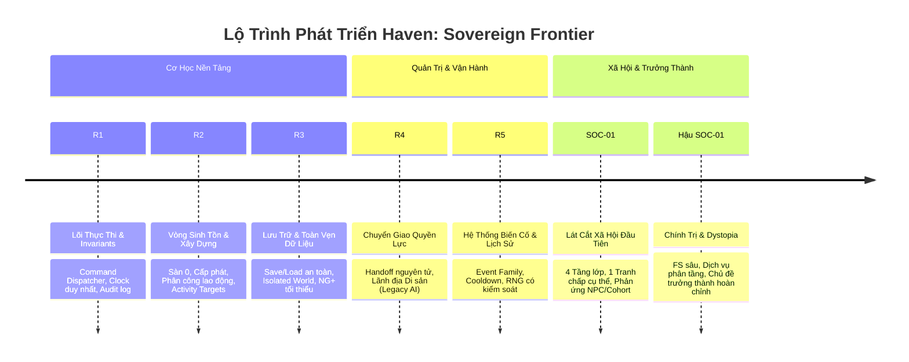

# Kế Hoạch Công Việc Thống Nhất: Sinh Tồn, Tầng Lớp & Quản Trị Lãnh Địa
# Mã Gói: WP-HAVEN-02 | Phiên Bản: 1.0 (DRAFT_FOR_G1)

> **Trạng thái**: `DRAFT_FOR_G1` — Chờ Human phê duyệt chính thức trước khi chuyển sang G2.  
> **Commit nền**: `8111bf1e0fa5d3a49e30404ea65a9fd6ff4ccc17` (nhánh `main`).  
> **Phần triển khai kỹ thuật đầu tiên**: Gói R2 — Vòng sinh tồn & xây dựng (`feat/r2-survival-building`).  
> **Các phần nằm trong thiết kế tổng nhưng chưa code trong R2**: Policy/FS động, Mâu thuẫn giai cấp đầy đủ, Nội dung trưởng thành, Save/Load (R3), Handoff (R4), Government AI.

---

## 1. Mục Tiêu Sản Phẩm & Vòng Chơi Thống Nhất

### 1.1. Tầm nhìn cốt lõi
> **Player xây dựng một cộng đồng hậu tận thế; tổ chức sản xuất và phân phối nguồn lực; hình thành trật tự xã hội; đối diện phản ứng của những con người sống trong trật tự đó; rồi có thể bàn giao lãnh địa và chứng kiến di sản của mình tiếp tục phát triển.**

### 1.2. Vòng chơi thống nhất (Unified Gameplay Loop)
$$\text{Xây dựng} \longrightarrow \text{Bố trí người} \longrightarrow \text{Sản xuất \& Cấp phát} \longrightarrow \text{Phân phối quyền lợi} \longrightarrow \text{Phản ứng xã hội / NPC} \longrightarrow \text{Luật lệ \& Tiền lệ} \longrightarrow \text{Thay đổi xã hội} \longrightarrow \text{Di sản}$$

* **Nguyên tắc xuyên suốt**: Mọi thay đổi quan trọng đều phải có nguyên nhân mà người chơi quan sát được và giải trình được dòng WHY, tuyệt đối không tăng giảm chỉ số ngẫu nhiên không rõ nguồn gốc.

---

## 2. Hệ Thống Tầng Lớp Xã Hội & Trục Thân Phận

### 2.1. Phân tầng xã hội (Đề xuất 4 tầng trong + 1 nhóm ngoài)
* **Giới nhà giàu (Thượng lưu & Quyền thế)**: Đến từ tài sản tích lũy, dòng dõi quý tộc, chức vụ cao cấp hoặc quyền chỉ huy quân sự.
* **Giới bình dân (Thường dân có sinh kế ổn định)**: Tiểu thương, thợ thủ công mỹ nghệ, thầy thuốc/y tế, chủ trang trại nhỏ, quân nhân biên chế ổn định.
* **Giới nhà nghèo (Lao động nghèo)**: Người làm thuê, tá điền, thợ phụ, lao động thời vụ bấp bênh.
* **Tầng đáy (Nhóm bên lề & Lệ thuộc)**: Người mất hoàn toàn sinh kế, người lưu vong chưa được tiếp nhận, người bị tước đoạt quyền tự quyết (nợ nần, tù nhân, lao động cưỡng bức).
* **Người ngoài lãnh địa (Lực lượng ngoại vi)**: Đoàn buôn vãng lai, cộng đồng wasteland láng giềng, nhóm thảo khấu ngoài vòng pháp luật, người tị nạn xin cư trú. *(Nhóm này đứng ngoài quyền quản trị trực tiếp, không phải là tầng lớp thứ 5 trên cùng một thang)*.

### 2.2. Tách bạch 6 thuộc tính nhân vật (Không đồng nhất nhãn)
1. **Occupation (Nghề nghiệp)**: Người đó làm công việc gì? (Nông dân, thợ máy, bác sĩ...).
2. **SocialClass (Tầng lớp xã hội)**: Vị thế và uy tín xã hội ở đâu?
3. **LegalStatus (Thân phận pháp lý)**: Có những quyền gì? (Công dân tự do, lao động giao kèo, nô lệ, ngoại kiều...).
4. **Bổ nhiệm (Chức vụ)**: Đang quản lý hoặc chỉ huy cơ sở/vùng nào?
5. **Tư cách thành viên (Affiliation)**: Thuộc lãnh địa trực trị, khách vãng lai hay thuộc phe thế lực khác?
6. **Điều kiện sống (Living Conditions)**: Thực tế được ăn, ở, bảo vệ và y tế ra sao?

*Nguyên tắc*: Không đánh đồng nghề nghiệp với giai cấp. Một bác sĩ có thể nghèo khó; một quý tộc có thể phá sản; một người mất tự do không bị xóa bỏ kỹ năng chuyên môn. **Trong R2 giữ nguyên enum dữ liệu hiện có, không tự ý refactor hàng loạt dữ liệu dân số**.

### 2.3. Nguyên Tắc Tác Nhân Tập Thể & Chống "Passive Aura"
* **Định vị Population Cohort**:
  > **Population Cohorts là tác nhân mô phỏng cấp tập thể, không phải background statistic. Mọi cohort phải có khả năng tham gia lao động, tiêu thụ, phản ứng xã hội và tạo hậu quả theo nhóm. Named NPC cung cấp chiều sâu cá nhân và vai trò đặc biệt, nhưng không thay thế chức năng của population.**
* **Khóa nguyên tắc "Không tự tạo bonus chỉ vì tồn tại" (No Passive Aura)**:
  100 dân nghèo trong thành phố không tự làm mọi cánh đồng $+10\%$. Bất kỳ sự gia tăng chỉ số hay sản lượng nào đều phải bắt nguồn từ **nhóm dân thực sự được phân công vào hoạt động đó**.
* **Phân hóa mối quan tâm giai cấp (Nền móng cho SOC-01)**:
  * *Lower / poor laborers*: Quan tâm trực tiếp đến việc làm, khẩu phần ăn uống, nơi trú ngụ.
  * *Stable commoners*: Quan tâm đến dịch vụ công cộng, ổn định giá cả, cơ hội chuyển đổi nghề nghiệp.
  * *Upper / elites*: Quan tâm đến bảo vệ tài sản, quyền lực chính trị, an ninh tuyệt đối và đặc quyền.

---

## 3. Mâu Thuẫn Xã Hội & Chủ Đề Trưởng Thành (Adult & Social Themes)

### 3.1. Bản chất của mâu thuẫn xã hội
Mâu thuẫn không phát sinh từ định kiến trừu tượng "tầng này ghét tầng kia", mà phát sinh từ **xung đột lợi ích cụ thể**:
* **Nhu yếu phẩm & Nhà ở**: Khẩu phần lương thực, nguồn nước sạch, chất lượng nơi cư trú, quyền ưu tiên dịch vụ.
* **Việc làm & Sở hữu**: Tiền công, quyền sở hữu công cụ/đất đai, quyền tự do đổi nghề hoặc rời bỏ quan hệ lệ thuộc.
* **Gia đình & Địa vị**: Sự công nhận hôn nhân, quyền thừa kế tài sản, đặc quyền huyết thống.
* **Chăm sóc & Dịch vụ công**: Công suất trạm y tế/trường học, tiêu chí ưu tiên bệnh nhân/học viên, điều kiện kèm theo của bên tài trợ.
* **Tiếp nhận ngoại kiều**: Cấp quyền cư trú, cạnh tranh việc làm, rủi ro an ninh và nghĩa vụ đóng góp.

$$\text{Tranh chấp cụ thể} \rightarrow \text{Yêu cầu gửi lên} \rightarrow \text{Player quyết định} \rightarrow \text{Chính sách thực thi} \rightarrow \text{Đời sống biến đổi} \rightarrow \text{Phản ứng Cohort/NPC} \rightarrow \text{Lưu ký ức/Tiền lệ}$$

### 3.2. Chuẩn mực xử lý chủ đề trưởng thành
* Nằm ở sự giao thoa giữa **quyền lực công quyền và đời sống cá nhân**: Hôn nhân, quyền riêng tư, điều kiện lao động, chăm sóc sinh sản và quyền tự quyết thân thể.
* Phản ánh thế giới hậu tận thế khốc liệt (dystopia) qua góc nhìn điều tra, lời kể và hậu quả pháp lý/xã hội; **tuyệt đối không biến bạo lực/bóc lột thành phần thưởng khiêu dâm hay vòng tối ưu hóa khoái cảm**.
* **Nguyên tắc đồng thuận**: Nỗi sợ hãi (`fear`), lệ thuộc hay trung thành cao (`devotion`) không thay thế cho sự tự nguyện thực sự.
* Nội dung thân mật chỉ diễn ra giữa những người trưởng thành có sự đồng thuận.
* Việc người chơi **tắt bộ lọc nội dung nhạy cảm không bao giờ làm suy giảm quyền lợi hoặc hiệu quả gameplay**.

---

## 4. Phân Biệt Giữa Luật Lệ (Policies) và Hệ Tư Tưởng Xã Hội (FS)

| Khái niệm | Định nghĩa & Trách nhiệm |
| :--- | :--- |
| **Founder Charter** | Hiến chương nền tảng và di sản lâu dài của người sáng lập lãnh địa. |
| **Policy / Law** | Quy tắc pháp lý chính quyền ban hành, có chi phí ban hành và duy trì. |
| **Emergency Decree** | Sắc lệnh khẩn cấp, có phạm vi áp dụng hẹp và thời hạn tự hủy. |
| **Executive Directive** | Chỉ thị điều hành trực tiếp của Lãnh chúa cho từng cơ sở/vùng. |
| **Management Rule** | Quy tắc tự động hóa vận hành, có cơ chế kiểm tra quyền ưu tiên và xung đột. |
| **Societal Direction / FS** | Thực tế xã hội đang biến chuyển thành gì dựa trên bằng chứng hành vi tích lũy. |

*Luật bất biến*: Không có chuyện ban hành một luật thì xã hội lập tức nhảy vọt điểm ý thức hệ ("FS +10"). Mọi luật lệ phải đi qua chuỗi:
$$\text{Năng lực bộ máy} \longrightarrow \text{Thực thi thực tế} \longrightarrow \text{Hành vi \& Phản ứng dân chúng} \longrightarrow \text{Bằng chứng xã hội tích lũy}$$

---

## 5. Kế Hoạch Triển Khai Chi Tiết Gói R2 (Vòng Sinh Tồn & Xây Dựng)

### 5.1. Tái Cấu Trúc Trọng Tâm R2: Mô Hình Activity Target & Phối Hợp Lao Động
R2 chuyển dịch tư duy từ `Building -> Workers -> Output` sang kiến trúc **Activity Target & Combined Operational Effect**:

```text
ACTIVITY / OPERATION TARGET (Field, Well, Workshop...)
│
├── Cohort Assignments
│     └── contribution theo số người / tầng lớp / nghề (Base Contribution)
│
├── Named NPC Assignments
│     └── contribution theo kỹ năng / chức vụ cá nhân (Amplifier Modifier)
│
└── Combined Operational Effect (Sản lượng thực tế / Dịch vụ / Ổn định)
```

* **Hoãn bài toán không gian (Spatial Scope Hoisted)**:
  Trong giai đoạn R2, hệ thống **chưa định nghĩa map placement, footprint, grid tọa độ, đường xá hay quá trình vẽ kiến trúc**. Các đối tượng `Field`, `Well`, `Shelter` đóng vai trò là các **Activity Targets** trong simulation nhằm kiểm chứng logic: *Dân vô danh và Named NPC cùng tác động lên dòng tài nguyên và sự sinh tồn*.

### 5.2. Cơ chế Xây dựng Công trình (Activity Target Creation)
* **Tính nguyên tử (Atomicity)**: Trừ chi phí kho và tạo bản ghi Activity Target trong cùng một giao dịch. Nếu thiếu bất kỳ tài nguyên nào $\rightarrow$ Rollback toàn bộ, kho giữ nguyên, không sinh dữ liệu rác.
* **Catalog giá chuẩn**: Chi phí xây dựng lấy từ Catalog chuẩn của hệ thống, không tin tưởng tham số giá do client/UI gửi lên.
* **Chu kỳ thi công 1 nhịp ngày**:
  * Ngày $T$ (lúc gửi lệnh): Trừ tài nguyên, công trình ở trạng thái `construction`.
  * Kết thúc ngày $T$: Công trình chưa hoạt động, chưa sinh sản lượng.
  * Mở đầu ngày $T+1$: Công trình chuyển thành `operational`, mở khóa nhận lao động.
  * Xử lý ngày $T+1$: Bắt đầu phát sinh sản lượng nếu đã được bố trí nhân lực.
* **Định danh duy nhất**: Mỗi thực thể tạo ra có `id` riêng biệt (UUID), cho phép tạo nhiều Activity Target cùng một bản vẽ (`blueprintId`).
* **Bảo toàn 3 bản vẽ hiện có**: Nông trại nhỏ (`farm_basic`), Giếng nước sạch (`well_basic`), Khu trú ẩn (`shelter_makeshift`).

### 5.3. Cơ chế Phân công Lao động & Tính Điểm Đóng Góp (Assignments & Contribution)
* Sử dụng Command chuẩn: `ASSIGN_WORKERS` với payload `{ facilityId, cohortId, targetWorkerCount }`.
* **Idempotency (Tính bất biến khi gọi lại)**: Gửi lệnh 4 người hai lần liên tiếp thì kết quả vẫn là 4, không cộng dồn thành 8. Đặt bằng 0 để giải phóng toàn bộ công nhân.
* **Bảo toàn nhân lực**: Tổng số công nhân phân bổ từ một cohort không bao giờ vượt quá quy mô dân số hiện có của cohort đó.
* **Không làm giảm dân số tiêu thụ**: Người đi làm việc ngoài đồng/giếng vẫn là thành viên cộng đồng và vẫn tiêu thụ lương thực/nước hàng ngày như bình thường.
* **Mô hình phối hợp Cohort + Named NPC**:
  $$\text{Total Contribution} = \text{Cohort Base} + \text{Named NPC Modifier}$$
  *Ví dụ minh họa*:
  - 100 dân tầng thấp được phân công $\rightarrow +10\%$ đóng góp lao động cơ sở.
  - Maria (chuyên gia nông nghiệp) $\rightarrow +5\%$ khuếch đại.
  - Mila (quản đốc giàu kinh nghiệm) $\rightarrow +5\%$ khuếch đại.
  - Tổng contribution đạt $+20\%$. Named NPC không thay thế dân công, mà nâng cao hiệu suất của tập thể.
* **Cấu trúc dữ liệu**: Bảng phân công minh bạch `assignments: Record<CohortId, number>`, tính tổng công nhân làm việc thực tế.

### 5.4. Mô hình Sản xuất & Cấp phát Sàn 0 (Zero-Floor Allocation)
* **Công thức sản lượng theo tỷ lệ nhân lực cơ sở**:
  $$\text{Output} = \left\lfloor \text{BaseOutput} \times \frac{\text{AssignedWorkers}}{\text{WorkersRequired}} \right\rfloor$$
  *Ví dụ*: Nông trại cần 4 người, sản lượng cơ sở 15 $\rightarrow$ 4 người cho 15 lương thực; 2 người cho 7 lương thực; 0 người cho 0.
* **Trình tự xử lý trong nhịp ngày (`ADVANCE_DAY`)**:
  1. **Sản xuất (Production)**: Tính sản lượng từ các Activity Target `operational` có người làm việc.
  2. **Tính nhu cầu (Demand)**: Dựa trên tổng dân số sống trong lãnh địa.
  3. **Cấp phát & Thiếu hụt (Allocation & Deficit)**:
     $$\text{Available} = \text{OpeningStock} + \text{Production}$$
     $$\text{Allocated} = \min(\text{Available}, \text{Demand})$$
     $$\text{Deficit} = \text{Demand} - \text{Allocated}$$
     $$\text{ClosingStock} = \text{Available} - \text{Allocated} \ge 0$$
  4. **Tác động Sĩ khí / Sức khỏe**: Áp dụng hình phạt nếu có thiếu hụt; hồi phục nếu được cấp đủ.
  5. **Cập nhật thi công**: Chuyển các công trình đến hạn từ `construction` sang `operational`.
  6. **Mở ngày mới**: `day = day + 1`.

### 5.5. Tham số Thiếu hụt & Hồi phục (Experimental Parameters)
* **Tỷ lệ thiếu hụt**: $\text{DeficitRatio} = \max\left(\frac{\text{FoodDeficit}}{\text{FoodDemand}}, \frac{\text{WaterDeficit}}{\text{WaterDemand}}\right)$.
* **Trừ Sĩ khí (Morale)**: Giảm ngay trong ngày thiếu: $\Delta\text{Morale} = -\text{round}(15 \times \text{DeficitRatio})$.
* **Trừ Sức khỏe (Health)**: Bắt đầu trừ từ ngày thiếu liên tiếp thứ 2 trở đi: $\Delta\text{Health} = -\text{round}(10 \times \text{DeficitRatio})$.
* **Hồi phục (Recovery)**: Khi ngày đó được cấp phát đủ 100% nhu cầu:
  * Reset bộ đếm ngày thiếu liên tiếp về 0.
  * Hồi phục tự nhiên tối đa $+2$/ngày cho đến ngưỡng trần an toàn: Morale đạt 75, Health đạt 85.
  * Nếu chỉ số vốn đang cao hơn ngưỡng trần thì giữ nguyên, không kéo tụt xuống.
* **Tác động lên Named NPC**: Ghi nhận suy giảm sức khỏe chung; chưa tự động quy đổi thành điểm quan hệ (`trust`/`affection`).
* **Tử vong / Bạo loạn**: Chưa kích hoạt trong phạm vi hẹp của R2.

---

## 6. Kịch Bản Nghiệm Thu Số Học Cụ Thể (R2 Acceptance Scenario)

* **Thiết lập ban đầu (Fixture ngày 1)**:
  * Dân số: 45 công nhân (`workers`), 1 Named NPC (`elder_thomas`), 1 Trú ẩn dựng sẵn.
  * Kho ban đầu: 100 Lương thực, 100 Nước, 150 Vật liệu, 25 Công cụ.
  * Nhu cầu hàng ngày: 46 người tiêu thụ 23 Lương thực (0.5/người) và 23 Nước (0.5/người).
* **Chuỗi thao tác kiểm thử**:
  * Ngày 1: Ra 3 lệnh xây dựng (2 Nông trại nhỏ tiêu tốn $2 \times 50$ vật liệu $+ 2 \times 5$ công cụ; 1 Giếng nước sạch tiêu tốn 30 vật liệu $+ 3$ công cụ).
  * Ngày 2: 3 công trình hoàn tất thi công. Ra lệnh phân công: 4 người vào Farm 1, 4 người vào Farm 2, 2 người vào Well 1 (Tổng 10 lao động).
  * Ngày 3 & 4: Vận hành sản xuất ổn định (Tổng sản lượng: 30 lương thực, 25 nước/ngày; thặng dư ròng: $+7$ lương thực, $+2$ nước/ngày).

**Bảng biến động tài nguyên kỳ vọng qua các nhịp ngày**:

| Mốc thời gian | Lương thực | Nước sạch | Vật liệu | Công cụ | Trạng thái công trình & lao động |
| :--- | :---: | :---: | :---: | :---: | :--- |
| **Khởi tạo Ngày 1** | 100 | 100 | 150 | 25 | 1 Trú ẩn hoạt động, 0 người phân công |
| **Sau 3 lệnh BUILD** | 100 | 100 | **20** | **12** | 2 Farm + 1 Well đang xây dựng (`construction`) |
| **Hết Ngày 1 $\rightarrow$ Mở Ngày 2** | **77** | **77** | 20 | 12 | Tiêu thụ 23/23; công trình thành `operational` |
| **Lệnh ASSIGN (4+4+2)** | 77 | 77 | 20 | 12 | 10 người đã vào vị trí; kho không đổi |
| **Hết Ngày 2 $\rightarrow$ Mở Ngày 3** | **84** | **79** | 20 | 12 | $+30$ ăn, $+25$ nước; $-23$ ăn, $-23$ nước (Dư $+7/+2$) |
| **Hết Ngày 3 $\rightarrow$ Mở Ngày 4** | **91** | **81** | 20 | 12 | Tích lũy tiếp $+7$ lương thực, $+2$ nước sạch |

---

## 7. Lộ Trình Phân Kỳ Tổng Thể (Phân Tách R2 và Xã Hội)



* **Quy tắc phân kỳ**:
  * **R2**: Tập trung 100% vào cơ học sinh tồn, tài nguyên sàn 0, lệnh xây dựng và phân bổ lao động. Không đụng đến Save/Load hay Tranh chấp giai cấp.
  * **SOC-01**: Triển khai một lát cắt xã hội tối thiểu (Minimal Vertical Slice): 1 kịch bản tranh chấp cụ thể giữa các tầng lớp về quyền tiếp cận dịch vụ, ghi nhận phản ứng và lưu lại tiền lệ xã hội.

---

## 8. Sổ Quyết Định Kỹ Thuật (Decision Records D01–D10)

* **D01 (Chi phí xây dựng)**: Trừ nguyên tử cùng lúc tạo thực thể công trình. Thất bại thì rollback 100%.
* **D02 (Thời gian thi công)**: 1 nhịp ngày (`construction` $\rightarrow$ `operational` ở ngày tiếp theo).
* **D03 (Lao động phân công)**: Lệnh `ASSIGN_WORKERS` theo cơ chế gán số lượng mục tiêu (idempotent), không giảm trừ tiêu thụ dân số.
* **D04 (Sản lượng)**: Tỷ lệ tuyến tính theo công nhân làm tròn xuống sàn (`Math.floor`).
* **D05 (Sàn tài nguyên)**: Tuyệt đối không âm; áp dụng mô hình Nhu cầu $\rightarrow$ Cấp phát $\rightarrow$ Thiếu hụt.
* **D06 (Hồi phục & Phạt)**: Sĩ khí trừ ngay khi thiếu; Sức khỏe trừ từ ngày thứ 2; Hồi phục tối đa $+2$/ngày có trần an toàn.
* **D07 (Interface công trình)**: Chuyển đổi an toàn từ `facilityType` sang `blueprintId` có test tương thích ngược.
* **D08 (Phân kỳ công việc)**: Giữ nguyên thiết kế xã hội trong tài liệu WP; chỉ giao Builder thực hiện phạm vi hẹp R2.
* **D09 (Kiến trúc Activity Target)**: Tạm hoãn hệ thống bản đồ/grid/footprint ở R2; định nghĩa công trình là các Activity Target để tập trung kiểm chứng vòng lặp nhân lực và sản lượng.
* **D10 (Mô hình đóng góp phối hợp)**: Contribution = Cohort Base + Named NPC Modifier. Cấm tạo bonus thụ động nếu dân không được phân công vào hoạt động cụ thể.

---

## 9. Danh Mục Tệp Được Phép Chỉnh Sửa Trong R2 (Allowlist)

### Được phép chỉnh sửa/tạo mới:
* `packages/core/src/domain/facility.ts` (Thêm cấu trúc assignments, blueprint, status thi công).
* `packages/core/src/domain/economy.ts` (Sửa logic cấp phát sàn 0, nhận ngày thực tế).
* `packages/core/src/domain/command.ts` (Khai báo lệnh `BUILD_FACILITY`, `ASSIGN_WORKERS`).
* `packages/core/src/rules/` (Logic tính sản lượng, validator phân công lao động).
* `packages/simulation/src/` (Dispatcher thực thi 2 lệnh mới và cập nhật nhịp ngày).
* `packages/ui/src/` (Hiển thị kho, sản lượng, thiếu hụt, form xây và phân công).
* Các file test tương ứng trong `__tests__/`.

### Nghiêm cấm đụng vào trong R2:
* Hệ thống Save/Load, LocalStorage, Serialization phức tạp (để dành R3).
* Logic Handoff, Đổi người quản trị, Legacy AI (để dành R4).
* Bảng quan hệ xã hội phức tạp, Enum phân tầng dân số mới (để dành SOC-01).

---

## 10. Tiêu Chí Nghiệm Thu Gói R2 (Acceptance Criteria AC01–AC16)

1. **AC01 (Lệnh sai)**: Lệnh xây thiếu tài nguyên hoặc phân công vượt dân số bị từ chối với mã lỗi và lý do rõ ràng.
2. **AC02 (Nguyên tử)**: Kho không bị trừ một phần khi lệnh xây dựng thất bại.
3. **AC03 (Thi công)**: Công trình mới xây không sinh sản lượng trong ngày đầu tiên.
4. **AC04 (Instance ID)**: Xây 2 công trình cùng loại tạo ra 2 ID riêng biệt, không đè nhau.
5. **AC05 (Phân công Idempotent)**: Gửi trùng lệnh phân công không làm nhân đôi số người.
6. **AC06 (Bảo toàn dân số)**: Tổng công nhân phân bổ $\le$ dân số thực tế của Cohort.
7. **AC07 (Tiêu thụ)**: Công nhân đi làm vẫn tiêu thụ đủ 0.5 ăn và 0.5 nước/ngày.
8. **AC08 (Named NPC)**: Named NPC không bị mất hay tính trùng vào Cohort.
9. **AC09 (Sản lượng đủ)**: Đủ người làm việc cho ra chính xác 100% BaseOutput.
10. **AC10 (Sản lượng thiếu)**: Thiếu người làm việc tính đúng công thức làm tròn sàn.
11. **AC11 (Kho không âm)**: Kho cạn kiệt thì cấp phát tối đa bằng lượng có sẵn, kho về đúng 0, không âm.
12. **AC12 (Hình phạt Sĩ khí)**: Thiếu hụt trừ đúng điểm Sĩ khí theo tỷ lệ.
13. **AC13 (Hình phạt Sức khỏe)**: Thiếu ngày 1 chưa trừ sức khỏe; thiếu liên tiếp ngày 2 trừ đúng điểm.
14. **AC14 (Hồi phục có trần)**: Khi cấp đủ, hồi phục $+2$/ngày và dừng lại ở trần 75 sĩ khí, 85 sức khỏe.
15. **AC15 (Kịch bản chuẩn)**: Chạy thông suốt kịch bản 4 ngày với bảng số liệu khớp 100%.
16. **AC16 (Hồi quy R1)**: Toàn bộ 51 unit tests hiện có của R1 vẫn PASS 100%.

---

## 11. Quy Chuẩn Vận Hành & Chuyển Giao (Lifecycle Gates G0 $\rightarrow$ G6)

* **Bước tiếp theo sau khi Human duyệt G1**:
  1. Xác nhận branch protection trên `main`.
  2. Tạo branch riêng: `feat/r2-survival-building`.
  3. Viết test case hồi quy và test case nghiệm thu trước (Test-First).
  4. Thực hiện mã hóa trong phạm vi Allowlist.
  5. Chạy toàn bộ lint, typecheck, unit test và e2e test local.
  6. Mở Pull Request lên GitHub, gắn kèm Commit SHA và Test Run ID.
  7. **Dừng lại ở G4/G5 để Human review và Human merge**. Tuyệt đối không tự ý push thẳng vào `main` hay tự approve PR.
