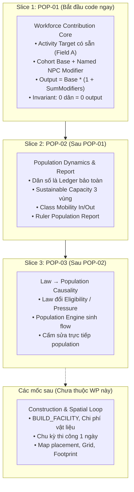

# Kế Hoạch Công Việc Thống Nhất: Dân Cư, Tầng Lớp & Quản Trị Lãnh Địa
# Mã Gói: WP-HAVEN-02 | Phiên Bản: 1.1 (DRAFT_FOR_G1)

> **Trạng thái**: `DRAFT_FOR_G1` — Cập nhật sau phản hồi Review PR #2 (`CHANGES_REQUESTED`), chờ Human duyệt G1.  
> **Commit nền**: `8111bf1e0fa5d3a49e30404ea65a9fd6ff4ccc17` (nhánh `main`).  
> **Nhánh thực hiện PR**: `docs/wp-haven-02` (Pull Request #2).  
> **Head Commit trước chỉnh sửa**: `25ce8adc754fd4f0d50ce7ffb41c47375b9a95a9`.  
> **Trọng tâm tái cấu trúc**: Chuyển đổi từ "Building/Construction R2" sang **Umbrella WP về Population & Society**, chia 3 lát cắt phụ thuộc. Lát cắt đầu tiên code ngay là **`POP-01: Workforce Contribution Core`**. Toàn bộ việc xây dựng vật lý (BUILD, construction stage, map/grid) được tách riêng và hoãn lại phía sau.

---

## 1. Mục Tiêu Sản Phẩm & Triết Lý "Con Người Đi Trước Kiến Trúc"

### 1.1. Tầm nhìn cốt lõi
> **Player xây dựng một cộng đồng hậu tận thế; tổ chức con người và phân bổ lao động; thiết lập trật tự xã hội; đối diện phản ứng của các tầng lớp dân chúng; rồi có thể bàn giao lãnh địa và chứng kiến di sản của mình tiếp tục vận hành.**

### 1.2. Nguyên tắc ưu tiên (Dependency Order)
$$\mathbf{Con\ người\ (Population)} \longrightarrow \mathbf{Phân\ công\ (Workforce)} \longrightarrow \mathbf{Động\ thái\ dân\ cư\ (Dynamics)} \longrightarrow \mathbf{Chính\ sách\ (Policy)} \longrightarrow \mathbf{Kiến\ trúc\ \&\ Bản\ đồ\ (Spatial)}$$

* Trò chơi bắt đầu từ con người và cách con người vận hành một cơ sở, chứ không bắt đầu từ việc vẽ công trình hay đo đạc bản đồ.
* Một `Field`, `Well` hay `Workshop` ở giai đoạn đầu chỉ đóng vai trò là **Activity Target (Mục tiêu hoạt động)** có sẵn trong simulation để kiểm chứng năng lực phân bổ lao động và sản xuất, chưa đòi hỏi Player phải trả chi phí xây dựng hay chờ đợi thi công.

---

## 2. Hệ Thống Tầng Lớp Xã Hội & Trục Thân Phận

### 2.1. Phân tầng xã hội (4 tầng trong + 1 nhóm ngoại vi)
* **Giới nhà giàu (Thượng lưu & Quyền thế)**: Đến từ tài sản tích lũy, dòng dõi, chức vụ quản lý hoặc chỉ huy quân sự.
* **Giới bình dân (Thường dân có sinh kế ổn định)**: Tiểu thương, thợ thủ công lành nghề, thầy thuốc, chủ nông trại nhỏ, quân nhân biên chế ổn định.
* **Giới nhà nghèo (Lao động nghèo)**: Người làm thuê, tá điền, thợ phụ, lao động thời vụ bấp bênh.
* **Tầng đáy (Nhóm bên lề & Lệ thuộc)**: Người mất hoàn toàn sinh kế, người lưu vong chưa được tiếp nhận, người bị tước đoạt quyền tự quyết (nợ nần, tù nhân, lao động cưỡng bức).
* **Người ngoài lãnh địa (Lực lượng ngoại vi)**: Đoàn buôn vãng lai, cộng đồng wasteland láng giềng, nhóm thảo khấu ngoài vòng pháp luật, người tị nạn xin cư trú. *(Đứng ngoài quyền quản trị trực tiếp, không phải là tầng thứ 5 trên cùng một thang)*.

### 2.2. Tách bạch 6 thuộc tính nhân vật (Không đồng nhất nhãn)
1. **Occupation (Nghề nghiệp)**: Người đó làm công việc gì? (Nông dân, thợ máy, bác sĩ...).
2. **SocialClass (Tầng lớp xã hội)**: Vị thế và uy tín xã hội ở đâu?
3. **LegalStatus (Thân phận pháp lý)**: Có những quyền gì? (Công dân tự do, lao động giao kèo, nô lệ, ngoại kiều...).
4. **Bổ nhiệm (Chức vụ)**: Đang quản lý hoặc chỉ huy cơ sở/vùng nào?
5. **Tư cách thành viên (Affiliation)**: Thuộc lãnh địa trực trị, khách vãng lai hay thuộc phe thế lực khác?
6. **Điều kiện sống (Living Conditions)**: Thực tế được ăn, ở, bảo vệ và y tế ra sao?

### 2.3. Nguyên Tắc Tác Nhân Tập Thể (Population Cohorts as Collective Agents)
> **Population Cohorts là tác nhân mô phỏng cấp tập thể, không phải background statistic. Mọi cohort phải có khả năng tham gia lao động, tiêu thụ, phản ứng xã hội và tạo hậu quả theo nhóm. Named NPC cung cấp chiều sâu cá nhân và vai trò đặc biệt, nhưng không thay thế chức năng của population.**

* **Quy tắc chống "Passive Aura" (Tầng lớp không tự tạo bonus chỉ vì tồn tại)**:
  100 dân nghèo trong thành phố không tự động làm mọi cánh đồng $+10\%$. Bất kỳ sự gia tăng sản lượng nào đều phải bắt nguồn từ **nhóm dân thực sự được phân công vào hoạt động đó**.
* **Phân hóa mối quan tâm giai cấp**:
  * *Lower / poor laborers*: Quan tâm việc làm, khẩu phần ăn uống, nhà ở che mưa nắng.
  * *Stable commoners*: Quan tâm dịch vụ, ổn định giá cả, cơ hội học nghề/đổi nghề.
  * *Upper / elites*: Quan tâm bảo vệ tài sản, quyền lực chính trị, an ninh tuyệt đối và đặc quyền.

---

## 3. Ba Lát Cắt Triển Khai (Implementation Slices) Của WP-HAVEN-02

Để bảo đảm kỷ luật phạm vi và kiểm thử độc lập, WP-HAVEN-02 được chia thành 3 lát cắt nối tiếp:



---

## 4. Chi Tiết Kỹ Thuật Lát Cắt POP-01: Workforce Contribution Core (CODE NGAY)

### 4.1. Khái niệm Activity Target
* Trong `POP-01`, công trình (ví dụ: `field_alpha`) được định nghĩa là một **Activity Target** trong simulation.
* Không yêu cầu lệnh `BUILD_FACILITY`, không trừ tài nguyên vật liệu kho, không có thời gian chờ thi công.
* Activity Target chứa:
  * `id`: Định danh duy nhất (UUID/slug).
  * `targetType`: Loại hoạt động (ví dụ: `agriculture`, `water_extraction`).
  * `workersRequired`: Số lượng công nhân tối ưu để đạt 100% BaseOutput.
  * `baseOutput`: Sản lượng cơ sở tại 100% nhân lực.
  * `assignedCohorts`: Bảng gán nhân lực theo cohort: `Record<CohortId, number>`.
  * `assignedNamedNpcs`: Danh sách ID các Named NPC được chỉ định hỗ trợ/quản lý.

### 4.2. Mô Hình Đóng Góp Hai Tầng (Two-Tier Contribution Model)
Sản lượng thực tế được tính toán nghiêm ngặt qua 2 bước:

$$\text{BaseOutput} = \left\lfloor \text{TargetBaseOutput} \times \frac{\sum \text{AssignedWorkers}}{\text{WorkersRequired}} \right\rfloor$$

$$\text{OperationalOutput} = \left\lfloor \text{BaseOutput} \times \left(1 + \sum_{\text{npc} \in \text{AssignedNamedNpcs}} \text{NPCModifier}_{\text{npc}}\right) \right\rfloor$$

* **Luật bất biến (State Invariant)**:
  $$\text{BaseOutput} = 0 \implies \text{OperationalOutput} = 0$$
  Nếu không có dân công vận hành cơ sở ($\sum \text{AssignedWorkers} = 0$), thì **dù có gán Maria hay Mila vào, sản lượng vẫn tuyệt đối bằng 0**. Named NPC là người lãnh đạo, chuyên môn hóa lực lượng, không phải người tự tay thay thế 50 lao động phổ thông.

### 4.3. Cơ chế Phân công Lao động (`ASSIGN_WORKERS` & `ASSIGN_NAMED_NPC`)
* **Lệnh `ASSIGN_WORKERS`**: Payload `{ targetId, cohortId, targetWorkerCount }`.
  * *Idempotency*: Gán 50 người hai lần liên tiếp kết quả vẫn là 50, không cộng dồn thành 100. Đặt bằng 0 để rút toàn bộ công nhân về.
  * *Bảo toàn nhân lực*: Tổng số người gán vào mọi Activity Target từ một cohort không vượt quá quy mô của cohort đó.
  * *Bảo toàn tiêu thụ*: Người đi làm việc vẫn tiêu thụ 0.5 ăn và 0.5 nước/ngày như mọi cư dân khác.
* **Lệnh `ASSIGN_NAMED_NPC`**: Payload `{ targetId, characterId }`.
  * 1 Named NPC chỉ được phân công vào tối đa 1 Activity Target tại một thời điểm.
  * Named NPC mang lại Modifier khuếch đại (ví dụ: Maria $+5\%$, Mila $+5\%$).

---

## 5. Chi Tiết Kế Hoạch Cho Các Lát Cắt Tiếp Theo (POP-02 & POP-03)

### 5.1. Slice POP-02: Động Thái Dân Cư & Báo Cáo Quản Trị (Population Dynamics & Report)
* **Nguyên tắc Bảo toàn Dân số (Population Conservation Ledger)**:
  Không có người nào tự động sinh ra hay mất đi mà không có dòng lưu chuyển nguồn - đích rõ ràng:
  $$P_{T+1} = P_T + \text{Immigration} - \text{Emigration} + \text{MobilityIn} - \text{MobilityOut} + \text{ForcedIn} - \text{ForcedOut}$$
* **Sức Chứa Bền Vững (Sustainable Capacity)**:
  Khả năng thu hút dân số phụ thuộc vào 5 trụ cột: *Food, Water, Housing, Employment, QoL & Security*. Chia làm 3 vùng trạng thái:
  * *Over Capacity*: Thiếu thốn tài nguyên, di cư tự nguyện tắt hẳn, áp lực rời đi tăng cao.
  * *Near Capacity*: Tăng trưởng chậm dần, yêu cầu đầu tư hạ tầng.
  * *Healthy Reserve*: Có dư thừa sinh kế, thu hút mạnh mẽ người nhập cư.
* **Báo cáo Dân cư của Lãnh chúa (`PopulationReport`)**:
  Là một domain output có cấu trúc đầy đủ, không ghi chung chung `Poor -50`, mà ghi rõ dòng **WHY**:
  ```text
  BÁO CÁO DÂN CƯ (Week T -> T+1)
  ├── Tổng dân số: 10.000 -> 10.142 (+142)
  ├── Lao động nghèo: 5.500 -> 5.480 (-20)
  │     ├── +28 lao động nhập cư mới
  │     ├── -48 người thăng tầng lên thường dân ổn định
  │     └── 0 người lưu vong được nhận
  └── Thường dân ổn định: 3.000 -> 3.119 (+119)
        ├── +81 lao động tay nghề nhập cư
        ├── +48 thăng tầng từ lao động nghèo
        └── -10 rời lãnh địa do bất mãn chính sách
  ```

### 5.2. Slice POP-03: Luật Lệ và Tính Nhân Quả Dân Số (Law $\rightarrow$ Population Causality)
* **Luật bất biến**: Luật pháp (`Law/Policy`) chỉ thay đổi điều kiện môi trường, tiêu chí tiếp nhận (`eligibility`), hoặc áp lực pháp lý; **tuyệt đối không bao giờ được sửa trực tiếp biến đếm dân số** (cấm code kiểu `if (law.noRefugees) lowerClass -= 100`).
* *Ví dụ kịch bản Luật Cấm Dân Lưu Vong (`No Refugees`)*:
  1. Ban hành luật $\rightarrow$ Tiêu chí tiếp nhận dân lưu vong đặt về 0 (`RefugeeAdmissionEligibility = 0`).
  2. Dân lưu vong tìm đến bị từ chối tiếp nhận (`RejectedArrivals += 300`). Cư dân nghèo hiện có **không hề biến mất**.
  3. Áp lực lương thực và nhà ở giảm bớt $\rightarrow$ Chỉ số an ninh và QoL tăng lên.
  4. Qua các chu kỳ sau, Population Engine ghi nhận sức hút với tầng lớp trung lưu tăng, trong khi dòng nhập cư dân nghèo giảm tự nhiên.

---

## 6. Kịch Bản Nghiệm Thu Số Học POP-01 (Acceptance Scenario)

### 6.1. Thiết lập thử nghiệm ban đầu (Fixture Setup)
* **Dân số**: 200 lao động phổ thông (`cohort_lower_labor`).
* **Named NPCs**: 
  * `Maria`: Kỹ năng nông vụ, mang lại modifier $+5\%$ ($+0.05$).
  * `Mila`: Quản đốc tổ chức, mang lại modifier $+5\%$ ($+0.05$).
* **Activity Target dựng sẵn**: `field_alpha`
  * `workersRequired`: 100 công nhân.
  * `baseOutput`: 100 đơn vị lương thực tại đủ 100 công nhân (hệ số 1.0 lương thực/người).

### 6.2. Chuỗi thao tác kiểm chứng và kết quả kỳ vọng

| Bước | Thao tác lệnh | Nhân sự gán tại Field | BaseOutput | Named NPC Modifiers | Output Cuối Cùng | Ghi chú kiểm chứng |
| :---: | :--- | :--- | :---: | :---: | :---: | :--- |
| **0** | Khởi tạo | 0 công nhân | 0 | Không có | **0** | Trạng thái nghỉ |
| **1** | `ASSIGN_WORKERS(50)` | 50 / 200 công nhân | 50 | Không có | **50** | Đạt 50% công suất cơ sở |
| **2** | `ASSIGN_NAMED_NPC(Maria)`| 50 công nhân + Maria | 50 | $+5\%$ ($+0.05$) | $\lfloor 50 \times 1.05 \rfloor = \mathbf{52}$ | Maria khuếch đại Base |
| **3** | `ASSIGN_NAMED_NPC(Mila)` | 50 công nhân + Maria + Mila | 50 | $+10\%$ ($+0.10$) | $\lfloor 50 \times 1.10 \rfloor = \mathbf{55}$ | 2 NPC cộng dồn modifier |
| **4** | `ASSIGN_WORKERS(100)` | 100 / 200 công nhân + 2 NPC | 100 | $+10\%$ ($+0.10$) | $\lfloor 100 \times 1.10 \rfloor = \mathbf{110}$ | Nâng công suất Base lên 100 |
| **5** | Rút Maria (`UNASSIGN`) | 100 công nhân + Mila | 100 | $+5\%$ ($+0.05$) | $\lfloor 100 \times 1.05 \rfloor = \mathbf{105}$ | Giảm modifier mượt mà |
| **6** | Lặp lại `ASSIGN_WORKERS(100)`| 100 công nhân + Mila | 100 | $+5\%$ ($+0.05$) | **105** | Idempotent, không đúp người |
| **7** | Rút hết công nhân (`ASSIGN(0)`)| 0 công nhân + Mila | 0 | $+5\%$ ($+0.05$) | **0** | **NPC không tự tạo sản lượng** |
| **8** | Rút toàn bộ | 0 công nhân, 0 NPC | 0 | Không có | **0** | Hoàn trả 200 dân về cohort |

---

## 7. Sổ Quyết Định Kỹ Thuật (Decision Records D09–D16)

* **D09 (Kiến trúc Activity Target)**: Trong giai đoạn hiện tại, các cơ sở (`field_alpha`, `well_alpha`...) được định nghĩa là các Activity Targets trong simulation; hoãn toàn bộ bài toán không gian (grid map, footprint, pathfinding) và chi phí xây dựng.
* **D10 (Mô hình đóng góp 2 tầng)**:
  $$\text{OperationalOutput} = \text{BaseOutput}(\text{Cohorts}) \times (1 + \sum \text{NPCModifiers})$$
  Named NPC đóng vai trò khuếch đại trên lực lượng lao động cơ sở; nếu BaseOutput bằng 0 thì OperationalOutput bắt buộc bằng 0.
* **D11 (Nguyên tắc Bảo toàn Dân số - Population Conservation)**: Không có người tự sinh ra hay biến mất; mọi biến động dân số phải ghi nhận qua ledger nguồn - đích (Immigration, Emigration, Mobility, Forced).
* **D12 (Sức chứa Bền vững - Sustainable Capacity)**: Giới hạn tăng dân dựa trên Food, Water, Housing, Employment và QoL theo 3 vùng: Over Capacity, Near Capacity, Healthy Reserve.
* **D13 (Tính Nhân Quả Của Chính Sách - Policy Causality)**: Luật pháp chỉ thay đổi điều kiện môi trường và tính đủ điều kiện tiếp nhận; tuyệt đối cấm code sửa trực tiếp số lượng dân số.
* **D14 (Dịch Chuyển Giai Cấp - Class Mobility)**: Công dân có thể thăng tầng hoặc giáng tầng dựa trên điều kiện sống và kinh tế; tổng dân số trong sự chuyển dịch phải được bảo toàn.
* **D15 (Sức Hút Theo Giai Cấp - Class-specific Attraction)**: Mỗi tầng lớp có hàm đo lường sức hút riêng biệt (Lower quan tâm lương thực/việc làm; Commoners quan tâm dịch vụ; Elites quan tâm an ninh/đặc quyền).
* **D16 (Báo Cáo Dân Cư Cho Lãnh Chúa - Ruler Population Report)**: Tạo domain output có cấu trúc cho biết biến động dân số trước/sau và giải trình lý do (WHY) của từng dòng chảy.

---

## 8. Danh Mục Tệp Được Phép Chỉnh Sửa Trong POP-01 (Allowlist)

### Được phép chỉnh sửa/tạo mới:
* `packages/core/src/domain/activity.ts` (hoặc `facility.ts`): Định nghĩa Activity Target, assignments của Cohort và Named NPC.
* `packages/core/src/domain/population.ts`: Bổ sung helper kiểm tra và bảo toàn quỹ lao động của Cohort.
* `packages/core/src/domain/command.ts`: Khai báo lệnh `ASSIGN_WORKERS`, `ASSIGN_NAMED_NPC`, `UNASSIGN_NAMED_NPC`.
* `packages/core/src/rules/workforce.ts` (hoặc rules tương đương): Logic tính toán BaseOutput và OperationalOutput hai tầng.
* `packages/simulation/src/`: Command Dispatcher xử lý các lệnh phân công và cập nhật nhịp đóng góp.
* Các file test tương ứng trong `__tests__/`.

### Nghiêm cấm đụng vào trong POP-01:
* Lệnh `BUILD_FACILITY`, trừ kho vật liệu, thời gian chờ thi công 1 ngày.
* Thuật toán bản đồ, tọa độ `(x, y)`, grid layout, footprint.
* Hệ thống Save/Load phức tạp (R3) hay Handoff (R4).

---

## 9. Tiêu Chí Nghiệm Thu Slice POP-01 (Acceptance Criteria POP01–POP10)

1. **AC-POP01 (Phân công hợp lệ)**: Gán số lượng công nhân $\le$ dân số khả dụng thành công; cập nhật chính xác bảng phân công.
2. **AC-POP02 (Vượt quá dân số)**: Lệnh gán số lượng công nhân vượt quá dân số khả dụng của Cohort bị từ chối với mã lỗi rõ ràng.
3. **AC-POP03 (Tính Idempotent)**: Gán cùng một số lượng công nhân liên tiếp nhiều lần không làm thay đổi trạng thái và không nhân đôi số người.
4. **AC-POP04 (Rút nhân lực)**: Gán số lượng bằng 0 giải phóng toàn bộ công nhân về lại quỹ lao động tự do của Cohort.
5. **AC-POP05 (BaseOutput)**: Sản lượng cơ sở tỷ lệ chính xác theo số công nhân gán trên số công nhân yêu cầu (làm tròn sàn).
6. **AC-POP06 (Named NPC Amplifier)**: Gán Named NPC áp dụng đúng modifier nhân trên BaseOutput hiện có.
7. **AC-POP07 (Cộng dồn NPC)**: Gán nhiều Named NPC cộng dồn modifier tuyến tính $(1 + \text{mod}_1 + \text{mod}_2)$.
8. **AC-POP08 (Luật 0 dân = 0 output)**: Khi công nhân bằng 0, sản lượng bắt buộc bằng 0 dù có bao nhiêu Named NPC được gán.
9. **AC-POP09 (Bảo toàn tiêu thụ)**: Công nhân đang làm việc vẫn được tính vào danh sách tiêu thụ nhu yếu phẩm hàng ngày.
10. **AC-POP10 (Hồi quy R1)**: Toàn bộ 51 unit tests hiện có của R1 vẫn PASS 100%.

---

## 10. Bằng Chứng Kỹ Thuật & Quy Trình Review PR #2

* **Head Commit ban đầu của PR #2**: `25ce8adc754fd4f0d50ce7ffb41c47375b9a95a9`.
* **CI Quality Gate ban đầu**: Run ID `36538827716` (Status: PASS).
* **Quy trình tiếp theo**:
  1. Commit bản cập nhật v1.1 này vào branch `docs/wp-haven-02`.
  2. Push lên remote origin để GitHub tự động cập nhật PR #2.
  3. Lấy SHA đầy đủ mới nhất từ `git rev-parse HEAD` làm bằng chứng.
  4. Chờ CI quality-gate chạy lại trên commit mới.
  5. Dừng tại G4/G5 để Human review và quyết định merge.
